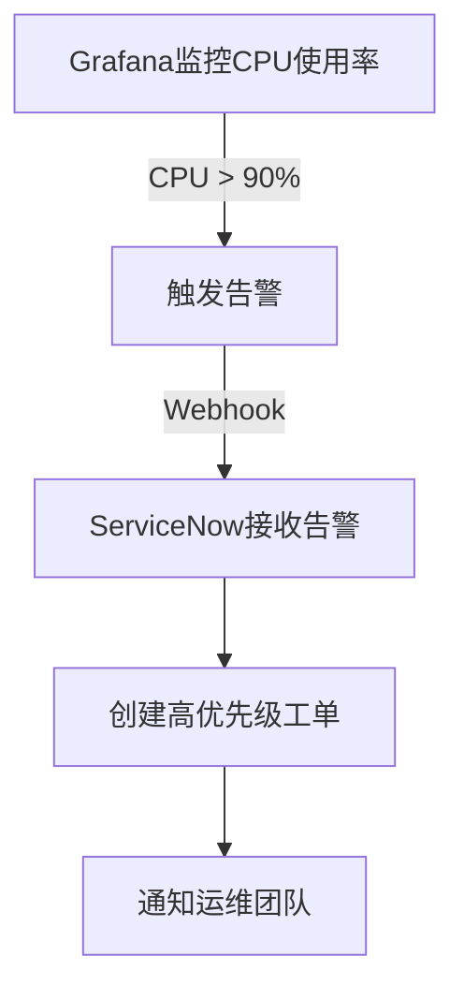

# IT服务管理集成

在现代IT环境中，监控和管理服务是确保业务连续性和高效运营的关键。Grafana作为一个强大的可视化工具，可以帮助您实时监控和分析数据。然而，仅仅监控数据是不够的，您还需要将这些数据与IT服务管理（ITSM）工具集成，以便在出现问题时能够快速响应和解决。

## 什么是IT服务管理集成？

IT服务管理集成是指将Grafana与ITSM工具（如ServiceNow、Jira、Zendesk等）结合使用，以便在监控到异常或问题时，自动创建工单、通知相关人员或触发其他业务流程。这种集成可以帮助您更快地响应问题，减少停机时间，并提高整体服务质量。

## 为什么需要IT服务管理集成？

1. **自动化响应**：通过集成，您可以在检测到问题时自动创建工单，减少手动干预。
2. **提高效率**：自动化的流程可以减少响应时间，提高问题解决的效率。
3. **更好的可见性**：将监控数据与ITSM工具结合，可以提供更全面的业务视图，帮助您更好地理解问题的影响。

## 如何实现IT服务管理集成？

### 1. 配置Grafana告警

首先，您需要在Grafana中配置告警规则。这些规则将定义在什么条件下触发告警。例如，当CPU使用率超过90%时，触发告警。

```yaml
alert:
  - name: High CPU Usage
    conditions:
      - query: 'A'
        reducer: 'avg'
        evaluator:
          type: 'gt'
          params: [90]
        operator: 'and'
    notifications:
      - uid: 'itsm-notification'
```

### 2. 配置通知渠道

接下来，您需要配置Grafana的通知渠道，以便在触发告警时将信息发送到ITSM工具。Grafana支持多种通知渠道，包括Webhook、Email、Slack等。

```yaml
notifications:
  - name: ITSM Notification
    type: webhook
    settings:
      url: 'https://your-itsm-tool.com/api/v1/alerts'
      httpMethod: 'POST'
      username: 'your-username'
      password: 'your-password'
```

### 3. 创建Webhook接收器

在ITSM工具中，您需要创建一个Webhook接收器，以便接收来自Grafana的告警信息。这个接收器将解析告警数据，并根据需要创建工单或触发其他操作。

```json
{
  "alertName": "High CPU Usage",
  "severity": "Critical",
  "description": "CPU usage has exceeded 90%",
  "timestamp": "2023-10-01T12:00:00Z"
}
```

### 4. 测试集成

最后，您需要测试整个集成流程，确保告警能够正确触发，并且ITSM工具能够正确接收和处理告警信息。

## 实际案例

假设您是一家电子商务公司的IT管理员，您使用Grafana监控服务器的CPU使用率。当CPU使用率超过90%时，Grafana触发告警，并通过Webhook将告警信息发送到ServiceNow。ServiceNow接收到告警后，自动创建一个高优先级的工单，并通知相关的运维团队进行处理。



## 总结

通过将Grafana与IT服务管理工具集成，您可以实现自动化的监控和响应流程，从而提高业务运营的效率和可靠性。这种集成不仅减少了手动干预，还提供了更好的可见性和控制能力。

## 附加资源

- [Grafana官方文档](https://grafana.com/docs/)
- [ServiceNow API文档](https://developer.servicenow.com/)
- [Webhook入门指南](https://webhook.site/)

## 练习

1. 在Grafana中创建一个告警规则，监控内存使用率，并在超过80%时触发告警。
2. 配置一个Webhook通知渠道，将告警信息发送到一个模拟的ITSM工具。
3. 在模拟的ITSM工具中创建一个Webhook接收器，并测试整个集成流程。

通过完成这些练习，您将更好地理解如何将Grafana与IT服务管理工具集成，并在实际业务中应用这些知识。