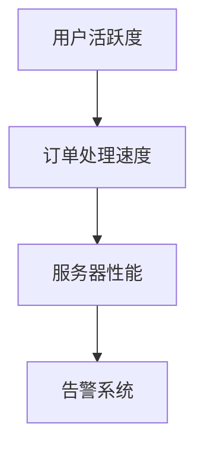

# Grafana 未来发展趋势

Grafana 是一个开源的可视化和监控平台，广泛用于实时数据的可视化和分析。随着技术的不断发展，Grafana 也在不断演进，以满足用户日益增长的需求。本文将探讨 Grafana 的未来发展趋势，帮助初学者了解其发展方向和潜在应用场景。

## 1. 介绍

Grafana 最初是为了解决时间序列数据的可视化问题而设计的，但随着其生态系统的扩展，它已经成为一个功能强大的监控和数据分析平台。未来，Grafana 将继续在以下几个方面发展：

- **更强大的数据源支持**：Grafana 将支持更多类型的数据源，包括非时间序列数据。
- **增强的可视化功能**：Grafana 将提供更多样化的图表类型和自定义选项。
- **更智能的告警系统**：Grafana 将集成更多的机器学习和 AI 技术，以实现更智能的告警和预测功能。
- **更广泛的社区支持**：Grafana 社区将继续壮大，提供更多的插件和扩展。

## 2. 更强大的数据源支持

Grafana 目前已经支持多种数据源，包括 Prometheus、InfluxDB、Elasticsearch 等。未来，Grafana 将支持更多类型的数据源，例如关系型数据库、NoSQL 数据库等。这将使 Grafana 能够处理更广泛的数据类型，满足不同场景的需求。

### 示例：连接 MySQL 数据源

```yaml
apiVersion: 1

datasources:
  - name: MySQL
    type: mysql
    url: localhost:3306
    database: mydb
    user: root
    password: password
```

在这个示例中，我们配置了一个 MySQL 数据源。通过这种方式，Grafana 可以直接从 MySQL 数据库中提取数据，并进行可视化。

## 3. 增强的可视化功能

Grafana 的可视化功能已经非常强大，但未来它将提供更多样化的图表类型和自定义选项。例如，Grafana 可能会引入更多的 3D 图表、地理空间图表等。

### 示例：创建自定义图表

```json
{
  "type": "graph",
  "title": "Custom Graph",
  "datasource": "Prometheus",
  "targets": [
    {
      "expr": "rate(http_requests_total[5m])",
      "legendFormat": "{{handler}}"
    }
  ],
  "options": {
    "tooltip": {
      "mode": "single"
    },
    "legend": {
      "display": true,
      "position": "bottom"
    }
  }
}
```

在这个示例中，我们创建了一个自定义图表，展示了 HTTP 请求的速率。通过这种方式，用户可以灵活地定制图表的显示方式。

## 4. 更智能的告警系统

Grafana 的告警系统目前已经非常强大，但未来它将集成更多的机器学习和 AI 技术，以实现更智能的告警和预测功能。例如，Grafana 可能会引入异常检测、趋势预测等功能。

### 示例：配置智能告警

```yaml
alert:
  - name: High CPU Usage
    conditions:
      - query: "rate(node_cpu_seconds_total{mode=\"system\"}[5m]) > 0.8"
        reducer: "avg"
        evaluator: "gt"
        threshold: 0.8
    notifications:
      - type: "email"
        to: "admin@example.com"
```

在这个示例中，我们配置了一个智能告警，当 CPU 使用率超过 80% 时，系统会发送邮件通知。未来，Grafana 可能会引入更多的智能算法，以更准确地检测异常。

## 5. 更广泛的社区支持

Grafana 社区是其成功的关键因素之一。未来，Grafana 社区将继续壮大，提供更多的插件和扩展。这将使 Grafana 能够更好地满足不同用户的需求。

### 示例：安装社区插件

```bash
grafana-cli plugins install grafana-piechart-panel
```

在这个示例中，我们安装了一个社区提供的饼图插件。通过这种方式，用户可以轻松地扩展 Grafana 的功能。

## 6. 实际案例

### 案例：电商平台的实时监控

假设我们有一个电商平台，需要实时监控用户行为、订单状态和服务器性能。我们可以使用 Grafana 来创建仪表盘，展示以下数据：

- 用户活跃度
- 订单处理速度
- 服务器 CPU 和内存使用率

通过这种方式，我们可以实时了解系统的运行状态，并及时发现和解决问题。



在这个案例中，Grafana 帮助我们实现了对电商平台的全面监控，确保了系统的稳定运行。

## 7. 总结

Grafana 的未来发展趋势主要集中在更强大的数据源支持、增强的可视化功能、更智能的告警系统和更广泛的社区支持。这些发展将使 Grafana 成为一个更加强大和灵活的工具，满足不同用户的需求。

## 8. 附加资源与练习

- **资源**：
  - [Grafana 官方文档](https://grafana.com/docs/)
  - [Grafana 社区论坛](https://community.grafana.com/)
- **练习**：
  - 尝试配置一个 MySQL 数据源，并创建一个自定义图表。
  - 配置一个智能告警，监控系统的 CPU 使用率。

通过学习和实践，你将能够更好地掌握 Grafana 的使用方法，并为未来的发展做好准备。