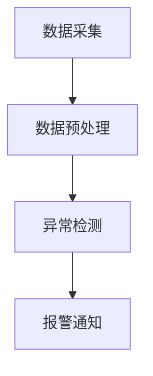

## 介绍

Grafana 是一个强大的开源监控和可视化工具，广泛应用于 DevOps、IT 运维和数据分析等领域。Grafana 社区是一个充满活力的生态系统，用户组与会议是其中重要的组成部分。通过参与用户组和会议，你可以与其他用户交流经验、学习最佳实践，并了解 Grafana 的最新动态。

## 什么是用户组？

用户组（User Group）是由 Grafana 用户自发组织的本地或线上社区。这些小组定期举办活动，如技术分享、研讨会和黑客马拉松，旨在促进成员之间的交流与合作。用户组通常由经验丰富的 Grafana 用户或开发者领导，他们分享自己的知识和经验，帮助新手快速上手。

### 用户组的好处

- **学习新技能**：通过参与用户组活动，你可以学习到 Grafana 的高级功能和最佳实践。
- **建立人脉**：与其他 Grafana 用户建立联系，拓展你的职业网络。
- **解决问题**：在用户组中，你可以向其他成员请教问题，获得解决方案。

## 什么是 Grafana 会议？

Grafana 会议（GrafanaCon）是由 Grafana Labs 组织的年度大会，汇集了全球的 Grafana 用户、开发者和行业专家。会议内容包括主题演讲、技术讲座、工作坊和展览，涵盖了 Grafana 的各个方面。此外，还有许多地方性的 Grafana 会议和 Meetup，为本地社区提供交流平台。

### 会议的好处

- **了解最新动态**：会议是了解 Grafana 最新功能和未来发展方向的最佳途径。
- **深度技术分享**：通过技术讲座和工作坊，你可以深入了解 Grafana 的高级功能和应用场景。
- **与专家互动**：在会议中，你有机会与 Grafana 的核心开发者和行业专家面对面交流。

## 如何参与用户组与会议

### 1. 查找本地用户组

你可以通过 Grafana 官方网站或 Meetup 平台查找你所在地区的用户组。加入用户组后，你将收到活动通知，并可以参与讨论。

```bash
# 示例：查找 Grafana 用户组
$ curl -X GET "https://grafana.com/community/user-groups"
```

### 2. 参加 Grafana 会议

GrafanaCon 是 Grafana 社区最重要的年度会议，通常在春季举行。你可以通过 Grafana 官方网站注册参会。此外，许多地方性的 Grafana 会议和 Meetup 也会定期举办，关注社区动态以获取最新信息。

```bash
# 示例：注册 GrafanaCon
$ curl -X POST "https://grafana.com/grafana-con/register" -d "email=your-email@example.com"
```

## 实际案例

### 案例 1：通过用户组解决性能问题

某公司的 DevOps 团队在使用 Grafana 监控其 Kubernetes 集群时，遇到了性能瓶颈。他们加入了当地的 Grafana 用户组，并在一次活动中向其他成员请教。通过讨论，他们了解到可以通过优化 Prometheus 查询和使用 Grafana 的缓存功能来提升性能。

```yaml
# 示例：优化 Prometheus 查询
- expr: rate(http_requests_total[5m])
  record: http_requests_per_second
```

### 案例 2：在 GrafanaCon 中学习新功能

一位数据分析师参加了 GrafanaCon，并在一次技术讲座中学习了如何使用 Grafana 的机器学习插件进行异常检测。回到公司后，他成功地将这一功能应用到业务监控中，显著提高了问题发现的效率。



## 总结

用户组与会议是 Grafana 社区的重要组成部分，通过参与这些活动，你可以快速提升自己的技能，解决实际问题，并与全球的 Grafana 用户建立联系。无论你是初学者还是经验丰富的用户，都可以从这些活动中受益匪浅。

## 附加资源

- [Grafana 用户组](https://grafana.com/community/user-groups)
- [GrafanaCon 官方网站](https://grafana.com/grafana-con)
- [Grafana 社区论坛](https://community.grafana.com)

## 练习

1. 查找并加入一个你所在地区的 Grafana 用户组。
2. 参加一次 Grafana 用户组活动，并记录你学到的内容。
3. 注册并参加下一次 GrafanaCon，准备一个问题或主题与专家讨论。
