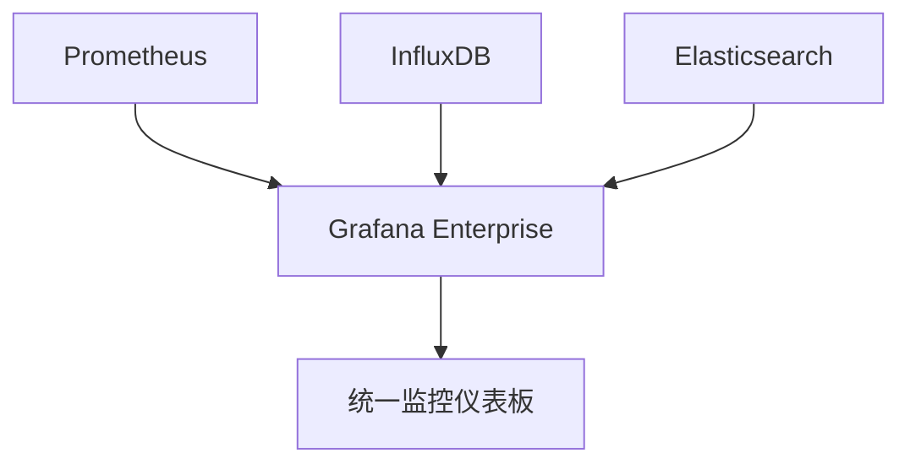

# Grafana Enterprise介绍

Grafana Enterprise 是 Grafana Labs 提供的企业级监控和可视化解决方案。它在开源 Grafana 的基础上，增加了许多专为企业用户设计的高级功能，旨在帮助团队更好地管理、监控和分析其基础设施和应用程序的性能。

## 什么是 Grafana Enterprise？

Grafana Enterprise 是 Grafana 的企业版，专为需要更高安全性、可扩展性和支持的企业用户设计。它不仅包含了开源 Grafana 的所有功能，还提供了额外的企业级功能，如高级身份验证、数据源管理、团队协作工具以及专业的技术支持。

### 主要功能

1. **高级身份验证和访问控制**：支持 LDAP、SAML、OAuth 等企业级身份验证方式，确保只有授权用户可以访问敏感数据。
2. **数据源管理**：提供更强大的数据源管理功能，支持多种数据源类型，并允许管理员集中管理数据源权限。
3. **团队协作**：支持团队级别的仪表板共享和协作，确保团队成员可以轻松共享和讨论监控数据。
4. **专业支持**：提供 24/7 的专业技术支持，确保企业在使用过程中遇到问题时能够及时获得帮助。

## 实际应用场景

### 场景一：企业级监控

假设你是一家大型企业的 IT 管理员，负责监控数百台服务器和应用程序的性能。使用 Grafana Enterprise，你可以轻松集成多种数据源（如 Prometheus、InfluxDB、Elasticsearch 等），并通过统一的仪表板实时监控所有系统的状态。



### 场景二：多团队协作

在一个大型企业中，不同的团队可能需要访问不同的监控数据。Grafana Enterprise 允许你为每个团队创建独立的仪表板，并根据团队成员的权限控制他们对数据的访问。


## 代码示例

以下是一个简单的 Grafana Enterprise 配置示例，展示了如何集成 Prometheus 数据源并创建一个基本的仪表板。

```yaml
apiVersion: 1

datasources:
  - name: Prometheus
    type: prometheus
    url: http://prometheus:9090
    access: proxy
    isDefault: true

dashboards:
  - name: System Metrics
    panels:
      - title: CPU Usage
        type: graph
        targets:
          - expr: rate(node_cpu_seconds_total{mode="system"}[1m])
            legendFormat: "{{instance}}"
```

### 输入与输出

- **输入**：上述 YAML 配置文件定义了 Prometheus 数据源和一个名为 "System Metrics" 的仪表板，其中包含一个显示 CPU 使用率的图表。
- **输出**：在 Grafana Enterprise 中，你将看到一个实时更新的 CPU 使用率图表，帮助你监控系统的性能。

## 总结

Grafana Enterprise 是一个强大的企业级监控和可视化工具，适合需要更高安全性、可扩展性和支持的企业用户。通过集成多种数据源、提供高级身份验证和访问控制、支持团队协作等功能，Grafana Enterprise 能够帮助企业更好地管理其基础设施和应用程序的性能。

## 附加资源

- [Grafana Enterprise 官方文档](https://grafana.com/docs/grafana/latest/enterprise/)
- [Grafana 社区论坛](https://community.grafana.com/)
- [Prometheus 官方文档](https://prometheus.io/docs/)

## 练习

1. 尝试在本地环境中安装 Grafana Enterprise，并集成 Prometheus 数据源。
2. 创建一个简单的仪表板，显示系统的 CPU 和内存使用情况。
3. 探索 Grafana Enterprise 的高级功能，如 LDAP 身份验证和团队协作工具。

通过以上步骤，你将能够更好地理解 Grafana Enterprise 的功能，并将其应用到实际的企业监控场景中。