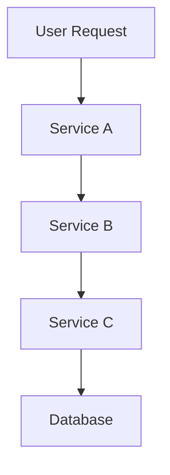

# Grafana Cloud 服务

Grafana Cloud 是 Grafana Labs 提供的一个全托管监控和可观测性平台。它集成了 Grafana 的强大可视化功能，并提供了开箱即用的数据存储、告警和日志管理服务。通过 Grafana Cloud，用户可以轻松监控应用程序、基础设施和日志，而无需管理复杂的后端基础设施。

## 什么是 Grafana Cloud？

Grafana Cloud 是一个基于云的监控和可观测性平台，旨在帮助开发者和运维团队快速构建、部署和管理监控系统。它支持多种数据源，包括 Prometheus、Loki（日志管理）和 Tempo（分布式追踪），并提供了丰富的仪表盘和告警功能。

:::note
Grafana Cloud 的核心优势在于其全托管服务，用户无需担心基础设施的管理，可以专注于监控和分析。
:::

## Grafana Cloud 的核心功能

### 1. 数据存储与查询
Grafana Cloud 提供了高性能的数据存储服务，支持 Prometheus 和 Loki 等数据源。用户可以通过 Grafana 的查询语言（如 PromQL 和 LogQL）对数据进行查询和分析。

```promql
# 示例：查询 CPU 使用率
rate(node_cpu_seconds_total{mode="user"}[1m])
```

### 2. 可视化仪表盘
Grafana Cloud 继承了 Grafana 的强大可视化功能，用户可以创建丰富的仪表盘来展示监控数据。以下是一个简单的仪表盘配置示例：

```json
{
  "panels": [
    {
      "type": "graph",
      "title": "CPU Usage",
      "targets": [
        {
          "expr": "rate(node_cpu_seconds_total{mode=\"user\"}[1m])",
          "legendFormat": "{{mode}}"
        }
      ]
    }
  ]
}
```

### 3. 告警与通知
Grafana Cloud 支持灵活的告警规则配置，并可以通过多种渠道（如电子邮件、Slack、PagerDuty 等）发送通知。以下是一个告警规则的示例：

```yaml
groups:
- name: example
  rules:
  - alert: HighCPUUsage
    expr: rate(node_cpu_seconds_total{mode="user"}[1m]) > 0.8
    for: 5m
    labels:
      severity: critical
    annotations:
      summary: "High CPU usage detected"
      description: "CPU usage is above 80% for the last 5 minutes."
```

### 4. 日志管理
Grafana Cloud 集成了 Loki，一个高效的日志聚合系统。用户可以通过 LogQL 查询日志数据，并将其与指标数据结合分析。

```logql
# 示例：查询包含 "error" 的日志
{job="myapp"} |= "error"
```

## 实际应用场景

### 场景 1：监控 Kubernetes 集群
Grafana Cloud 可以轻松集成 Kubernetes 集群，监控其资源使用情况、Pod 状态和日志。以下是一个监控 Kubernetes 集群 CPU 使用率的示例：

```promql
# 查询 Kubernetes 集群的 CPU 使用率
sum(rate(container_cpu_usage_seconds_total{namespace="default"}[1m])) by (pod)
```

### 场景 2：分布式追踪
Grafana Cloud 支持 Tempo，一个分布式追踪系统。用户可以通过 Tempo 追踪微服务架构中的请求链路，分析性能瓶颈。



:::tip
在实际应用中，分布式追踪可以帮助开发者快速定位性能问题，尤其是在复杂的微服务架构中。
:::

## 总结

Grafana Cloud 是一个功能强大的监控和可观测性平台，适合初学者快速上手。通过本文的介绍，您已经了解了 Grafana Cloud 的核心功能及其在实际场景中的应用。希望这些内容能帮助您更好地利用 Grafana Cloud 来监控和分析您的系统。

## 附加资源与练习

- **练习 1**：尝试在 Grafana Cloud 中创建一个简单的仪表盘，展示 CPU 使用率和内存使用情况。
- **练习 2**：配置一个告警规则，当某个服务的响应时间超过 500ms 时发送通知。
- **附加资源**：访问 [Grafana Cloud 官方文档](https://grafana.com/docs/grafana-cloud/) 了解更多高级功能和使用技巧。

:::caution
在使用 Grafana Cloud 时，请确保您的数据源配置正确，以避免数据丢失或误报。
:::