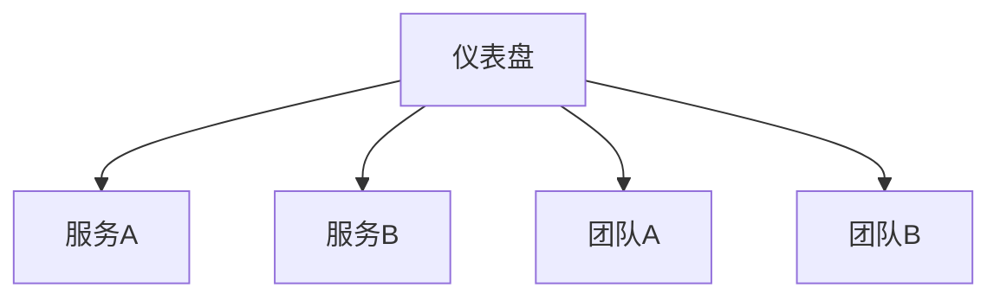
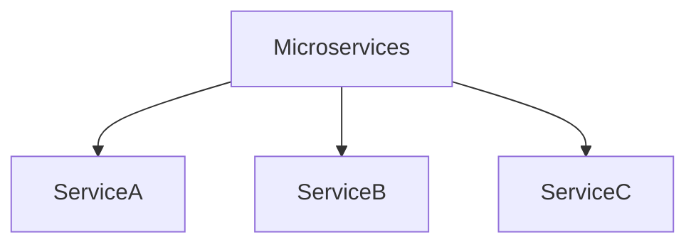
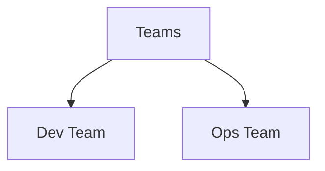

# 仪表盘组织策略

在 Grafana 中，仪表盘是监控和可视化数据的关键工具。一个良好组织的仪表盘不仅能提高工作效率，还能帮助团队更快地识别和解决问题。本文将介绍如何有效地组织 Grafana 仪表盘，以便更好地管理和监控数据。

## 1. 仪表盘组织的重要性

仪表盘组织不仅仅是美观的问题，它直接影响到数据的可读性和可操作性。一个混乱的仪表盘可能会导致信息过载，使得用户难以快速找到关键指标。因此，合理的组织策略是确保仪表盘有效性的关键。

## 2. 仪表盘组织的基本原则

### 2.1 按功能或团队划分

将仪表盘按功能或团队划分是最常见的组织方式。例如，你可以为不同的服务或应用程序创建单独的仪表盘，或者为不同的团队（如开发团队、运维团队）创建不同的仪表盘。



### 2.2 使用文件夹

Grafana 提供了文件夹功能，允许你将相关的仪表盘组织在一起。例如，你可以为每个项目创建一个文件夹，然后将与该项目相关的所有仪表盘放入该文件夹中。

```bash
# 示例：创建文件夹
grafana-cli folders create "Project A"
```

### 2.3 命名规范

为仪表盘和面板使用一致的命名规范可以帮助用户快速理解其内容。例如，你可以使用 `服务名称-指标类型` 的格式来命名仪表盘，如 `ServiceA-CPUUsage`。

## 3. 实际案例

### 3.1 案例：监控微服务架构

假设你正在监控一个微服务架构，其中包含多个服务（如 `ServiceA`、`ServiceB` 和 `ServiceC`）。你可以为每个服务创建一个仪表盘，并将这些仪表盘放入一个名为 `Microservices` 的文件夹中。



在每个服务仪表盘中，你可以进一步按指标类型（如 CPU 使用率、内存使用率、请求延迟等）组织面板。

### 3.2 案例：团队协作

在一个团队协作的环境中，你可以为每个团队创建一个文件夹，并将与该团队相关的仪表盘放入其中。例如，开发团队可以有一个 `Dev Team` 文件夹，运维团队可以有一个 `Ops Team` 文件夹。



## 4. 总结

有效的仪表盘组织策略可以显著提高数据监控的效率和可读性。通过按功能或团队划分、使用文件夹以及遵循一致的命名规范，你可以创建一个清晰、易于管理的仪表盘结构。

## 5. 附加资源与练习

- **练习**：尝试为你的项目创建一个新的仪表盘，并按照本文介绍的组织策略进行布局。
- **资源**：阅读 [Grafana 官方文档](https://grafana.com/docs/) 以了解更多关于仪表盘组织的高级技巧。

:::tip
记住，仪表盘的组织是一个持续的过程。随着项目的发展，定期审查和调整仪表盘结构是保持其有效性的关键。
:::