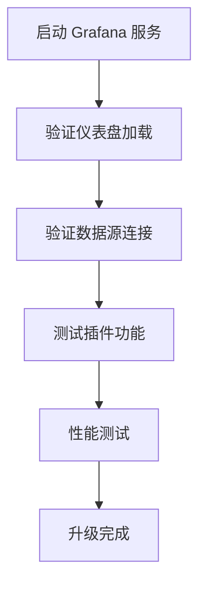

# 升级测试流程

在 Grafana 中，升级测试流程是确保系统在升级后仍能正常运行的关键步骤。无论是升级 Grafana 本身，还是升级相关的插件或依赖项，都需要经过严格的测试流程。本文将详细介绍如何设计和实施一个有效的升级测试流程，帮助初学者掌握这一重要技能。

## 什么是升级测试流程？

升级测试流程是指在升级软件或系统之前、期间和之后，通过一系列测试来验证系统是否能够正常运行的过程。其目的是确保升级不会引入新的问题或破坏现有功能。对于 Grafana 这样的监控和可视化工具，升级测试尤为重要，因为任何问题都可能导致监控数据的丢失或错误。

## 升级测试流程的步骤

### 1. 制定升级计划

在开始升级之前，首先需要制定一个详细的升级计划。这个计划应包括以下内容：

- **升级目标**：明确要升级的组件（如 Grafana 主程序、插件、数据库等）。
- **升级版本**：确定要升级到的具体版本。
- **备份策略**：确保在升级前对现有数据和配置进行完整备份。
- **回滚计划**：如果升级失败，如何快速回滚到之前的版本。

:::tip
在制定升级计划时，建议参考 Grafana 官方文档中的升级指南，以确保不会遗漏任何重要步骤。
:::

### 2. 创建测试环境

在实际升级之前，建议在一个与生产环境相似的测试环境中进行升级测试。测试环境应包括：

- **相同的 Grafana 版本**：确保测试环境中的 Grafana 版本与生产环境一致。
- **相同的数据源**：使用与生产环境相同的数据源（如 Prometheus、InfluxDB 等）。
- **相同的仪表盘和插件**：确保测试环境中包含所有生产环境中使用的仪表盘和插件。

### 3. 执行升级

在测试环境中执行升级操作。升级步骤可能包括：

- **下载新版本**：从 Grafana 官方网站或包管理工具下载新版本。
- **停止 Grafana 服务**：在升级前停止 Grafana 服务。
- **备份数据和配置**：备份 Grafana 的数据目录和配置文件。
- **安装新版本**：按照官方文档的指示安装新版本。
- **启动 Grafana 服务**：启动 Grafana 并验证服务是否正常运行。

```bash
# 示例：停止 Grafana 服务
sudo systemctl stop grafana-server

# 示例：备份 Grafana 数据目录
sudo cp -r /var/lib/grafana /var/lib/grafana_backup

# 示例：安装新版本
sudo apt-get update
sudo apt-get install grafana
```

### 4. 验证升级

升级完成后，需要进行一系列验证测试，以确保系统正常运行。验证测试应包括：

- **仪表盘加载**：检查所有仪表盘是否能够正常加载并显示数据。
- **数据源连接**：验证所有数据源是否能够正常连接并获取数据。
- **插件功能**：测试所有已安装插件是否能够正常工作。
- **性能测试**：确保升级后系统的性能没有明显下降。



### 5. 记录和报告

在升级测试过程中，记录所有测试结果和发现的问题。如果发现问题，应及时修复并重新测试。最终，生成一份详细的升级测试报告，内容包括：

- **测试环境**：测试环境的配置和版本信息。
- **测试步骤**：执行的测试步骤和测试用例。
- **测试结果**：每个测试用例的结果。
- **问题记录**：发现的问题及其解决方案。
- **结论**：升级是否成功，是否可以推广到生产环境。

## 实际案例

假设你正在管理一个使用 Grafana 7.5.0 的生产环境，并计划升级到 Grafana 8.0.0。以下是一个实际案例的升级测试流程：

1. **制定升级计划**：确定升级目标为 Grafana 8.0.0，并制定备份和回滚计划。
2. **创建测试环境**：在测试环境中安装 Grafana 7.5.0，并导入生产环境中的仪表盘和数据源。
3. **执行升级**：在测试环境中升级到 Grafana 8.0.0，并验证服务是否正常运行。
4. **验证升级**：检查所有仪表盘、数据源和插件是否正常工作，并运行性能测试。
5. **记录和报告**：生成升级测试报告，确认升级成功并准备在生产环境中执行升级。

## 总结

升级测试流程是确保 Grafana 系统在升级后仍能正常运行的关键步骤。通过制定详细的升级计划、创建测试环境、执行升级、验证升级结果，并记录测试过程，可以最大限度地减少升级带来的风险。希望本文能帮助你掌握升级测试流程的基本概念和实施方法。

## 附加资源

- [Grafana 官方升级指南](https://grafana.com/docs/grafana/latest/installation/upgrading/)
- [Grafana 社区论坛](https://community.grafana.com/)
- [Grafana 插件文档](https://grafana.com/docs/grafana/latest/plugins/)

## 练习

1. 在你的本地环境中安装 Grafana，并尝试从一个版本升级到另一个版本。
2. 创建一个测试环境，模拟生产环境中的仪表盘和数据源，并执行升级测试。
3. 记录升级测试过程中的所有步骤和结果，并生成一份升级测试报告。