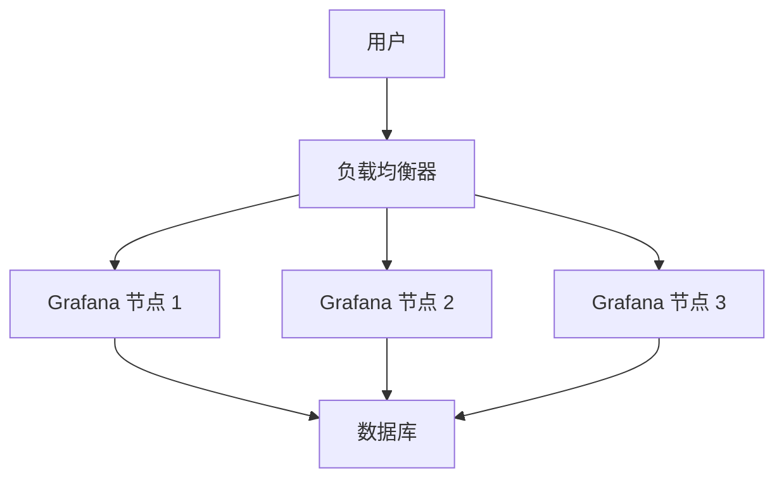

# 可用性保障措施

在构建和运维监控系统时，确保 Grafana 的高可用性是至关重要的。可用性保障措施是指通过一系列技术和策略，确保 Grafana 在任何情况下都能正常运行，从而为用户提供可靠的监控数据。本文将详细介绍如何在 Grafana 中实施可用性保障措施，帮助初学者理解并应用这些概念。

## 什么是可用性保障措施？

可用性保障措施是指通过技术手段和运维策略，确保系统在面对硬件故障、网络中断、软件错误等情况下，仍能持续提供服务。对于 Grafana 来说，可用性保障措施包括但不限于：

- **高可用性架构**：通过多节点部署和负载均衡，避免单点故障。
- **数据备份与恢复**：定期备份 Grafana 的配置和仪表盘数据，确保在数据丢失时能够快速恢复。
- **监控与告警**：实时监控 Grafana 的运行状态，及时发现并处理潜在问题。
- **自动化运维**：通过自动化工具减少人为错误，提高系统的稳定性。

## 高可用性架构

在 Grafana 中，高可用性架构通常通过多节点部署和负载均衡来实现。以下是一个简单的架构示例：



在这个架构中，用户通过负载均衡器访问 Grafana，负载均衡器将请求分发到多个 Grafana 节点。即使其中一个节点发生故障，其他节点仍能继续提供服务，从而确保系统的高可用性。

:::tip
在实际部署中，建议使用 Kubernetes 等容器编排工具来管理 Grafana 节点，以便在节点故障时自动进行故障转移。
:::

## 数据备份与恢复

Grafana 的配置和仪表盘数据通常存储在数据库中。为了确保数据的安全性，建议定期备份数据库。以下是一个简单的备份脚本示例：

```bash
#!/bin/bash
# 备份 Grafana 数据库
BACKUP_DIR="/backup/grafana"
DATE=$(date +%Y%m%d%H%M%S)
mysqldump -u root -p'password' grafana > $BACKUP_DIR/grafana_backup_$DATE.sql
```

在数据丢失时，可以通过以下命令恢复数据库：

```bash
mysql -u root -p'password' grafana < /backup/grafana/grafana_backup_20231010120000.sql
```

:::caution
请确保备份文件存储在安全的位置，并定期测试备份文件的可用性。
:::

## 监控与告警

为了确保 Grafana 的高可用性，建议使用 Prometheus 等监控工具实时监控 Grafana 的运行状态。以下是一个简单的 Prometheus 配置示例：

```yaml
scrape_configs:
  - job_name: 'grafana'
    static_configs:
      - targets: ['grafana:3000']
```

在 Grafana 中，可以创建仪表盘来展示监控数据，并设置告警规则。例如，当 Grafana 的响应时间超过 1 秒时，触发告警：

```sql
ALERT GrafanaHighLatency
  IF rate(grafana_http_request_duration_seconds_sum[1m]) > 1
  FOR 5m
  LABELS { severity="critical" }
  ANNOTATIONS {
    summary = "Grafana 响应时间过高",
    description = "Grafana 的响应时间超过 1 秒，请立即检查。"
  }
```

## 自动化运维

自动化运维可以减少人为错误，提高系统的稳定性。例如，可以使用 Ansible 等工具自动化 Grafana 的部署和配置。以下是一个简单的 Ansible Playbook 示例：

```yaml
- hosts: grafana_servers
  tasks:
    - name: 安装 Grafana
      apt:
        name: grafana
        state: present
    - name: 启动 Grafana 服务
      service:
        name: grafana-server
        state: started
        enabled: yes
```

:::note
自动化运维工具可以帮助你快速部署和更新 Grafana，减少手动操作带来的风险。
:::

## 实际案例

假设你正在为一个电商网站构建监控系统，该网站每天有数百万用户访问。为了确保 Grafana 的高可用性，你采取了以下措施：

1. **多节点部署**：在三个不同的数据中心部署了 Grafana 节点，并通过负载均衡器分发流量。
2. **数据备份**：每天凌晨 2 点自动备份 Grafana 数据库，并将备份文件存储在异地。
3. **监控与告警**：使用 Prometheus 监控 Grafana 的运行状态，并设置了响应时间告警。
4. **自动化运维**：使用 Ansible 自动化 Grafana 的部署和配置，确保所有节点的一致性。

通过这些措施，你成功确保了 Grafana 的高可用性，即使在高峰期也能为用户提供稳定的监控服务。

## 总结

可用性保障措施是确保 Grafana 高可用性的关键。通过高可用性架构、数据备份与恢复、监控与告警以及自动化运维，你可以有效降低系统故障的风险，确保监控系统的稳定性。

## 附加资源

- [Grafana 官方文档](https://grafana.com/docs/)
- [Prometheus 官方文档](https://prometheus.io/docs/)
- [Ansible 官方文档](https://docs.ansible.com/)

## 练习

1. 尝试在多台服务器上部署 Grafana，并配置负载均衡器。
2. 编写一个脚本，自动备份 Grafana 数据库，并测试恢复过程。
3. 使用 Prometheus 监控 Grafana 的运行状态，并设置一个响应时间告警。
4. 使用 Ansible 自动化 Grafana 的部署和配置。

通过完成这些练习，你将更深入地理解可用性保障措施，并能够在实际项目中应用这些知识。