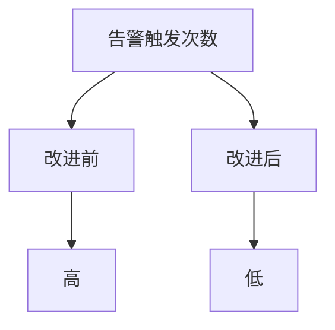

## 介绍

持续改进方法论是一种通过不断迭代和优化流程、工具和实践，以实现更高效率和更好结果的方法。在 Grafana 的上下文中，持续改进意味着通过定期评估和调整监控仪表板、告警规则和数据源配置，确保系统始终处于最佳状态。

对于初学者来说，理解持续改进的核心思想是：**小步快跑，快速迭代**。通过不断收集反馈、分析数据并做出调整，你可以逐步优化你的监控系统，使其更加符合实际需求。

## 持续改进的步骤

### 1. 设定目标

在开始持续改进之前，首先需要明确你想要达到的目标。这些目标可以是：
- 提高系统的可用性
- 减少误报率
- 优化仪表板的加载速度
- 提升用户体验

例如，假设你的目标是减少告警的误报率。你可以通过以下步骤来实现：

```yaml
# 目标：减少告警误报率
steps:
  - 分析当前告警规则
  - 识别高误报率的告警
  - 调整告警阈值或条件
  - 测试新的告警规则
  - 监控误报率的变化
```

### 2. 收集数据

持续改进的基础是数据。你需要收集和分析与目标相关的数据。在 Grafana 中，你可以使用 Prometheus、InfluxDB 或其他数据源来收集系统性能、告警触发次数等数据。

例如，你可以通过以下 PromQL 查询来获取某个告警的触发次数：

```promql
count(ALERTS{alertname="HighCPUUsage"})
```

### 3. 分析数据

收集到数据后，下一步是分析这些数据，找出问题的根源。你可以使用 Grafana 的仪表板来可视化数据，帮助你更好地理解系统的行为。

例如，如果你发现某个告警频繁触发，可能是因为阈值设置过低。你可以通过调整阈值来减少误报。

### 4. 实施改进

根据分析结果，实施改进措施。这可能包括：
- 调整告警规则
- 优化查询语句
- 重新设计仪表板布局

例如，你可以通过以下方式调整告警规则：

```yaml
# 原始告警规则
alert: HighCPUUsage
expr: cpu_usage > 80
for: 5m

# 改进后的告警规则
alert: HighCPUUsage
expr: cpu_usage > 85
for: 10m
```

### 5. 监控效果

改进措施实施后，需要持续监控其效果。你可以通过 Grafana 仪表板来跟踪关键指标的变化，确保改进措施达到了预期效果。

例如，你可以创建一个仪表板来监控告警触发次数的变化：



### 6. 迭代优化

持续改进是一个循环过程。根据监控结果，你可能需要进一步调整和改进。每次迭代都应该带来更好的结果，直到达到你的目标。

## 实际案例

假设你正在监控一个 Web 应用程序的性能。你发现用户经常抱怨页面加载速度慢。通过持续改进方法论，你可以采取以下步骤：

1. **设定目标**：减少页面加载时间。
2. **收集数据**：使用 Grafana 和 Prometheus 收集页面加载时间的数据。
3. **分析数据**：发现某些页面的加载时间明显高于其他页面。
4. **实施改进**：优化这些页面的代码和资源加载策略。
5. **监控效果**：通过 Grafana 仪表板监控页面加载时间的变化。
6. **迭代优化**：根据监控结果进一步优化，直到页面加载时间达到预期目标。

## 总结

持续改进方法论是一种强大的工具，可以帮助你不断优化 Grafana 监控系统。通过设定目标、收集数据、分析问题、实施改进和监控效果，你可以逐步提升系统的性能和用户体验。

:::tip
记住，持续改进是一个循环过程。每次迭代都应该带来更好的结果，直到达到你的目标。
:::

## 附加资源

- [Grafana 官方文档](https://grafana.com/docs/)
- [Prometheus 查询语言 (PromQL) 指南](https://prometheus.io/docs/prometheus/latest/querying/basics/)
- [持续改进方法论简介](https://en.wikipedia.org/wiki/Continuous_improvement)

## 练习

1. 选择一个你当前的 Grafana 仪表板，设定一个改进目标（例如减少告警误报率）。
2. 收集相关数据并进行分析，找出问题的根源。
3. 实施改进措施，并通过 Grafana 监控其效果。
4. 记录每次迭代的结果，并总结你的经验。