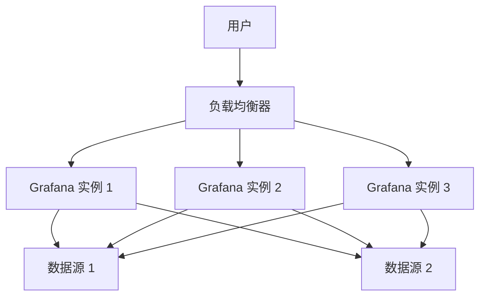

# 大规模部署指南

Grafana 是一个强大的开源监控和可视化工具，广泛应用于各种规模的生产环境中。然而，随着数据量和用户数量的增加，如何高效地部署和管理 Grafana 成为了一个挑战。本指南将为你提供大规模部署 Grafana 的全面指导，帮助你构建一个稳定、高性能的监控系统。

## 1. 介绍

在大规模部署 Grafana 时，我们需要考虑多个因素，包括架构设计、性能优化、高可用性和安全性。以下是一些关键概念：

- **架构设计**：如何设计一个可扩展的架构来支持大量用户和数据。
- **性能优化**：如何优化 Grafana 的性能，确保在高负载下仍能快速响应。
- **高可用性**：如何确保 Grafana 服务的高可用性，避免单点故障。
- **安全性**：如何保护 Grafana 免受未经授权的访问和攻击。

## 2. 架构设计

在大规模部署中，Grafana 通常需要与多个数据源（如 Prometheus、InfluxDB 等）集成。为了确保系统的可扩展性和高可用性，建议采用以下架构：



:::note
**注意**：在实际部署中，建议使用 Kubernetes 或 Docker Swarm 等容器编排工具来管理 Grafana 实例，以确保高可用性和自动扩展。
:::

## 3. 性能优化

### 3.1 数据库优化

Grafana 使用 SQLite、MySQL 或 PostgreSQL 作为后端数据库。在大规模部署中，建议使用 PostgreSQL 或 MySQL，并对其进行优化：

- **索引优化**：为常用查询字段创建索引，以加快查询速度。
- **分区表**：对于大型数据集，可以使用分区表来提高查询性能。

```sql
-- 示例：创建索引
CREATE INDEX idx_dashboard_id ON dashboard (id);
```

### 3.2 缓存优化

Grafana 支持多种缓存机制，如 Redis 和 Memcached。通过启用缓存，可以显著减少数据库的负载：

```ini
# grafana.ini 配置文件
[cache]
enabled = true
backend = redis
```

:::tip
**提示**：在高并发场景下，建议使用 Redis 作为缓存后端，因为它支持分布式缓存和高可用性。
:::

## 4. 高可用性

为了确保 Grafana 的高可用性，建议采用以下策略：

- **多实例部署**：部署多个 Grafana 实例，并通过负载均衡器分发流量。
- **自动故障转移**：使用 Kubernetes 或 Docker Swarm 实现自动故障转移。
- **数据备份**：定期备份 Grafana 的数据库和配置文件，以防止数据丢失。

## 5. 安全性

在大规模部署中，安全性至关重要。以下是一些关键的安全措施：

- **身份验证**：启用 OAuth、LDAP 或 SAML 等身份验证机制，确保只有授权用户才能访问 Grafana。
- **HTTPS**：配置 HTTPS 以加密数据传输，防止中间人攻击。
- **访问控制**：使用 Grafana 的 RBAC（基于角色的访问控制）功能，限制用户对仪表板和数据的访问权限。

```ini
# grafana.ini 配置文件
[security]
admin_user = admin
admin_password = securepassword
```

## 6. 实际案例

假设你正在为一个拥有 10,000 名用户和 100 个数据源的公司部署 Grafana。以下是一个可能的部署方案：

1. **架构设计**：使用 Kubernetes 部署 5 个 Grafana 实例，并通过负载均衡器分发流量。
2. **性能优化**：使用 PostgreSQL 作为后端数据库，并启用 Redis 缓存。
3. **高可用性**：配置 Kubernetes 的自动扩展和故障转移功能。
4. **安全性**：启用 OAuth 身份验证和 HTTPS，并配置 RBAC。

## 7. 总结

大规模部署 Grafana 需要综合考虑架构设计、性能优化、高可用性和安全性。通过采用合理的架构和优化策略，你可以构建一个稳定、高性能的监控系统，满足大规模用户和数据的需求。

## 8. 附加资源

- [Grafana 官方文档](https://grafana.com/docs/)
- [Kubernetes 官方文档](https://kubernetes.io/docs/)
- [PostgreSQL 性能优化指南](https://www.postgresql.org/docs/current/performance.html)

## 9. 练习

1. 尝试在 Kubernetes 上部署 Grafana，并配置自动扩展。
2. 使用 PostgreSQL 作为 Grafana 的后端数据库，并优化其性能。
3. 启用 Redis 缓存，并测试其对 Grafana 性能的影响。

通过完成这些练习，你将更好地理解如何在大规模环境中部署和管理 Grafana。