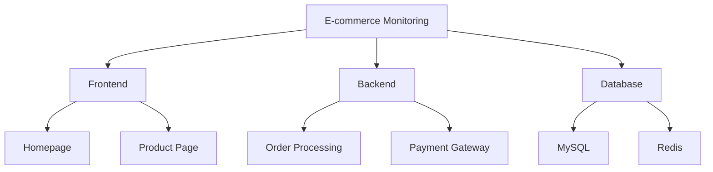

# 仪表盘文件夹组织

在 Grafana 中，仪表盘文件夹（Dashboard Folders）是一种用于组织和分类仪表盘的工具。通过合理地使用文件夹，您可以更轻松地管理和查找仪表盘，尤其是在拥有大量仪表盘的情况下。本文将详细介绍如何在 Grafana 中创建、管理和使用仪表盘文件夹，并提供一些实际案例来帮助您更好地理解这一概念。

## 什么是仪表盘文件夹？

仪表盘文件夹是 Grafana 中用于存储和组织仪表盘的容器。每个文件夹可以包含多个仪表盘，并且文件夹本身可以嵌套在其他文件夹中。通过使用文件夹，您可以将相关的仪表盘分组在一起，从而简化管理和查找过程。

## 创建仪表盘文件夹

在 Grafana 中创建仪表盘文件夹非常简单。以下是创建文件夹的步骤：

1. 登录到 Grafana 实例。
2. 导航到左侧菜单中的 **Dashboards** 选项。
3. 点击 **Manage** 按钮。
4. 在 **Dashboards** 页面中，点击 **New Folder** 按钮。
5. 输入文件夹的名称，然后点击 **Create**。

:::note
文件夹名称应该是描述性的，以便您和其他用户能够轻松理解其内容。
:::

## 将仪表盘移动到文件夹中

创建文件夹后，您可以将现有的仪表盘移动到该文件夹中。以下是移动仪表盘的步骤：

1. 在 **Dashboards** 页面中，找到您想要移动的仪表盘。
2. 点击仪表盘名称旁边的 **Settings** 图标（齿轮图标）。
3. 在 **General** 选项卡中，找到 **Folder** 部分。
4. 从下拉菜单中选择目标文件夹，然后点击 **Save**。

:::tip
您还可以在创建新仪表盘时直接选择将其保存到特定的文件夹中。
:::

## 嵌套文件夹

Grafana 允许您将文件夹嵌套在其他文件夹中，以便进一步组织仪表盘。以下是嵌套文件夹的步骤：

1. 在 **Dashboards** 页面中，点击 **New Folder** 按钮。
2. 输入新文件夹的名称。
3. 在 **Parent Folder** 下拉菜单中，选择您希望嵌套的父文件夹。
4. 点击 **Create**。

:::caution
嵌套文件夹可能会增加复杂性，因此请确保您的文件夹结构清晰且易于理解。
:::

## 实际案例

假设您正在为一个大型电子商务网站设置监控仪表盘。您可能希望将仪表盘按功能或服务进行分类。以下是一个可能的文件夹结构：

在这个案例中，**E-commerce Monitoring** 是顶级文件夹，包含了 **Frontend**、**Backend** 和 **Database** 三个子文件夹。每个子文件夹又进一步细分为更具体的仪表盘，例如 **Homepage** 和 **Product Page**。

## 总结

通过合理地使用仪表盘文件夹，您可以更有效地组织和管理 Grafana 中的仪表盘。无论是按功能、服务还是其他标准进行分类，文件夹都能帮助您快速找到所需的仪表盘，并简化维护工作。

## 附加资源

- [Grafana 官方文档](https://grafana.com/docs/grafana/latest/dashboards/manage-dashboard-folders/)
- [Grafana 仪表盘最佳实践](https://grafana.com/docs/grafana/latest/best-practices/dashboard-organization/)

## 练习

1. 在您的 Grafana 实例中创建一个名为 **Infrastructure** 的文件夹，并将所有与基础设施相关的仪表盘移动到该文件夹中。
2. 尝试嵌套文件夹，创建一个名为 **Network** 的子文件夹，并将其放在 **Infrastructure** 文件夹中。
3. 思考您的项目或团队的需求，设计一个适合的文件夹结构，并实施它。

通过完成这些练习，您将更好地掌握如何在 Grafana 中组织和管理仪表盘文件夹。