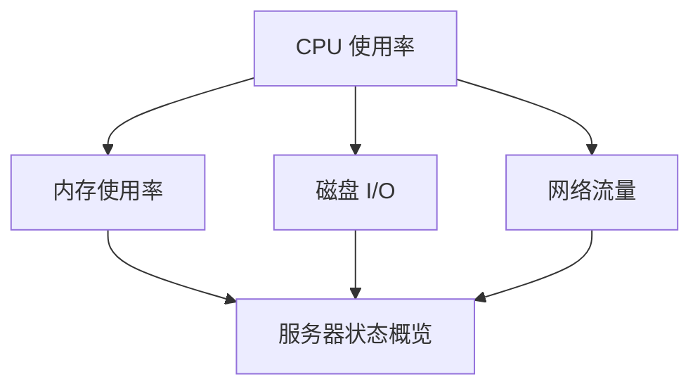

# 仪表盘布局设计

Grafana 是一个强大的数据可视化工具，而仪表盘布局设计是创建高效且美观的数据展示界面的关键。无论是监控系统性能、分析业务数据，还是展示实时指标，合理的布局设计都能帮助用户快速理解数据并做出决策。本文将逐步讲解 Grafana 仪表盘布局设计的基本概念和实用技巧，帮助你从零开始构建专业的仪表盘。

## 什么是仪表盘布局设计？

仪表盘布局设计是指通过合理安排面板（Panel）的位置、大小和层次结构，使数据以清晰、直观的方式呈现给用户。一个好的布局设计不仅能提升用户体验，还能提高数据传达的效率。

在 Grafana 中，仪表盘由多个面板组成，每个面板可以显示不同的数据可视化内容，如图表、表格、文本等。布局设计的核心在于如何将这些面板组织在一起，形成一个逻辑清晰、易于理解的仪表盘。

---

## 仪表盘布局的基本概念

### 1. 网格系统
Grafana 使用网格系统来排列面板。仪表盘被划分为多个网格单元（Grid Units），每个面板可以占据一个或多个网格单元。网格系统使得面板的排列更加灵活，同时保证了布局的整齐性。

- **网格单元大小**：默认情况下，每个网格单元的宽度为 24 像素，高度为 30 像素。
- **面板大小**：面板的宽度和高度以网格单元为单位进行设置。例如，一个宽度为 6 网格单元、高度为 4 网格单元的面板，实际大小为 144 像素（6 * 24）宽和 120 像素（4 * 30）高。

### 2. 面板排列
面板的排列方式直接影响仪表盘的可读性和美观性。以下是几种常见的排列方式：

- **水平排列**：将多个面板并排排列，适合展示多个相关指标。
- **垂直排列**：将面板从上到下排列，适合展示时间序列数据或需要逐层分析的数据。
- **混合排列**：结合水平和垂直排列，适合复杂的数据展示需求。

### 3. 响应式设计
Grafana 的仪表盘支持响应式设计，这意味着布局可以根据屏幕大小自动调整。例如，当屏幕宽度较小时，面板可以自动换行或缩小，以适应不同的设备。

---

## 如何设计仪表盘布局

### 步骤 1：确定仪表盘的目标
在设计布局之前，首先要明确仪表盘的目标。例如：
- 你是要监控服务器的 CPU 使用率，还是分析销售数据？
- 你需要展示哪些关键指标？
- 用户需要从仪表盘中获取哪些信息？

明确目标后，你可以更有针对性地选择面板类型和布局方式。

### 步骤 2：选择面板类型
Grafana 提供了多种面板类型，包括折线图、柱状图、饼图、表格、文本等。根据数据的特点和展示需求，选择合适的面板类型。

例如：
- 使用折线图展示时间序列数据。
- 使用表格展示详细的数值数据。
- 使用文本面板添加说明或标题。

### 步骤 3：规划面板布局
在 Grafana 中，你可以通过拖拽面板来调整其位置和大小。以下是一些布局设计的建议：

1. **突出重点**：将最重要的面板放在仪表盘的顶部或中心位置，并使用较大的尺寸。
2. **分组相关数据**：将相关的面板放在一起，方便用户对比和分析。
3. **留白**：适当留白可以避免仪表盘显得过于拥挤，提升可读性。

### 步骤 4：调整面板属性
每个面板都有多种属性可以调整，例如：
- **标题**：为面板添加描述性标题。
- **背景颜色**：通过颜色区分不同类型的数据。
- **透明度**：调整面板的透明度，使仪表盘更具层次感。

---

## 实际案例：服务器监控仪表盘

假设你需要设计一个服务器监控仪表盘，用于展示 CPU 使用率、内存使用率、磁盘 I/O 和网络流量。以下是一个可能的布局设计：

- **顶部**：放置一个较大的折线图面板，展示 CPU 使用率和内存使用率。
- **中部**：放置两个较小的面板，分别展示磁盘 I/O 和网络流量。
- **底部**：放置一个表格面板，展示服务器的详细状态信息。

通过这种布局，用户可以快速了解服务器的整体状态，并深入分析具体指标。

---

## 总结

仪表盘布局设计是 Grafana 数据可视化的核心技能之一。通过合理的网格系统、面板排列和响应式设计，你可以创建出高效且美观的仪表盘。记住，布局设计的关键在于明确目标、选择合适的面板类型，并注重用户体验。

---

## 附加资源与练习

### 资源
- [Grafana 官方文档](https://grafana.com/docs/)
- [Grafana 社区论坛](https://community.grafana.com/)

### 练习
1. 创建一个简单的服务器监控仪表盘，包含 CPU 使用率、内存使用率和网络流量面板。
2. 尝试使用不同的面板类型（如饼图、柱状图）重新设计仪表盘，观察效果。
3. 调整面板的大小和位置，体验网格系统的灵活性。

通过不断实践，你将逐步掌握仪表盘布局设计的技巧，成为一名出色的数据可视化专家！