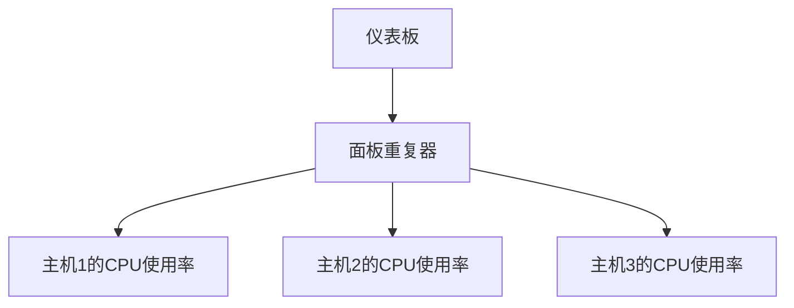

# 面板重复器

在 Grafana 中，**面板重复器**（Panel Repeater）是一个强大的功能，允许你基于某个变量动态生成多个面板。通过面板重复器，你可以避免手动创建多个相似的面板，从而节省时间并提高仪表板的可维护性。

## 什么是面板重复器？

面板重复器是一种自动化工具，它可以根据指定的变量值重复生成相同类型的面板。例如，如果你有一个变量 `host`，其中包含多个主机名，你可以使用面板重复器为每个主机生成一个独立的面板。这样，当变量值发生变化时，面板的数量和内容也会自动更新。

## 如何使用面板重复器？

### 1. 创建变量

首先，你需要创建一个变量，用于面板重复器的基础。变量可以是查询变量、自定义变量或其他类型的变量。以下是一个查询变量的示例：

```yaml
variables:
  - name: host
    type: query
    query: SHOW TAG VALUES FROM cpu_usage WITH KEY = "host"
    refresh: onDashboardLoad
```

这个变量 `host` 会从 `cpu_usage` 数据源中获取所有 `host` 标签的值。

### 2. 配置面板重复器

接下来，在面板的编辑界面中，找到 **Repeat options** 部分。选择你刚刚创建的变量 `host` 作为重复依据。

```yaml
repeat:
  direction: horizontal
  variable: host
```

### 3. 面板内容

在面板中，你可以使用变量 `$host` 来引用当前重复的面板所对应的主机名。例如，如果你正在显示 CPU 使用率，可以这样编写查询：

```sql
SELECT usage FROM cpu_usage WHERE host = '$host'
```

### 4. 运行并查看结果

保存并运行仪表板后，Grafana 会根据 `host` 变量的值动态生成多个面板。每个面板都会显示对应主机的 CPU 使用率。

## 实际案例

假设你正在监控一个包含多个服务器的集群。每个服务器的 CPU 使用率数据都存储在同一个数据源中，但通过 `host` 标签区分。通过面板重复器，你可以轻松地为每个服务器生成一个独立的 CPU 使用率面板。



在这个案例中，面板重复器会根据 `host` 变量的值（例如 `host1`, `host2`, `host3`）生成三个独立的面板，每个面板显示对应主机的 CPU 使用率。

## 总结

面板重复器是 Grafana 中一个非常实用的功能，特别适合需要动态生成多个相似面板的场景。通过使用面板重复器，你可以大大减少手动配置的工作量，并提高仪表板的灵活性和可维护性。

:::tip 提示
如果你有多个变量，可以尝试将它们组合使用，以生成更复杂的重复面板。
:::

:::caution 注意
面板重复器可能会增加仪表板的加载时间，特别是在变量值较多的情况下。请确保优化查询和数据源性能。
:::

## 附加资源

- [Grafana 官方文档 - 面板重复器](https://grafana.com/docs/grafana/latest/panels/repeat-panels/)
- [Grafana 社区论坛](https://community.grafana.com/)

## 练习

1. 创建一个包含多个主机的变量，并使用面板重复器为每个主机生成一个内存使用率面板。
2. 尝试将面板重复器与多个变量结合使用，生成更复杂的仪表板布局。

通过以上步骤和练习，你将能够熟练掌握 Grafana 中的面板重复器功能，并将其应用到实际监控场景中。