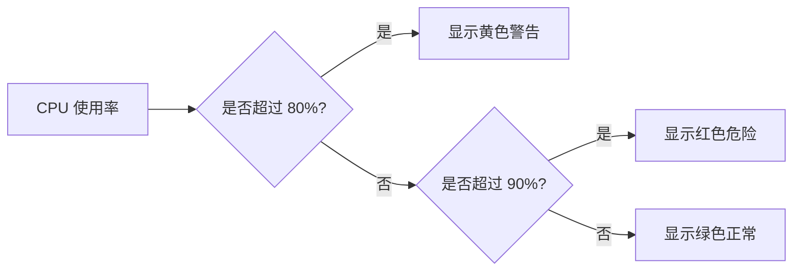

# 面板高级选项

Grafana 是一个强大的数据可视化工具，而面板（Panel）是其核心组件之一。通过面板，我们可以将数据以图表、表格等形式展示出来。在 Grafana 中，面板的高级选项提供了丰富的自定义功能，帮助用户更好地控制数据的展示方式和交互行为。本文将详细介绍这些高级选项，并通过实际案例帮助你理解如何利用它们优化你的面板。

## 什么是面板高级选项？

面板高级选项是 Grafana 提供的一组配置项，允许用户对面板的显示、交互、数据查询等方面进行更精细的控制。这些选项通常隐藏在面板的“高级”或“选项”标签下，适合那些希望进一步优化面板展示效果的用户。

## 面板高级选项的主要功能

### 1. 数据链接（Data Links）

数据链接允许你将面板中的数据点与其他资源（如另一个 Grafana 面板、外部网站或 API）关联起来。通过数据链接，用户可以点击图表中的某个数据点，跳转到相关资源，从而获得更详细的信息。

#### 示例：添加数据链接

```json
{
  "datasource": "Prometheus",
  "fieldConfig": {
    "links": [
      {
        "title": "View Details",
        "url": "https://example.com/details?query=${__data.fields[0]}"
      }
    ]
  }
}
```

在这个示例中，我们为面板添加了一个数据链接，当用户点击某个数据点时，会跳转到 `https://example.com/details` 页面，并附带查询参数。

### 2. 阈值（Thresholds）

阈值功能允许你为面板中的数据设置特定的阈值，并在图表中以不同的颜色或样式显示超出阈值的数据。这对于监控系统状态或识别异常数据非常有用。

#### 示例：设置阈值

```json
{
  "fieldConfig": {
    "thresholds": {
      "mode": "absolute",
      "steps": [
        {
          "value": null,
          "color": "green"
        },
        {
          "value": 80,
          "color": "yellow"
        },
        {
          "value": 90,
          "color": "red"
        }
      ]
    }
  }
}
```

在这个示例中，我们设置了两个阈值：当数据值低于 80 时显示绿色，介于 80 和 90 之间时显示黄色，超过 90 时显示红色。

### 3. 单位格式化（Unit Formatting）

单位格式化功能允许你为面板中的数据指定显示单位，如百分比、字节、时间等。这可以帮助用户更直观地理解数据的含义。

#### 示例：设置单位格式化

```json
{
  "fieldConfig": {
    "defaults": {
      "unit": "percent"
    }
  }
}
```

在这个示例中，我们将面板中的数据单位设置为百分比，所有数据将以百分比形式显示。

### 4. 时间范围覆盖（Time Range Overrides）

时间范围覆盖功能允许你为面板中的特定查询设置不同的时间范围。这对于在同一面板中展示不同时间范围的数据非常有用。

#### 示例：设置时间范围覆盖

```json
{
  "fieldConfig": {
    "overrides": [
      {
        "matcher": {
          "id": "byName",
          "options": "QueryA"
        },
        "properties": [
          {
            "id": "timeRange",
            "value": "now-1h"
          }
        ]
      }
    ]
  }
}
```

在这个示例中，我们为名为 `QueryA` 的查询设置了时间范围覆盖，使其只显示过去一小时的数据。

## 实际应用案例

### 案例 1：监控系统状态

假设你正在监控一个服务器的 CPU 使用率。你可以使用阈值功能为 CPU 使用率设置警告和危险阈值，并在图表中以不同颜色显示。当 CPU 使用率超过 80% 时，图表会显示黄色警告；当超过 90% 时，图表会显示红色危险信号。



### 案例 2：数据链接跳转

假设你正在展示一组服务器的响应时间数据。你可以为每个数据点添加一个数据链接，点击后跳转到该服务器的详细监控页面。这样，用户可以快速查看特定服务器的详细信息，而不必手动搜索。

## 总结

Grafana 的面板高级选项提供了丰富的自定义功能，帮助用户更好地控制和优化数据的展示方式。通过数据链接、阈值、单位格式化和时间范围覆盖等功能，你可以创建更具交互性和可读性的面板。希望本文能帮助你更好地理解这些高级选项，并在实际项目中灵活运用。

## 附加资源与练习

- **练习 1**：尝试为你的面板添加一个数据链接，使其点击后跳转到外部网站。
- **练习 2**：为你的面板设置一个阈值，并在图表中以不同颜色显示超出阈值的数据。
- **附加资源**：阅读 [Grafana 官方文档](https://grafana.com/docs/) 以了解更多关于面板高级选项的详细信息。

:::tip
如果你在使用 Grafana 时遇到问题，可以访问 [Grafana 社区论坛](https://community.grafana.com/) 寻求帮助。
:::