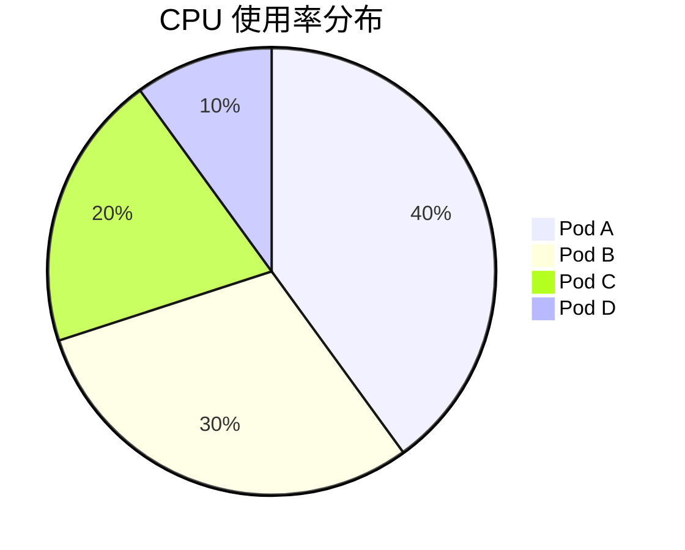

# 饼图面板设置

饼图是一种常见的数据可视化工具，用于展示数据的分布和比例。在 Grafana 中，饼图面板可以帮助你直观地理解数据的组成。本文将逐步介绍如何在 Grafana 中设置和配置饼图面板，并通过实际案例展示其应用。

## 什么是饼图？

饼图是一种圆形统计图表，被分割成多个扇形区域，每个区域的大小代表数据在整体中的比例。饼图非常适合展示数据的相对比例，例如市场份额、资源分配等。

## 在 Grafana 中创建饼图面板

### 步骤 1：添加新面板

1. 打开 Grafana 仪表盘。
2. 点击右上角的 **"Add panel"** 按钮。
3. 选择 **"Add new panel"**。

### 步骤 2：选择数据源

1. 在面板编辑器中，选择你要使用的数据源。
2. 编写查询以获取需要可视化的数据。例如，使用 Prometheus 查询语言（PromQL）来获取 CPU 使用率数据：

   ```promql
   sum(rate(container_cpu_usage_seconds_total{job="kubernetes-nodes"}[5m])) by (pod)
   ```

### 步骤 3：配置饼图

1. 在面板编辑器的右侧，找到 **"Visualization"** 选项卡。
2. 从下拉菜单中选择 **"Pie chart"**。
3. 配置饼图的显示选项：
   - **Display**: 选择显示方式，如 **"Pie"** 或 **"Donut"**。
   - **Legend**: 配置图例的位置和显示方式。
   - **Tooltip**: 设置鼠标悬停时的提示信息。

### 步骤 4：调整样式

1. 在 **"Panel options"** 中，设置面板的标题和描述。
2. 在 **"Field"** 选项卡中，调整字段的显示格式和单位。
3. 在 **"Thresholds"** 中，设置阈值以突出显示特定数据。

## 实际案例

假设你有一个 Kubernetes 集群，并且想要监控各个 Pod 的 CPU 使用率。你可以使用饼图来展示每个 Pod 的 CPU 使用率占总使用率的比例。



:::note
**注意**: 在实际使用中，数据会动态变化，因此饼图也会实时更新。
:::

## 总结

通过本文，你已经学会了如何在 Grafana 中设置和配置饼图面板。饼图是一种强大的工具，可以帮助你直观地理解数据的分布和比例。希望你能在实际项目中灵活运用这一技能。

## 附加资源

- [Grafana 官方文档](https://grafana.com/docs/)
- [Prometheus 查询语言（PromQL）指南](https://prometheus.io/docs/prometheus/latest/querying/basics/)

## 练习

1. 创建一个新的 Grafana 仪表盘，并添加一个饼图面板。
2. 使用 Prometheus 数据源，查询并展示不同服务的请求量分布。
3. 调整饼图的样式和显示选项，使其更符合你的需求。

祝你学习愉快！