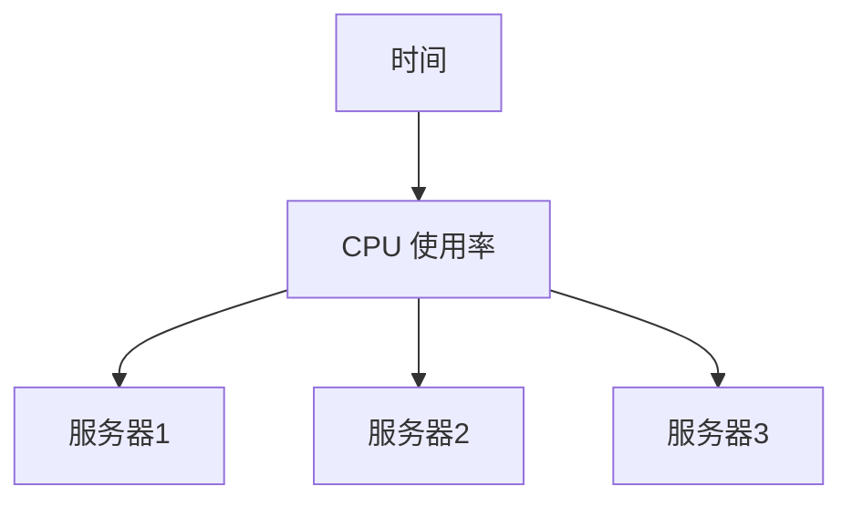

# 坐标轴设置

在数据可视化中，坐标轴是图表的核心组成部分之一。它们帮助我们理解数据的分布、趋势和关系。Grafana 提供了强大的工具来配置和自定义坐标轴，以满足不同的可视化需求。本文将详细介绍如何在 Grafana 中设置坐标轴，并通过实际案例展示其应用。

## 什么是坐标轴？

坐标轴是图表中用于表示数据维度的参考线。通常，图表有两个坐标轴：**X 轴**（水平轴）和 **Y 轴**（垂直轴）。X 轴通常表示时间或类别，而 Y 轴表示数值。通过调整坐标轴的设置，我们可以更好地控制数据的展示方式。

## 基本坐标轴设置

在 Grafana 中，坐标轴的设置可以通过面板的“Axes”选项卡进行配置。以下是一些常见的设置选项：

1. **X 轴和 Y 轴的显示**：可以选择是否显示 X 轴或 Y 轴。
2. **轴标签**：可以为坐标轴添加自定义标签，以更清晰地描述数据。
3. **轴单位**：可以为 Y 轴设置单位（如百分比、时间、温度等）。
4. **轴范围**：可以手动设置坐标轴的最小值和最大值，以控制数据的显示范围。

### 示例：设置 Y 轴的单位

假设我们有一个显示 CPU 使用率的图表，我们希望 Y 轴以百分比显示。可以通过以下步骤进行设置：

1. 打开 Grafana 面板的“Axes”选项卡。
2. 在 Y 轴设置中，找到“Unit”选项。
3. 选择“Percent (0.0-1.0)”作为单位。

```json
{
  "yaxes": [
    {
      "format": "percent",
      "label": "CPU Usage",
      "min": 0,
      "max": 1
    }
  ]
}
```

设置完成后，Y 轴将显示为百分比，范围从 0% 到 100%。

## 自定义坐标轴范围

有时，默认的坐标轴范围可能无法很好地展示数据。例如，如果数据集中在某个较小的范围内，图表可能会显得过于扁平。此时，我们可以手动设置坐标轴的最小值和最大值。

### 示例：手动设置 Y 轴范围

假设我们有一个显示温度变化的图表，数据范围在 20°C 到 30°C 之间。我们可以将 Y 轴的最小值设置为 20，最大值设置为 30，以更好地展示数据的变化。

```json
{
  "yaxes": [
    {
      "format": "celsius",
      "label": "Temperature",
      "min": 20,
      "max": 30
    }
  ]
}
```

## 实际案例：监控服务器负载

假设我们正在监控一组服务器的 CPU 使用率，并希望将数据可视化。我们可以使用 Grafana 创建一个图表，展示每台服务器的 CPU 使用率随时间的变化。

1. **X 轴**：表示时间。
2. **Y 轴**：表示 CPU 使用率（百分比）。

通过设置 Y 轴的单位为百分比，并手动调整范围（0% 到 100%），我们可以清晰地看到每台服务器的负载情况。



## 总结

坐标轴是数据可视化中的重要组成部分，通过合理配置，可以显著提升图表的可读性和信息量。在 Grafana 中，我们可以轻松地自定义坐标轴的显示、标签、单位和范围，以满足不同的可视化需求。

## 附加资源

- [Grafana 官方文档](https://grafana.com/docs/)：了解更多关于 Grafana 的高级功能。
- [数据可视化最佳实践](https://www.tableau.com/learn/whitepapers/visual-best-practices)：学习如何更好地展示数据。

## 练习

1. 创建一个新的 Grafana 面板，并尝试设置 X 轴和 Y 轴的标签和单位。
2. 手动调整 Y 轴的范围，观察图表的变化。
3. 尝试为不同的数据集配置坐标轴，看看如何通过调整设置来优化数据展示。

通过以上练习，你将更深入地理解坐标轴设置的重要性，并能够灵活运用这些技巧来创建更具表现力的图表。