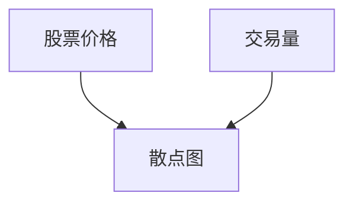
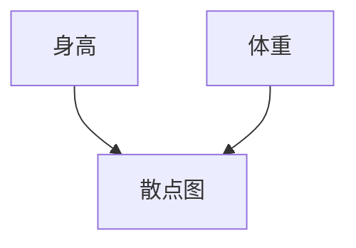
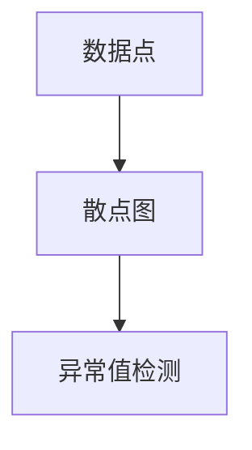
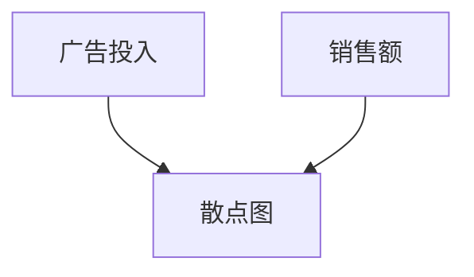

# 散点图应用场景

散点图（Scatter Plot）是一种用于展示两个变量之间关系的图表类型。它通过在二维平面上绘制数据点来显示变量之间的相关性、分布模式或趋势。散点图是数据分析中常用的工具，尤其在探索性数据分析（EDA）中非常有用。

## 什么是散点图？

散点图由一系列的点组成，每个点代表一个数据样本。横轴（X轴）通常表示一个变量，纵轴（Y轴）表示另一个变量。通过观察这些点的分布，我们可以直观地判断两个变量之间是否存在某种关系。

### 散点图的基本结构

- **X轴**：表示第一个变量。
- **Y轴**：表示第二个变量。
- **数据点**：每个点代表一个数据样本，其位置由X和Y的值决定。

## 散点图的应用场景

散点图在许多领域都有广泛的应用，以下是一些常见的应用场景：

### 1. 相关性分析

散点图常用于分析两个变量之间的相关性。例如，在金融领域，我们可以使用散点图来分析股票价格与交易量之间的关系。



### 2. 数据分布

散点图可以帮助我们了解数据的分布情况。例如，在生物学研究中，我们可以使用散点图来展示不同物种的身高与体重之间的关系。



### 3. 异常值检测

散点图还可以用于检测数据中的异常值。通过观察散点图中的离群点，我们可以识别出可能存在的异常数据。



### 4. 趋势分析

散点图可以用于分析数据的趋势。例如，在市场营销中，我们可以使用散点图来分析广告投入与销售额之间的关系，从而判断广告投入是否有效。



## 实际案例

### 案例1：学生成绩分析

假设我们有一组学生的数学成绩和物理成绩数据，我们可以使用散点图来分析这两门成绩之间的关系。

```python
import matplotlib.pyplot as plt

# 示例数据
math_scores = [85, 90, 78, 92, 88, 76, 95, 89, 77, 84]
physics_scores = [82, 88, 75, 90, 85, 74, 93, 87, 76, 83]

# 绘制散点图
plt.scatter(math_scores, physics_scores)
plt.xlabel('Math Scores')
plt.ylabel('Physics Scores')
plt.title('Math vs Physics Scores')
plt.show()
```

:::note
**注意**：上述代码使用了Python的`matplotlib`库来绘制散点图。你可以通过修改数据来观察不同的散点图效果。
:::

### 案例2：气温与冰淇淋销量

假设我们有一组气温和冰淇淋销量的数据，我们可以使用散点图来分析气温对冰淇淋销量的影响。

```python
import matplotlib.pyplot as plt

# 示例数据
temperatures = [22, 25, 28, 30, 32, 35, 38, 40, 42, 45]
ice_cream_sales = [100, 120, 150, 180, 200, 220, 250, 280, 300, 320]

# 绘制散点图
plt.scatter(temperatures, ice_cream_sales)
plt.xlabel('Temperature (°C)')
plt.ylabel('Ice Cream Sales')
plt.title('Temperature vs Ice Cream Sales')
plt.show()
```

:::tip
**提示**：通过观察散点图，我们可以发现气温与冰淇淋销量之间存在正相关关系。
:::

## 总结

散点图是一种强大的数据可视化工具，适用于多种数据分析场景。通过散点图，我们可以直观地观察变量之间的关系、数据的分布、异常值以及趋势。掌握散点图的使用方法，将有助于你在数据分析中做出更准确的判断。

## 附加资源

- [Matplotlib 官方文档](https://matplotlib.org/stable/contents.html)
- [Grafana 官方文档](https://grafana.com/docs/)

## 练习

1. 使用Python的`matplotlib`库绘制一个散点图，分析你所在城市的房价与面积之间的关系。
2. 尝试在Grafana中创建一个散点图面板，展示你感兴趣的两个变量之间的关系。

:::caution
**注意**：在绘制散点图时，确保数据的准确性和完整性，以避免误导性的结论。
:::