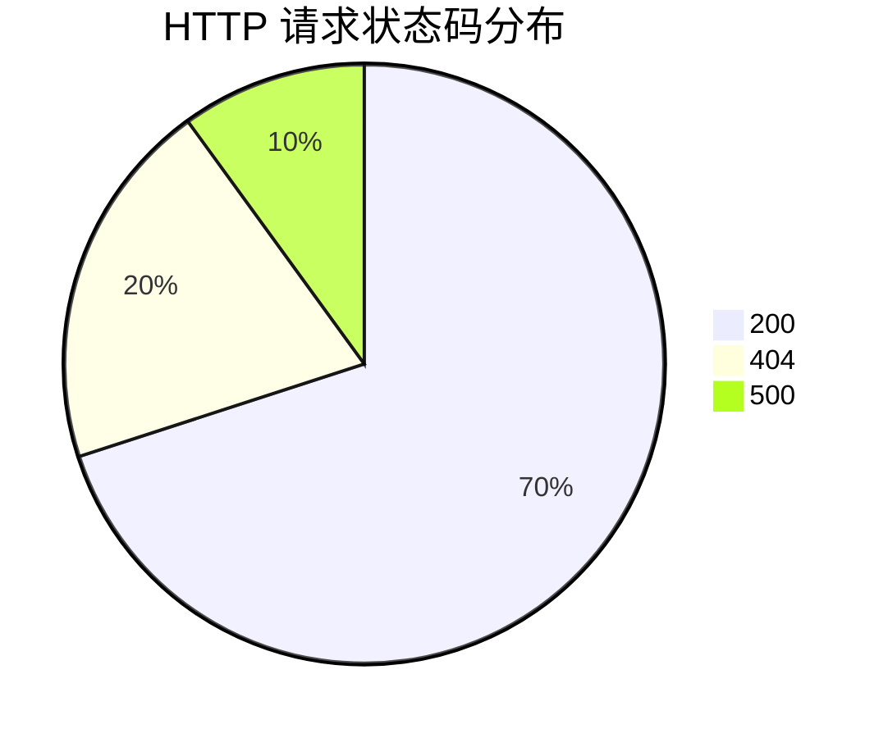

# 饼图与环形图

在数据可视化中，**饼图**和**环形图**是两种常见的图表类型，用于展示数据的分布情况。它们通过将数据划分为不同的扇形区域，直观地表示各部分在整体中的占比。本文将详细介绍如何在 Grafana 中使用这两种图表，并通过实际案例帮助您掌握它们的应用。

## 什么是饼图与环形图？

**饼图**是一种圆形图表，将数据划分为多个扇形区域，每个区域的大小表示其在整体中的占比。**环形图**是饼图的一种变体，中心部分被挖空，形成一个环形结构。这两种图表非常适合展示比例关系，例如市场份额、任务完成情况等。

:::tip
饼图和环形图适用于展示少量类别的数据分布。如果类别过多，可能会导致图表难以阅读。
:::

## 在 Grafana 中创建饼图与环形图

Grafana 提供了强大的可视化功能，支持创建饼图和环形图。以下是逐步指南：

### 1. 准备数据源
首先，确保您已经配置了数据源。Grafana 支持多种数据源，如 Prometheus、MySQL、InfluxDB 等。假设您已经连接了一个数据源。

### 2. 创建新的面板
在 Grafana 中，点击“创建”按钮，选择“面板”并创建一个新的面板。在面板编辑器中，选择“饼图”或“环形图”作为可视化类型。

### 3. 配置查询
在查询编辑器中，编写查询语句以获取需要可视化的数据。例如，如果您使用 Prometheus，可以编写如下查询：

```promql
sum(rate(http_requests_total[5m])) by (status_code)
```

此查询将返回不同状态码的 HTTP 请求速率。

### 4. 配置图表选项
在“显示”选项卡中，您可以配置图表的样式。例如，选择“环形图”模式，调整颜色方案，或启用图例。

### 5. 保存并查看
完成配置后，点击“保存”按钮。您将看到生成的饼图或环形图，展示数据的分布情况。

## 实际案例

假设您正在监控一个 Web 服务的 HTTP 请求状态码分布。您希望了解不同状态码（如 200、404、500 等）的占比情况。通过 Grafana 的饼图或环形图，您可以轻松实现这一目标。

以下是一个示例查询和对应的图表：

```promql
sum(rate(http_requests_total[5m])) by (status_code)
```



:::note
在实际使用中，您可以根据需要调整查询和图表配置，以满足具体的分析需求。
:::

## 总结

饼图和环形图是展示数据分布的有效工具，特别适合初学者使用。通过 Grafana，您可以轻松创建这些图表，并将其应用于各种实际场景中。希望本文能帮助您掌握饼图和环形图的基本使用方法。

## 附加资源与练习

- **练习 1**：尝试在 Grafana 中创建一个饼图，展示您所在团队的每日任务完成情况。
- **练习 2**：使用环形图展示某个服务的错误类型分布。
- **资源**：访问 [Grafana 官方文档](https://grafana.com/docs/) 了解更多高级功能和配置选项。

通过不断实践，您将能够熟练使用饼图和环形图，为您的数据分析工作增添更多价值。