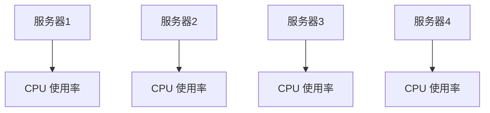

# 热图与色彩映射

热图（Heatmap）是一种强大的数据可视化工具，用于展示数据的分布和密度。它通过色彩映射（Color Mapping）将数值转换为颜色，从而直观地呈现数据的模式和趋势。在 Grafana 中，热图常用于监控和分析时间序列数据，例如服务器负载、网络流量或传感器数据。

## 什么是热图？

热图是一种二维图表，其中每个数据点通过颜色来表示其数值。通常，颜色从冷色调（如蓝色）到暖色调（如红色）渐变，表示数值从低到高的变化。热图特别适合展示大量数据，因为它可以在一张图中清晰地呈现数据的分布和密度。

## 什么是色彩映射？

色彩映射是将数值转换为颜色的过程。在热图中，色彩映射决定了每个数据点的颜色。Grafana 提供了多种色彩映射方案，例如 `Jet`、`Viridis` 和 `Plasma`，每种方案都有其独特的视觉效果和适用场景。

## 如何在 Grafana 中创建热图？

### 1. 准备数据

假设我们有一组时间序列数据，表示某个服务器的 CPU 使用率。数据格式如下：

```json
[
  {"time": "2023-10-01T00:00:00Z", "value": 25},
  {"time": "2023-10-01T01:00:00Z", "value": 30},
  {"time": "2023-10-01T02:00:00Z", "value": 45},
  {"time": "2023-10-01T03:00:00Z", "value": 60},
  {"time": "2023-10-01T04:00:00Z", "value": 50},
  {"time": "2023-10-01T05:00:00Z", "value": 40}
]
```

### 2. 创建热图面板

在 Grafana 中，选择 `Heatmap` 面板类型，并将上述数据导入。Grafana 会自动将时间序列数据转换为热图。

### 3. 配置色彩映射

在面板的 `Display` 选项中，选择适合的色彩映射方案。例如，选择 `Viridis` 方案，它将数值从低到高映射为从紫色到黄色的渐变。

### 4. 调整热图设置

你可以调整热图的 `Bucket size`（桶大小）来控制数据的分辨率。较小的桶大小会显示更多的细节，而较大的桶大小则会显示更广泛的趋势。

## 实际案例：服务器负载监控

假设我们有一个服务器集群，需要监控每台服务器的 CPU 使用率。我们可以使用热图来展示每台服务器的负载情况。



在 Grafana 中，我们可以创建一个热图面板，将每台服务器的 CPU 使用率数据导入，并使用色彩映射来展示负载情况。通过热图，我们可以快速识别出哪些服务器的负载较高，从而采取相应的措施。

## 总结

热图和色彩映射是 Grafana 中强大的数据可视化工具，特别适合展示大量数据的分布和趋势。通过合理配置色彩映射和热图设置，你可以创建出直观且信息丰富的图表，帮助你更好地理解和分析数据。

## 附加资源

- [Grafana 官方文档：热图](https://grafana.com/docs/grafana/latest/visualizations/heatmap/)
- [色彩映射方案比较](https://matplotlib.org/stable/tutorials/colors/colormaps.html)

## 练习

1. 尝试在 Grafana 中创建一个热图，展示某个时间段内的网络流量数据。
2. 比较不同的色彩映射方案，观察它们对数据可视化的影响。
3. 调整热图的桶大小，观察数据分辨率的变化。

:::tip
在创建热图时，选择合适的色彩映射方案和桶大小非常重要。不同的方案和设置会影响数据的呈现效果，因此建议多尝试不同的配置，找到最适合你数据的方案。
:::