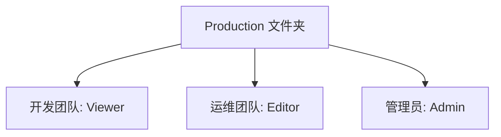

# 告警权限管理

在 Grafana 中，告警权限管理是一个关键功能，它允许管理员控制谁可以创建、编辑、查看或删除告警规则。这对于确保系统的安全性和数据的完整性至关重要，尤其是在团队协作的环境中。本文将逐步介绍 Grafana 中的告警权限管理，并通过实际案例帮助您理解其应用。

## 什么是告警权限管理？

告警权限管理是指通过设置不同的权限级别，控制用户或团队对告警规则的访问和操作权限。Grafana 提供了灵活的权限管理机制，允许管理员根据团队的需求分配不同的权限。

### 权限级别

在 Grafana 中，告警权限主要分为以下几种：

1. **查看权限**：允许用户查看告警规则和告警状态。
2. **编辑权限**：允许用户创建、修改或删除告警规则。
3. **管理权限**：允许用户管理告警规则的所有方面，包括权限分配。

## 如何配置告警权限

Grafana 的告警权限管理主要通过 **文件夹权限** 和 **告警规则权限** 来实现。以下是如何配置这些权限的步骤。

### 1. 配置文件夹权限

在 Grafana 中，告警规则通常存储在特定的文件夹中。通过设置文件夹的权限，您可以控制谁可以访问其中的告警规则。

```bash
# 示例：设置文件夹权限
POST /api/folders/{folder_uid}/permissions
{
  "items": [
    {
      "role": "Viewer",
      "permission": 1
    },
    {
      "role": "Editor",
      "permission": 2
    },
    {
      "role": "Admin",
      "permission": 4
    }
  ]
}
```

- `role`：用户角色（Viewer、Editor、Admin）。
- `permission`：权限级别（1：查看，2：编辑，4：管理）。

### 2. 配置告警规则权限

除了文件夹权限，您还可以为单个告警规则设置权限。这允许更细粒度的控制。

```bash
# 示例：设置告警规则权限
POST /api/alerts/{alert_id}/permissions
{
  "items": [
    {
      "teamId": 1,
      "permission": 2
    },
    {
      "userId": 2,
      "permission": 1
    }
  ]
}
```

- `teamId`：团队 ID。
- `userId`：用户 ID。
- `permission`：权限级别（1：查看，2：编辑）。

## 实际案例

假设您有一个团队，负责监控生产环境的系统状态。您希望：

1. **开发团队** 可以查看告警状态，但不能修改告警规则。
2. **运维团队** 可以创建和修改告警规则。
3. **管理员** 可以管理所有告警规则和权限。

### 配置步骤

1. 创建一个名为 `Production` 的文件夹。
2. 为 `Production` 文件夹设置权限：
   - 开发团队：`Viewer` 权限。
   - 运维团队：`Editor` 权限。
   - 管理员：`Admin` 权限。
3. 在 `Production` 文件夹中创建告警规则，并根据需要为特定规则设置额外的权限。



## 总结

告警权限管理是 Grafana 中确保系统安全和团队协作的重要功能。通过合理配置文件夹和告警规则的权限，您可以确保每个团队成员都能在适当的权限范围内工作，同时保护系统的完整性。

### 附加资源

- [Grafana 官方文档：告警权限管理](https://grafana.com/docs/grafana/latest/alerting/)
- [Grafana API 文档：文件夹权限](https://grafana.com/docs/grafana/latest/http_api/folder/)
- [Grafana API 文档：告警规则权限](https://grafana.com/docs/grafana/latest/http_api/alerting/)

### 练习

1. 在您的 Grafana 实例中创建一个新文件夹，并为其设置不同的权限。
2. 尝试为单个告警规则设置权限，并验证不同用户的访问权限。
3. 思考如何在您的团队中应用告警权限管理，以确保安全和高效的协作。

:::tip
在配置权限时，建议遵循最小权限原则，即只授予用户完成其工作所需的最低权限。
:::