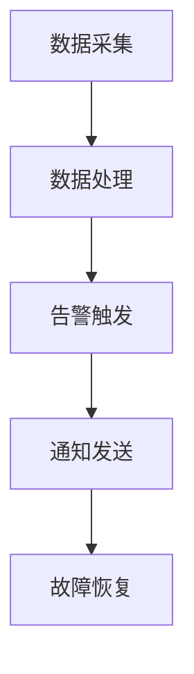

# 高可用告警系统

在现代分布式系统中，监控和告警是确保系统稳定性和可用性的关键组成部分。高可用告警系统（Highly Available Alerting System）是一种能够在系统故障或异常情况下，持续、可靠地发送告警通知的机制。本文将详细介绍高可用告警系统的概念、实现方式以及实际应用场景。

## 什么是高可用告警系统？

高可用告警系统是指在系统出现故障或异常时，能够持续、可靠地发送告警通知的机制。它通常包括以下几个关键组件：

1. **数据采集**：从各种数据源（如服务器、应用程序、数据库等）收集监控数据。
2. **数据处理**：对采集到的数据进行处理和分析，以识别异常情况。
3. **告警触发**：当检测到异常时，触发告警。
4. **通知发送**：将告警信息发送给相关人员或系统。
5. **故障恢复**：在告警处理后，系统能够自动或手动恢复正常状态。

高可用告警系统的核心目标是确保在系统出现故障时，告警信息能够及时、准确地传达给相关人员，以便快速响应和处理。

## 高可用告警系统的实现

### 1. 数据采集

数据采集是高可用告警系统的基础。通常，我们可以使用以下工具进行数据采集：

- **Prometheus**：一个开源的监控和告警工具，广泛用于采集时间序列数据。
- **Grafana**：一个开源的可视化工具，通常与 Prometheus 结合使用，用于展示监控数据。

```yaml
# Prometheus 配置文件示例
global:
  scrape_interval: 15s

scrape_configs:
  - job_name: 'node_exporter'
    static_configs:
      - targets: ['localhost:9100']
```

### 2. 数据处理

数据处理阶段通常包括数据清洗、聚合和分析。我们可以使用 Prometheus 的查询语言 PromQL 来对数据进行处理。

```promql
# 计算 CPU 使用率的 PromQL 查询示例
100 - (avg by (instance) (irate(node_cpu_seconds_total{mode="idle"}[1m])) * 100
```

### 3. 告警触发

告警触发是高可用告警系统的核心。我们可以使用 Prometheus 的告警规则来定义何时触发告警。

```yaml
# Prometheus 告警规则示例
groups:
- name: example
  rules:
  - alert: HighCPUUsage
    expr: 100 - (avg by (instance) (irate(node_cpu_seconds_total{mode="idle"}[1m])) * 100 > 80
    for: 5m
    labels:
      severity: critical
    annotations:
      summary: "High CPU usage detected"
      description: "CPU usage is above 80% for 5 minutes."
```

### 4. 通知发送

当告警触发时，我们需要将告警信息发送给相关人员。常用的通知方式包括电子邮件、Slack、PagerDuty 等。

```yaml
# Prometheus Alertmanager 配置文件示例
route:
  receiver: 'email-notifications'

receivers:
- name: 'email-notifications'
  email_configs:
  - to: 'team@example.com'
```

### 5. 故障恢复

在告警处理后，系统需要能够自动或手动恢复正常状态。这通常涉及到自动化脚本或手动干预。

```bash
# 示例：重启服务的脚本
#!/bin/bash
systemctl restart my-service
```

## 实际应用场景

### 案例：电商网站的高可用告警系统

假设我们有一个电商网站，需要监控以下关键指标：

1. **CPU 使用率**：确保服务器不会因为高负载而崩溃。
2. **响应时间**：确保用户请求的响应时间在可接受范围内。
3. **订单处理成功率**：确保订单处理系统正常运行。

我们可以使用 Prometheus 和 Grafana 来构建高可用告警系统：

1. **数据采集**：使用 Prometheus 采集服务器的 CPU 使用率、响应时间和订单处理成功率。
2. **数据处理**：使用 PromQL 对数据进行处理，识别异常情况。
3. **告警触发**：定义告警规则，当 CPU 使用率超过 80%、响应时间超过 1 秒或订单处理成功率低于 95% 时触发告警。
4. **通知发送**：使用 Alertmanager 将告警信息发送给运维团队。
5. **故障恢复**：在告警处理后，使用自动化脚本或手动干预恢复系统。



## 总结

高可用告警系统是确保分布式系统稳定性和可用性的关键组成部分。通过合理的数据采集、处理、告警触发、通知发送和故障恢复机制，我们可以构建一个可靠的高可用告警系统。本文介绍了高可用告警系统的基本概念、实现方式以及实际应用场景，希望对初学者有所帮助。

## 附加资源

- [Prometheus 官方文档](https://prometheus.io/docs/)
- [Grafana 官方文档](https://grafana.com/docs/)
- [Alertmanager 配置指南](https://prometheus.io/docs/alerting/latest/configuration/)

## 练习

1. 使用 Prometheus 和 Grafana 搭建一个简单的监控系统，监控你的本地服务器的 CPU 使用率。
2. 定义一个告警规则，当 CPU 使用率超过 70% 时触发告警，并将告警信息发送到你的电子邮件。
3. 尝试使用 PromQL 查询语言，计算你的服务器的内存使用率，并在 Grafana 中展示。

通过以上练习，你将更深入地理解高可用告警系统的实现和应用。