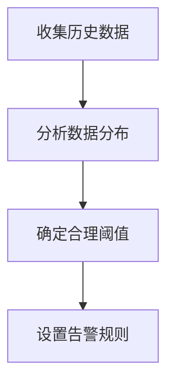

# 告警最佳实践

在监控系统中，告警是确保系统稳定性和及时响应问题的关键组件。Grafana 提供了强大的告警功能，帮助用户监控关键指标并在异常情况下及时通知相关人员。本文将介绍如何在 Grafana 中设置和管理告警，并分享一些最佳实践，以确保告警系统的可靠性和有效性。

## 什么是 Grafana 告警？

Grafana 告警是一种机制，用于在监控指标达到特定阈值或条件时触发通知。告警可以帮助团队及时发现和解决问题，避免系统故障或性能下降。Grafana 告警支持多种通知渠道，如电子邮件、Slack、PagerDuty 等，确保告警信息能够及时传达给相关人员。

## 告警最佳实践

### 1. 定义清晰的告警规则

在设置告警之前，首先需要明确哪些指标需要监控，以及这些指标的阈值是多少。告警规则应基于业务需求和系统性能指标，避免设置过多或过少的告警。

```yaml
# 示例：定义一个 CPU 使用率的告警规则
- alert: HighCPUUsage
  expr: sum(rate(container_cpu_usage_seconds_total[5m])) by (container_name) > 0.8
  for: 5m
  labels:
    severity: critical
  annotations:
    summary: "High CPU usage detected"
    description: "Container {{ $labels.container_name }} has high CPU usage (current value: {{ $value }})."
```

:::tip
**提示**：告警规则应尽量简洁明了，避免复杂的逻辑，以便于维护和调试。
:::

### 2. 设置合理的告警阈值

告警阈值应根据历史数据和业务需求进行设置。过低的阈值可能导致过多的误报，而过高的阈值可能导致漏报。建议通过分析历史数据来确定合理的阈值。



### 3. 使用 `for` 字段避免瞬时告警

瞬时告警通常是由于系统短暂波动引起的，可能并不代表真正的异常。通过设置 `for` 字段，可以确保告警在持续一段时间后才触发，从而减少误报。

```yaml
- alert: HighMemoryUsage
  expr: sum(container_memory_usage_bytes) by (container_name) > 1e9
  for: 10m
  labels:
    severity: warning
  annotations:
    summary: "High memory usage detected"
    description: "Container {{ $labels.container_name }} has high memory usage (current value: {{ $value }})."
```

:::caution
**注意**：`for` 字段的值应根据具体场景进行调整，过长的持续时间可能导致告警响应延迟。
:::

### 4. 分级告警

不同的告警严重程度需要不同的处理方式。建议将告警分为多个级别（如 `warning`、`critical`），并根据严重程度采取不同的响应措施。

```yaml
- alert: DiskSpaceLow
  expr: node_filesystem_free_bytes{mountpoint="/"} < 1e9
  for: 5m
  labels:
    severity: warning
  annotations:
    summary: "Low disk space"
    description: "Disk space on {{ $labels.mountpoint }} is low (current value: {{ $value }})."
```

### 5. 定期审查和优化告警规则

告警规则应定期审查和优化，以确保其仍然符合当前业务需求和系统状态。过时的告警规则可能导致误报或漏报，影响告警系统的有效性。

:::note
**建议**：每季度或每半年对告警规则进行一次全面审查，并根据需要进行调整。
:::

## 实际案例

假设我们有一个在线电商平台，需要监控其订单处理系统的性能。我们可以设置以下告警规则：

1. **订单处理延迟过高**：当订单处理延迟超过 5 秒时触发告警。
2. **订单处理失败率过高**：当订单处理失败率超过 10% 时触发告警。

```yaml
- alert: HighOrderProcessingLatency
  expr: histogram_quantile(0.99, sum(rate(order_processing_latency_seconds_bucket[5m])) by (service)) > 5
  for: 5m
  labels:
    severity: critical
  annotations:
    summary: "High order processing latency"
    description: "Service {{ $labels.service }} has high order processing latency (current value: {{ $value }})."

- alert: HighOrderProcessingFailureRate
  expr: sum(rate(order_processing_failures_total[5m])) by (service)) / sum(rate(order_processing_total[5m])) by (service)) > 0.1
  for: 5m
  labels:
    severity: warning
  annotations:
    summary: "High order processing failure rate"
    description: "Service {{ $labels.service }} has high order processing failure rate (current value: {{ $value }})."
```

## 总结

通过遵循上述最佳实践，您可以构建一个可靠且有效的 Grafana 告警系统。清晰的告警规则、合理的阈值设置、分级告警以及定期审查和优化告警规则，都是确保告警系统高效运行的关键。

## 附加资源

- [Grafana 官方文档](https://grafana.com/docs/grafana/latest/alerting/)
- [Prometheus 告警规则指南](https://prometheus.io/docs/practices/alerting/)

## 练习

1. 为您的监控系统设置一个 CPU 使用率的告警规则，并测试其触发条件。
2. 分析您的系统历史数据，确定一个合理的磁盘空间告警阈值，并设置相应的告警规则。
3. 定期审查您的告警规则，并根据需要进行优化。

通过实践这些步骤，您将能够更好地掌握 Grafana 告警的使用方法，并提升系统的监控能力。