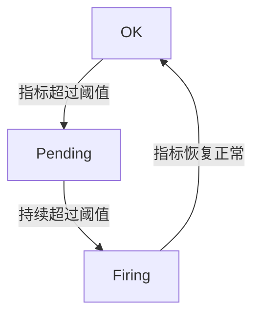

# 告警状态与历史

在监控系统中，告警是确保系统稳定性和可靠性的重要组成部分。Grafana 提供了强大的告警功能，允许用户定义告警规则、监控指标，并在触发告警时采取相应的行动。本文将详细介绍 Grafana 中的告警状态与历史，帮助初学者理解如何有效地管理和监控告警。

## 什么是告警状态与历史？

告警状态是指告警规则在特定时间点的状态。Grafana 中的告警状态通常包括以下几种：

- **OK**：指标正常，未触发告警。
- **Pending**：指标已达到告警阈值，但尚未满足告警持续时间条件。
- **Firing**：指标已达到告警阈值，并且满足告警持续时间条件，告警已触发。
- **No Data**：无法获取指标数据，可能是数据源问题或指标未定义。

告警历史则记录了告警状态的变化过程，包括告警触发、恢复以及状态变更的时间点。通过告警历史，用户可以追溯告警的触发原因、持续时间以及处理情况。

## 告警状态的生命周期

告警状态的生命周期通常包括以下几个阶段：

1. **OK**：初始状态，指标正常。
2. **Pending**：当指标达到告警阈值时，告警进入 Pending 状态。此时，Grafana 会检查指标是否持续超过阈值一段时间（由告警规则定义）。
3. **Firing**：如果指标在 Pending 状态下持续超过阈值，告警将进入 Firing 状态，并触发通知。
4. **OK**：当指标恢复正常时，告警状态将重新变为 OK。

:::note
告警状态的转换是自动的，Grafana 会根据指标数据和告警规则自动更新状态。
:::

## 告警历史的查看与管理

Grafana 提供了告警历史面板，用户可以通过该面板查看告警的触发时间、持续时间、状态变化等信息。告警历史面板通常包括以下信息：

- **告警名称**：告警规则的名称。
- **触发时间**：告警触发的时间点。
- **持续时间**：告警从触发到恢复的时间。
- **状态**：告警的当前状态（OK、Pending、Firing、No Data）。
- **详细信息**：告警触发时的指标值和告警规则。

### 示例：查看告警历史

假设我们有一个告警规则，监控 CPU 使用率。当 CPU 使用率超过 80% 并持续 5 分钟时，触发告警。我们可以通过以下步骤查看告警历史：

1. 打开 Grafana 仪表盘，进入告警面板。
2. 选择相应的告警规则，查看告警历史。
3. 在告警历史面板中，可以看到告警的触发时间、持续时间以及状态变化。



## 实际案例：监控 Web 服务的响应时间

假设我们有一个 Web 服务，需要监控其响应时间。我们可以定义一个告警规则，当响应时间超过 500ms 并持续 2 分钟时，触发告警。

### 告警规则定义

```yaml
alert: HighResponseTime
expr: avg(rate(http_request_duration_seconds_sum[1m])) > 0.5
for: 2m
labels:
  severity: critical
annotations:
  summary: "High response time detected"
  description: "The average response time is over 500ms for the last 2 minutes."
```

### 告警状态与历史

当响应时间超过 500ms 时，告警将进入 Pending 状态。如果响应时间持续超过 500ms 并达到 2 分钟，告警将进入 Firing 状态，并触发通知。当响应时间恢复正常时，告警状态将重新变为 OK。

:::tip
在实际应用中，告警规则的定义应根据业务需求进行调整，确保告警的准确性和及时性。
:::

## 总结

告警状态与历史是 Grafana 监控系统中不可或缺的一部分。通过理解告警状态的生命周期和告警历史的查看方法，用户可以更好地管理和监控系统的健康状况。本文介绍了告警状态的基本概念、生命周期以及实际应用案例，帮助初学者掌握 Grafana 中的告警管理。

## 附加资源与练习

- **练习**：尝试在 Grafana 中创建一个简单的告警规则，监控某个指标，并观察告警状态的变化。
- **资源**：阅读 Grafana 官方文档，了解更多关于告警规则和告警管理的详细信息。

:::caution
告警规则的设置应谨慎，避免频繁触发误报，影响系统的正常运行。
:::