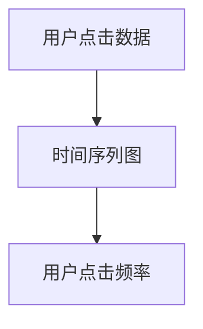
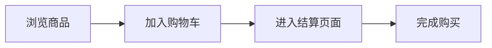
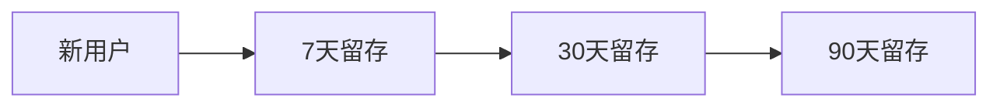
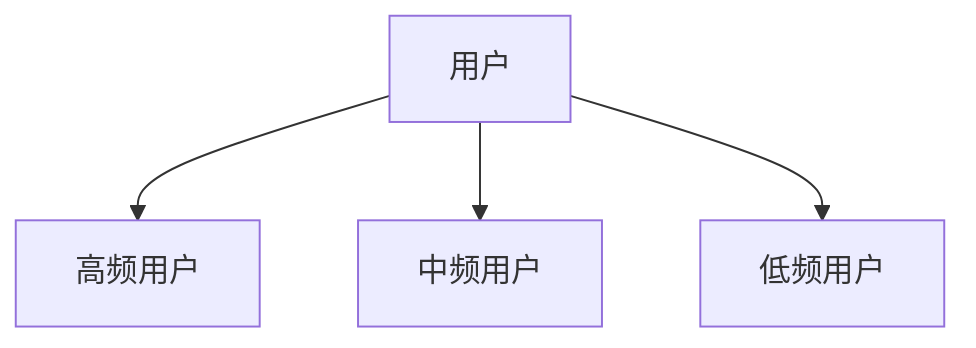

## 介绍

用户行为分析是指通过收集和分析用户在系统中的操作数据，来了解用户的行为模式、偏好和需求。这对于优化用户体验、改进产品功能以及提升系统性能至关重要。Grafana 作为一个强大的数据可视化和监控工具，可以帮助您轻松实现用户行为分析。

在本教程中，我们将逐步介绍如何使用 Grafana 的高级功能来进行用户行为分析，并通过实际案例展示其应用场景。

## 准备工作

在开始之前，请确保您已经完成以下准备工作：

1. 安装并配置 Grafana。
2. 确保您有访问相关数据源的权限。
3. 准备好用于分析的用户行为数据。

## 数据收集

用户行为分析的第一步是收集用户的操作数据。这些数据可以包括用户的点击、页面浏览、表单提交等。通常，这些数据可以通过日志文件、数据库或第三方分析工具（如 Google Analytics）获取。

### 示例：收集用户点击数据

假设我们有一个简单的日志文件，记录了用户的点击事件：

```plaintext
2023-10-01T12:00:00Z, user123, /home
2023-10-01T12:01:00Z, user123, /products
2023-10-01T12:02:00Z, user123, /cart
2023-10-01T12:03:00Z, user123, /checkout
```

我们可以将这些数据导入 Grafana 进行分析。

## 数据可视化

Grafana 提供了多种可视化工具，帮助您更好地理解用户行为数据。以下是一些常用的可视化类型：

- **时间序列图**：展示用户行为随时间的变化。
- **柱状图**：比较不同用户行为的频率。
- **热力图**：展示用户行为的密集程度。

### 示例：创建时间序列图

假设我们已经将用户点击数据导入 Grafana，现在我们可以创建一个时间序列图来展示用户点击的频率。

1. 在 Grafana 中创建一个新的仪表板。
2. 添加一个新的面板，并选择“时间序列”作为可视化类型。
3. 配置数据源，选择包含用户点击数据的日志文件。
4. 设置时间范围，并选择适当的聚合函数（如计数）。
5. 保存并查看图表。



## 用户行为分析

通过可视化工具，我们可以更深入地分析用户行为。以下是一些常见的分析场景：

### 1. 用户路径分析

用户路径分析是指跟踪用户在系统中的操作路径，了解用户从进入系统到完成目标（如购买商品）的整个过程。

#### 示例：用户路径分析

假设我们有一个电子商务网站，我们可以分析用户从浏览商品到完成购买的路径。



通过分析用户路径，我们可以发现用户在哪个步骤流失最多，从而优化该步骤的用户体验。

### 2. 用户留存分析

用户留存分析是指分析用户在系统中的持续使用情况，了解用户的忠诚度和活跃度。

#### 示例：用户留存分析

我们可以创建一个留存率图表，展示用户在不同时间段内的留存情况。



通过分析留存率，我们可以了解用户的忠诚度，并采取措施提高用户留存。

### 3. 用户分群分析

用户分群分析是指将用户按照某些特征（如行为、 demographics）进行分组，以便更精准地分析不同用户群体的行为。

#### 示例：用户分群分析

我们可以将用户按照购买频率分为高、中、低三个群体，并分析每个群体的行为特征。



通过用户分群分析，我们可以针对不同群体制定个性化的营销策略。

## 实际案例

### 案例：优化电子商务网站的用户体验

假设我们运营一个电子商务网站，发现用户在结算页面的流失率较高。通过用户行为分析，我们发现用户在填写支付信息时遇到了困难。于是，我们优化了支付流程，简化了表单填写步骤，并提供了更多的支付选项。经过优化后，用户的结算成功率显著提高。

## 总结

用户行为分析是优化用户体验、提升系统性能的重要手段。通过 Grafana 的高级功能，我们可以轻松实现用户行为数据的收集、可视化和分析。希望本教程能帮助您更好地理解用户行为分析的概念，并在实际项目中应用这些技术。

## 附加资源

- [Grafana 官方文档](https://grafana.com/docs/)
- [用户行为分析的最佳实践](https://www.example.com/user-behavior-best-practices)
- [Grafana 社区论坛](https://community.grafana.com/)

## 练习

1. 尝试在 Grafana 中创建一个时间序列图，展示用户点击的频率。
2. 分析一个电子商务网站的用户路径，找出用户流失最多的步骤。
3. 将用户按照购买频率进行分群，并分析每个群体的行为特征。

:::tip
在完成练习时，可以参考 Grafana 的官方文档和社区论坛，获取更多帮助和灵感。
:::