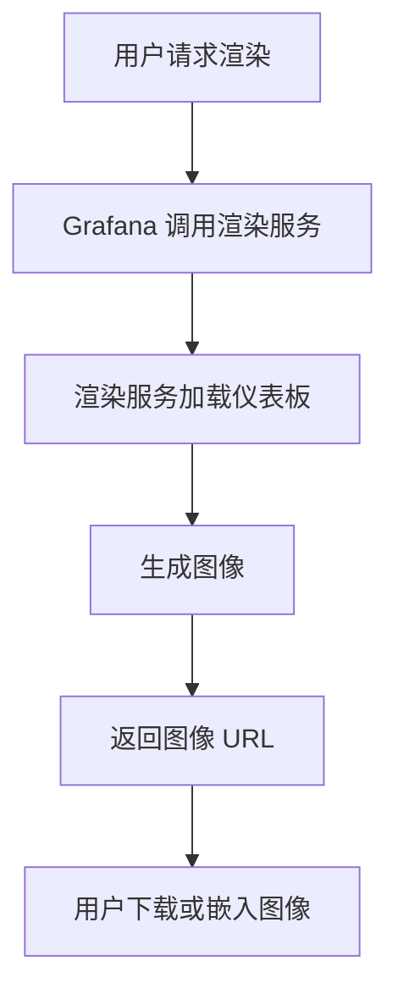

# 图像渲染服务

Grafana 的图像渲染服务（Image Rendering Service）是一项强大的功能，允许用户将仪表板或面板渲染为静态图像。这对于生成报告、共享仪表板状态或集成到自动化流程中非常有用。本文将详细介绍图像渲染服务的工作原理、配置方法以及实际应用场景。

## 什么是图像渲染服务？

图像渲染服务是 Grafana 提供的一个独立服务，用于将仪表板或面板渲染为 PNG 或 PDF 格式的图像。它通过无头浏览器（如 PhantomJS 或 Chrome Headless）加载仪表板，并将其内容捕获为图像。这个功能特别适合需要定期生成报告或将仪表板状态嵌入到其他系统中的场景。

:::note
图像渲染服务通常用于生成静态图像，但也可以用于生成动态内容，例如带有时间戳的仪表板快照。
:::

## 配置图像渲染服务

在 Grafana 中，图像渲染服务可以通过以下步骤进行配置：

1. **启用图像渲染服务**：默认情况下，Grafana 会使用内置的图像渲染服务。如果需要更高的性能或自定义配置，可以启用独立的渲染服务。

2. **安装独立渲染服务**：
   - 下载并安装 Grafana 图像渲染服务的独立版本。
   - 启动服务并确保其与 Grafana 实例通信。

3. **配置 Grafana**：
   - 在 Grafana 的配置文件（`grafana.ini`）中，设置 `[rendering]` 部分的参数，例如 `server_url` 和 `callback_url`。

   ```ini
   [rendering]
   server_url = http://localhost:8081/render
   callback_url = http://localhost:3000/
   ```

4. **测试渲染服务**：
   - 在 Grafana 中打开一个仪表板，点击“分享”按钮，选择“直接链接渲染图像”。
   - 确认图像能够正确生成并下载。

## 使用图像渲染服务

### 通过 API 渲染图像

Grafana 提供了 REST API 来渲染图像。以下是一个使用 `curl` 命令通过 API 渲染图像的示例：

```bash
curl -X POST \
  -H "Authorization: Bearer <API_KEY>" \
  -H "Content-Type: application/json" \
  -d '{
        "dashboard": {
          "uid": "dash-uid"
        },
        "panelId": 2,
        "width": 1000,
        "height": 500,
        "time": {
          "from": "now-6h",
          "to": "now"
        }
      }' \
  http://localhost:3000/api/render
```

**输入**：
- `dashboard.uid`：仪表板的唯一标识符。
- `panelId`：要渲染的面板 ID。
- `width` 和 `height`：图像的宽度和高度。
- `time`：时间范围，用于指定渲染的时间段。

**输出**：
- 返回一个 PNG 或 PDF 文件的 URL，可以直接下载或嵌入到其他系统中。

### 渲染仪表板快照

Grafana 还支持生成仪表板快照，并将其渲染为图像。以下是一个生成快照并渲染的示例：

1. 在 Grafana 中打开仪表板，点击“分享”按钮。
2. 选择“快照”选项卡，生成一个快照链接。
3. 使用图像渲染服务将快照渲染为图像。

## 实际应用场景

### 1. 自动化报告生成

图像渲染服务可以集成到自动化流程中，定期生成仪表板图像并发送给相关人员。例如，每天生成一份系统性能报告，并通过邮件发送。

```bash
# 示例：每天生成报告并发送邮件
0 8 * * * curl -X POST -H "Authorization: Bearer <API_KEY>" -o report.png http://localhost:3000/api/render && mail -s "Daily Report" user@example.com -A report.png
```

### 2. 嵌入到其他系统

将渲染的图像嵌入到其他系统中，例如 Confluence 文档、Slack 消息或监控工具中。这样可以实时展示仪表板的状态。

```markdown

```

### 3. 共享仪表板状态

通过图像渲染服务生成仪表板的静态图像，可以方便地共享给没有访问 Grafana 权限的人员。

## 总结

Grafana 的图像渲染服务是一个强大的工具，能够将动态仪表板转换为静态图像，适用于报告生成、系统集成和共享等多种场景。通过本文的学习，你应该已经掌握了如何配置和使用图像渲染服务，并了解了其实际应用。

:::tip
如果你希望进一步探索，可以尝试将图像渲染服务与 Grafana 的告警功能结合，自动生成告警状态的图像并发送通知。
:::

## 附加资源

- [Grafana 官方文档：图像渲染服务](https://grafana.com/docs/grafana/latest/administration/image-rendering/)
- [Grafana API 文档](https://grafana.com/docs/grafana/latest/http_api/)
- [使用 Mermaid 绘制流程图](#)

## 练习

1. 配置 Grafana 的图像渲染服务，并尝试通过 API 渲染一个仪表板图像。
2. 将渲染的图像集成到一个自动化脚本中，每天生成并发送报告。
3. 尝试使用 Mermaid 绘制一个流程图，展示图像渲染服务的工作流程。



通过以上练习，你将更深入地理解图像渲染服务的应用和潜力。祝你学习愉快！