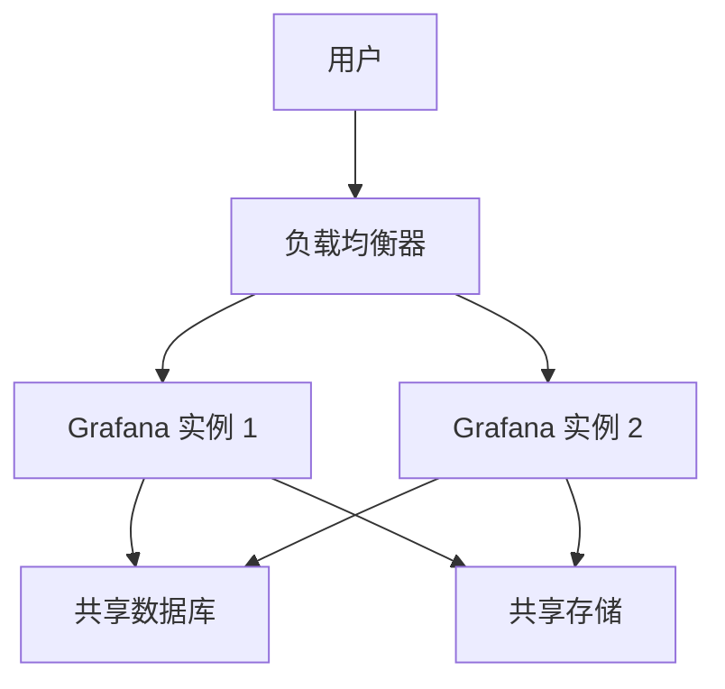

# 高可用部署架构

在现代监控系统中，高可用性（High Availability, HA）是一个至关重要的概念。高可用性意味着系统能够在出现故障时继续正常运行，从而确保服务的连续性和数据的完整性。Grafana 作为一个流行的监控和可视化工具，支持高可用部署架构，以满足企业级需求。

## 什么是高可用部署架构？

高可用部署架构是指通过冗余和故障转移机制，确保系统在部分组件失效时仍能继续提供服务。对于 Grafana 来说，高可用部署通常涉及多个 Grafana 实例、负载均衡器、共享数据库和存储系统。

### 高可用架构的核心组件

1. **多个 Grafana 实例**：部署多个 Grafana 实例，确保在一个实例失效时，其他实例可以接管工作。
2. **负载均衡器**：用于将流量分发到多个 Grafana 实例，确保负载均衡和故障转移。
3. **共享数据库**：所有 Grafana 实例共享同一个数据库（如 PostgreSQL 或 MySQL），以确保配置和数据的一致性。
4. **共享存储**：用于存储仪表板、插件和其他资源，确保所有实例都能访问相同的资源。

## 高可用部署架构的实现步骤

### 1. 部署多个 Grafana 实例

首先，你需要在不同的服务器或容器中部署多个 Grafana 实例。每个实例都应该配置相同的环境变量和配置文件。

```bash
# 示例：使用 Docker 部署多个 Grafana 实例
docker run -d --name grafana1 -p 3000:3000 grafana/grafana
docker run -d --name grafana2 -p 3001:3000 grafana/grafana
```

### 2. 配置负载均衡器

接下来，你需要配置一个负载均衡器（如 Nginx 或 HAProxy）来分发流量到多个 Grafana 实例。

```nginx
# 示例：Nginx 配置
http {
    upstream grafana {
        server 127.0.0.1:3000;
        server 127.0.0.1:3001;
    }

    server {
        listen 80;

        location / {
            proxy_pass http://grafana;
        }
    }
}
```

### 3. 配置共享数据库

所有 Grafana 实例应该连接到同一个数据库。你可以在 `grafana.ini` 配置文件中指定数据库连接信息。

```ini
# 示例：grafana.ini 配置文件
[database]
type = postgres
host = 127.0.0.1:5432
name = grafana
user = grafana
password = secret
```

### 4. 配置共享存储

为了确保所有 Grafana 实例都能访问相同的仪表板和插件，你需要配置共享存储（如 NFS 或 S3）。

```ini
# 示例：grafana.ini 配置文件
[paths]
data = /shared/grafana/data
plugins = /shared/grafana/plugins
```

## 实际案例：企业级监控系统

假设你正在为一个大型企业构建监控系统，该系统需要处理数千个指标和仪表板。通过使用 Grafana 的高可用部署架构，你可以确保即使某个 Grafana 实例或服务器出现故障，监控系统仍能正常运行。



## 总结

高可用部署架构是确保 Grafana 系统稳定性和可靠性的关键。通过部署多个 Grafana 实例、配置负载均衡器、共享数据库和存储，你可以构建一个能够应对故障的监控系统。

:::tip
**练习**：尝试在你的本地环境中部署两个 Grafana 实例，并使用 Nginx 配置负载均衡器。观察当其中一个实例失效时，系统是否能够继续正常运行。
:::

:::note
**附加资源**：
- [Grafana 官方文档](https://grafana.com/docs/)
- [Nginx 负载均衡配置指南](https://nginx.org/en/docs/http/load_balancing.html)
- [PostgreSQL 高可用性解决方案](https://www.postgresql.org/docs/current/high-availability.html)
:::