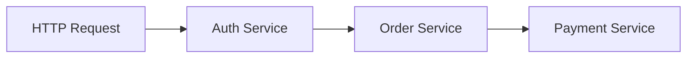

# Jaeger 简介

## 什么是Jaeger？

Jaeger 是一个开源的**分布式追踪系统**，由 Uber 开发并贡献给云原生计算基金会（CNCF）。它用于监控和排查微服务架构中的复杂事务问题，帮助开发者理解请求在多个服务间的流动路径、延迟和依赖关系。

:::note 分布式追踪是什么？
分布式追踪是一种记录请求在分布式系统中流转路径的技术。例如，一个电商网站的“下单”操作可能涉及用户服务、订单服务、支付服务等多个模块，追踪系统会记录请求经过的每个服务节点及其耗时。
:::

---

## 核心概念

### 1. Span（跨度）
**Span** 是 Jaeger 中的基本单元，代表一个独立的工作单元（如一次函数调用、数据库查询）。每个 Span 包含：
- 操作名称（如 `GET /api/users`）
- 开始和结束时间戳
- 键值对形式的标签（Tags）和日志（Logs）

### 2. Trace（追踪）
**Trace** 是由多个 Span 组成的有向无环图（DAG），表示一个完整的事务流程。例如，一次 HTTP 请求从网关到微服务的调用链。



### 3. Context Propagation（上下文传播）
Jaeger 通过 `traceID` 和 `spanID` 在服务间传递上下文，确保不同服务产生的 Span 能关联到同一个 Trace 中。

---

## 快速示例

以下是一个使用 Jaeger 追踪 Node.js 应用的代码片段：

1. **安装依赖**：
```bash
npm install jaeger-client
```

2. **初始化 Jaeger 客户端**：
```javascript
const { initTracer } = require('jaeger-client');

const config = {
  serviceName: 'my-awesome-app',
  sampler: { type: 'const', param: 1 }, // 采样率：100%
  reporter: { logSpans: true }
};
const tracer = initTracer(config);
```

3. **创建 Span**：
```javascript
const span = tracer.startSpan('say-hello');
span.setTag('greeting', 'Hello World');
span.log({ event: 'wave' });
// ... 业务逻辑 ...
span.finish(); // 结束 Span
```

4. **输出结果**：
Jaeger UI 中将显示如下信息：
- TraceID: `3a4b5c6d7e8f9g0h`
- Span: `say-hello`，耗时 15ms，标签 `greeting="Hello World"`

---

## 实际应用场景

### 案例：电商订单系统
假设用户下单时经历了以下服务：
1. **API 网关**验证请求
2. **订单服务**创建订单
3. **库存服务**扣减库存
4. **支付服务**处理付款

Jaeger 的追踪结果可能如下：

```mermaid
gantt
  title 订单处理流程
  dateFormat  X
  axisFormat %s
  section 服务调用
  API 网关      :a1, 0, 10
  订单服务      :a2, after a1, 20
  库存服务      :a3, after a2, 15
  支付服务      :a4, after a3, 30
```


通过 Jaeger UI，开发者可以快速发现支付服务耗时过长，进而针对性优化。

---

## 总结

### 关键点回顾
- Jaeger 用于解决微服务架构中的**可视化排查**问题。
- **Span** 和 **Trace** 是核心数据模型。
- 支持多种语言（Java、Go、Python 等）的客户端库。

### 后续学习建议
1. 尝试在本地部署 [Jaeger All-in-One](https://www.jaegertracing.io/docs/1.46/getting-started/)。
2. 为你的微服务项目添加追踪代码。
3. 学习如何配置采样率以平衡性能和数据量。

:::tip 扩展阅读
- [Jaeger 官方文档](https://www.jaegertracing.io/docs/)
- 《分布式追踪：原理与实践》（书籍）
:::