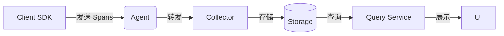
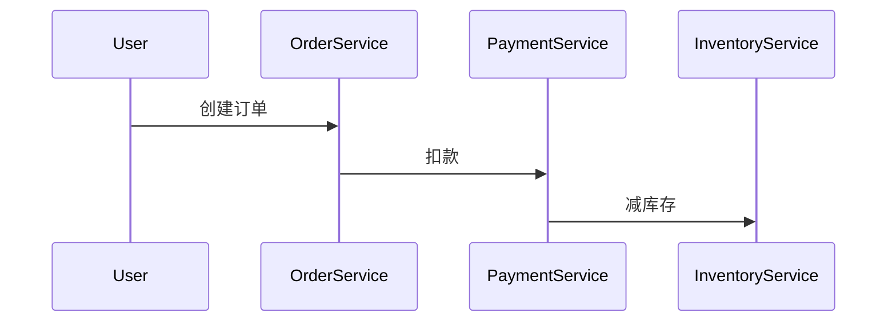

## 介绍

Jaeger 是一个开源的分布式追踪系统，由 Uber 开发并贡献给云原生计算基金会（CNCF）。它用于监控和排查微服务架构中的复杂事务。本文将介绍 Jaeger 的核心架构组件及其协作方式，帮助你理解其设计哲学和实际应用场景。

## Jaeger 核心组件

Jaeger 的架构主要由以下组件构成：

1. **Client SDK**：集成到应用程序中，负责生成追踪数据（Spans）。
2. **Agent**：接收客户端发送的追踪数据，并转发给 Collector。
3. **Collector**：接收、验证和处理追踪数据，然后存储到后端。
4. **Storage**：持久化存储追踪数据（如 Cassandra、Elasticsearch 等）。
5. **Query Service**：提供 API 和 UI 查询追踪数据。
6. **UI**：可视化展示追踪结果。



### 1. Client SDK

Client SDK 是集成到应用程序中的库，支持多种语言（如 Go、Java、Python 等）。它负责生成 **Spans**（追踪的基本单元），并将它们发送到 Jaeger Agent。

:::note
**Span** 是 Jaeger 中的基本概念，代表一个独立的工作单元（如 HTTP 请求或数据库调用）。
:::

#### 示例代码（Go）：
```go
import (
    "github.com/uber/jaeger-client-go"
    "github.com/uber/jaeger-client-go/config"
)

func initTracer() (opentracing.Tracer, io.Closer) {
    cfg := config.Configuration{
        ServiceName: "my-service",
        Sampler: &config.SamplerConfig{
            Type:  "const",
            Param: 1,
        },
    }
    tracer, closer, err := cfg.NewTracer()
    if err != nil {
        panic(err)
    }
    return tracer, closer
}
```

### 2. Agent

Agent 是一个轻量级的守护进程，通常部署在应用服务器上。它接收来自 Client SDK 的 Spans，并通过 UDP 协议批量转发给 Collector。

:::tip
Agent 的设计减少了客户端与 Collector 的直接耦合，提高了系统的可扩展性。
:::

### 3. Collector

Collector 负责接收 Agent 发送的 Spans，并进行以下操作：
- **验证**：检查 Span 数据的完整性。
- **处理**：执行采样、过滤或转换。
- **存储**：将数据写入后端存储（如 Cassandra 或 Elasticsearch）。

### 4. Storage

Jaeger 支持多种存储后端：
- **Cassandra**：适合高写入负载的场景。
- **Elasticsearch**：支持全文搜索和复杂查询。
- **内存存储**：仅用于开发和测试。

### 5. Query Service 和 UI

Query Service 提供 REST API 查询追踪数据，UI 则通过可视化界面展示调用链和性能指标。

## 实际应用场景

假设一个电商平台的订单服务调用支付服务和库存服务。通过 Jaeger，可以追踪整个请求流：
1. 用户下单 → 订单服务生成 Span。
2. 订单服务调用支付服务 → 生成子 Span。
3. 支付服务调用库存服务 → 生成子 Span。



## 总结

Jaeger 的架构设计解耦了数据生成、传输、存储和展示，使其能够高效处理大规模分布式系统的追踪需求。关键组件包括：
- Client SDK 生成 Spans。
- Agent 和 Collector 处理数据传输。
- Storage 持久化数据。
- Query Service 和 UI 提供查询和可视化。

## 附加资源
1. [Jaeger 官方文档](https://www.jaegertracing.io/docs/)
2. 练习：尝试在本地部署 Jaeger 并追踪一个简单的微服务应用。