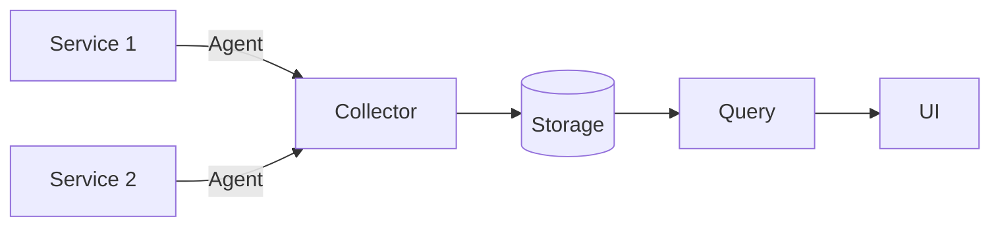
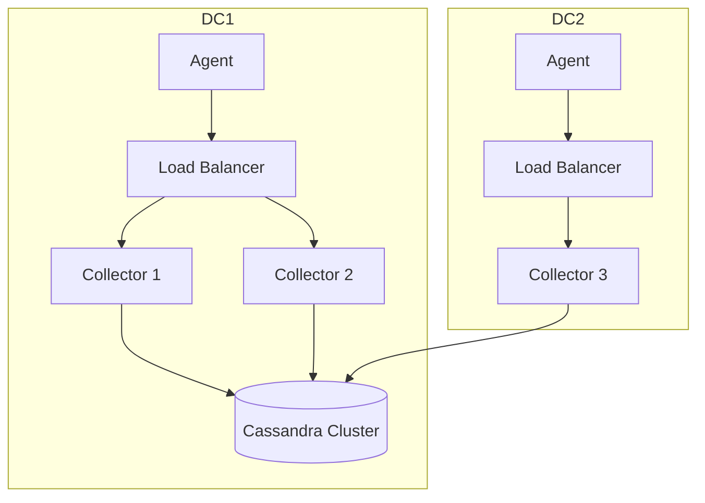

# Jaeger 部署模式

## 介绍

Jaeger是一个开源的分布式追踪系统，用于监控和排查微服务架构中的性能问题。根据不同的生产需求，Jaeger提供了多种**部署模式**，从开发环境快速启动的单一节点到生产环境的高可用集群。本文将详细介绍这些模式及其适用场景。

---

## 1. All-in-One 模式

**适用场景**：开发、测试或快速演示环境。

All-in-One模式将所有Jaeger组件（Agent、Collector、Query、Storage等）打包在一个进程中，使用内存存储（默认）或外部数据库（如Badger、Cassandra）。优点是部署简单，但不可用于生产环境。

```bash
# 启动All-in-One容器（内存存储）
docker run -d --name jaeger \
  -p 16686:16686 \    # UI端口
  -p 4317:4317 \      # OTLP接收端口
  jaegertracing/all-in-one:latest
```

访问 `http://localhost:16686` 即可打开Jaeger UI。

:::note
内存存储会在进程重启后丢失数据，仅适合临时测试。
:::

---

## 2. Collector与Storage分离模式

**适用场景**：生产环境，需要高可用性和持久化存储。

此模式下，Jaeger组件独立部署：
- **Agent**：部署在每个服务节点上，负责收集追踪数据并发送给Collector。
- **Collector**：接收Agent数据，处理后写入存储。
- **Storage**：持久化数据（如Cassandra、Elasticsearch）。
- **Query**：从存储中检索数据并提供UI界面。



### 配置示例（Docker Compose）
```yaml
version: '3'
services:
  jaeger-collector:
    image: jaegertracing/jaeger-collector
    ports:
      - "14269:14269" # 健康检查
    environment:
      - SPAN_STORAGE_TYPE=cassandra
      - CASSANDRA_SERVERS=cassandra
  cassandra:
    image: cassandra:3.11
  jaeger-query:
    image: jaegertracing/jaeger-query
    ports:
      - "16686:16686"
    environment:
      - SPAN_STORAGE_TYPE=cassandra
      - CASSANDRA_SERVERS=cassandra
```

---

## 3. 高可用部署

**关键点**：
- **Collector水平扩展**：多个Collector实例通过负载均衡接收数据。
- **存储集群化**：如Cassandra或Elasticsearch集群。
- **异地冗余**：跨数据中心部署。



---

## 实际案例：电商平台追踪

**场景**：用户下单流程涉及多个微服务（订单、支付、库存）。  
**部署方案**：
1. 每个服务Pod中注入Jaeger Agent。
2. 区域级部署Collector集群，数据写入Elasticsearch。
3. 全局Query服务聚合多区域数据。

---

## 总结

| 模式            | 存储类型       | 适用场景         |
|-----------------|---------------|------------------|
| All-in-One      | 内存          | 开发/测试        |
| 组件分离        | Cassandra/ES  | 中小型生产环境   |
| 高可用集群      | 分布式数据库  | 大型分布式系统   |

## 延伸学习
- 官方文档：[Jaeger Deployment](https://www.jaegertracing.io/docs/latest/deployment/)
- 练习：尝试在Kubernetes中部署高可用Jaeger集群。