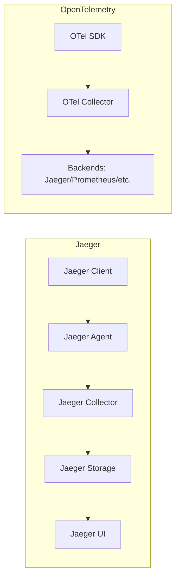

# Jaeger 与OpenTelemetry比较

## 介绍

在现代微服务架构中，分布式追踪（Distributed Tracing）是诊断性能问题和理解系统行为的关键工具。Jaeger和OpenTelemetry是当前最流行的两种解决方案，但它们的定位和功能存在显著差异。本文将帮助初学者理解两者的核心区别、适用场景以及如何选择。

:::note 关键概念
- **Jaeger**：专注于分布式追踪的端到端解决方案，提供数据收集、存储和可视化。
- **OpenTelemetry**：跨语言的观测性框架，支持追踪（Tracing）、指标（Metrics）和日志（Logging）。
:::

---

## 核心功能对比

### 1. 架构设计


- **Jaeger**：自成体系的闭环系统，包含从数据采集到展示的全套组件。
- **OpenTelemetry**：模块化设计，通过 Collector 将数据导出到多种后端（如 Jaeger、Prometheus）。

### 2. 数据模型
- Jaeger 使用自定义的 Span 模型，而 OpenTelemetry 实现了 [OpenTelemetry Protocol (OTLP)](https://opentelemetry.io/docs/specs/otel/protocol/) 标准。
- OpenTelemetry 的 Span 包含更丰富的语义约定（Semantic Conventions），例如标准化的属性命名（如 `http.method`）。

---

## 代码示例对比

### Jaeger 示例（Go）
```go
import (
	"context"
	"github.com/jaegertracing/jaeger-client-go/config"
)

func main() {
	cfg := config.Configuration{
		ServiceName: "my-service",
		Sampler: &config.SamplerConfig{Type: "const", Param: 1},
	}
	tracer, closer, _ := cfg.NewTracer()
	defer closer.Close()

	span := tracer.StartSpan("say-hello")
	defer span.Finish()
	span.SetTag("greeting", "hello world")
}
```

### OpenTelemetry 示例（Go）
```go
import (
	"context"
	"go.opentelemetry.io/otel"
	"go.opentelemetry.io/otel/exporters/jaeger"
	"go.opentelemetry.io/otel/sdk/trace"
)

func main() {
	exporter, _ := jaeger.New(jaeger.WithCollectorEndpoint())
	tp := trace.NewTracerProvider(trace.WithBatcher(exporter))
	otel.SetTracerProvider(tp)

	tracer := otel.Tracer("my-service")
	ctx, span := tracer.Start(context.Background(), "say-hello")
	defer span.End()
	span.SetAttributes(attribute.String("greeting", "hello world"))
}
```

:::tip 关键差异
- OpenTelemetry 的 API 更标准化（如 `otel.Tracer`）。
- Jaeger 的配置更“一站式”，而 OpenTelemetry 需要显式选择导出目标。
:::

---

## 实际应用场景

### 何时选择 Jaeger？
1. **快速上手**：需要开箱即用的完整追踪系统。
2. **简单部署**：小团队或单一技术栈项目。
3. **已有集成**：使用 Kubernetes 时可通过 [Jaeger Operator](https://www.jaegertracing.io/docs/1.46/operator/) 快速部署。

### 何时选择 OpenTelemetry？
1. **多信号观测**：需要同时处理追踪、指标和日志。
2. **长期维护**：OpenTelemetry 是 CNCF 毕业项目，社区支持更活跃。
3. **供应商中立**：避免被特定后端（如 Jaeger）锁定。

---

## 总结与建议

| 特性                | Jaeger            | OpenTelemetry       |
|---------------------|-------------------|---------------------|
| 数据收集            | 仅追踪            | 追踪+指标+日志      |
| 部署复杂度          | 低                | 中                  |
| 扩展性              | 有限              | 高（支持多后端）    |
| 社区趋势            | 维护阶段          | 快速增长            |

:::caution 注意
Jaeger 从 v1.35 开始支持作为 OpenTelemetry 的后端，两者并非完全互斥！
:::

---

## 延伸资源
1. [Jaeger 官方文档](https://www.jaegertracing.io/docs/)
2. [OpenTelemetry 入门指南](https://opentelemetry.io/docs/)
3. 练习：尝试用 OpenTelemetry 将追踪数据同时导出到 Jaeger 和 Zipkin。