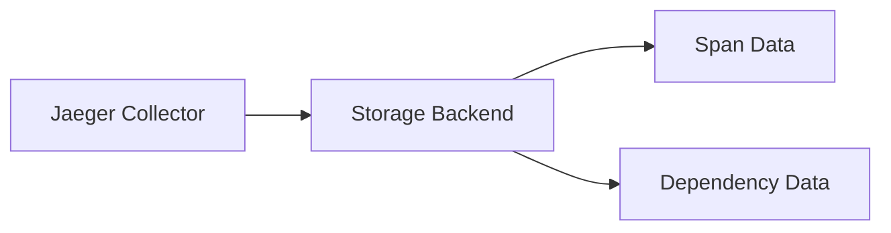
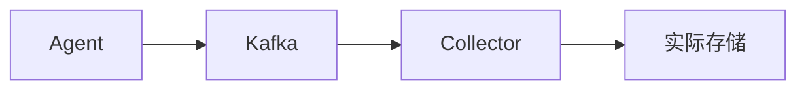

Jaeger是一个开源的分布式追踪系统，用于监控和排查微服务架构中的复杂事务。存储组件是Jaeger架构中的关键部分，决定了追踪数据的持久化和查询性能。本文将详细介绍Jaeger支持的存储选项及其适用场景。

## 存储架构概述

Jaeger的存储设计分为两部分：
1. **Span存储**：原始追踪数据（spans）
2. **依赖关系存储**：服务间调用关系的聚合数据



## 支持的存储后端

### 1. 内存存储（In-Memory）
默认用于开发和测试环境，**重启后数据丢失**。

配置示例（`jaeger-config.yaml`）：
```yaml
storage:
  type: memory
```

:::caution 生产环境警告
内存存储仅适用于测试，不可用于生产环境。
:::

### 2. Cassandra
高可用、高可扩展的NoSQL数据库，适合大规模部署。

**特点**：
- 需要预先创建schema
- 支持TTL（自动过期数据）
- 读写性能均衡

初始化Keyspace示例：
```bash
docker run --rm jaegertracing/jaeger-cassandra-schema \
  -hosts cassandra.example.com \
  -keyspace jaeger_v1_test \
  -replication-factor 2 \
  -mode prod
```

### 3. Elasticsearch
全文搜索和分析引擎，提供强大的查询能力。

**优势场景**：
- 需要复杂查询（如tag搜索）
- 已有ES集群的环境
- 需要与日志系统集成

配置示例：
```yaml
storage:
  type: elasticsearch
  options:
    es:
      server-urls: http://elasticsearch:9200
      index-prefix: jaeger
```

### 4. Kafka（仅缓冲）
作为中间缓冲层，不直接存储最终数据。

典型架构：


## 存储选择对比

| 存储类型       | 适用场景          | 数据持久性 | 查询复杂度 |
|----------------|-------------------|------------|------------|
| 内存           | 开发/测试         | ❌ 临时     | ⭐️         |
| Cassandra      | 大规模生产环境    | ✅ 永久     | ⭐️⭐️       |
| Elasticsearch  | 需要高级查询      | ✅ 永久     | ⭐️⭐️⭐️⭐️   |
| Kafka          | 高流量缓冲        | ⏳ 临时     | N/A        |

## 实际配置案例

### 生产环境组合方案
```yaml
# 使用Kafka作为缓冲，ES作为存储
storage:
  type: elasticsearch
  options:
    es:
      server-urls: http://es1:9200,http://es2:9200
      username: jaeger
      password: "secure-password"

ingester:
  kafka:
    broker: kafka:9092
    topic: jaeger-spans
```

### 本地开发配置
```bash
jaeger-all-in-one --memory.max-traces=10000
```

## 性能调优建议

1. **Cassandra**：
   - 调整`batch-size`（默认10）
   - 优化一致性级别（`consistency`）

2. **Elasticsearch**：
   - 配置分片数（`num-shards`）
   - 启用`sniffing`发现节点

:::tip 小技巧
使用`--help`参数查看存储组件的完整配置选项：
```bash
jaeger-collector --help | grep storage
```
:::

## 总结

Jaeger提供灵活的存储选项以适应不同场景：
- 开发测试 → 内存存储
- 大规模生产 → Cassandra
- 复杂查询需求 → Elasticsearch
- 流量高峰缓冲 → Kafka + 持久存储

## 延伸学习

1. 官方文档：[Jaeger Storage Backends](https://jaegertracing.io/docs/latest/deployment/#storage-backends)
2. 尝试练习：在Docker中部署Cassandra+Jaeger组合
3. 进阶话题：比较不同存储的GC策略对性能的影响