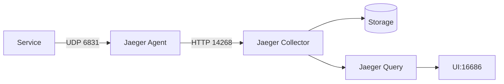

Jaeger是Uber开源的分布式追踪系统，用于监控和排查微服务架构中的性能问题。在开始使用Jaeger之前，确保你的环境满足以下要求至关重要。本文将详细介绍Jaeger的硬件、软件和依赖项需求，并提供实际配置示例。

## 介绍

Jaeger由多个组件构成（如Collector、Agent、Query等），可以部署在多种环境中（本地开发机、云服务器或Kubernetes集群）。不同部署方式对环境的要求略有差异，但核心依赖是一致的。

## 基础环境要求

### 1. 操作系统
Jaeger支持以下操作系统：
- Linux（推荐Ubuntu 18.04+/CentOS 7+）
- macOS（仅开发测试）
- Windows（有限支持，不推荐生产环境）

:::tip
生产环境建议使用Linux发行版，尤其是容器化部署时。
:::

### 2. 硬件要求
| 组件       | CPU  | 内存  | 磁盘空间 |
|------------|------|-------|----------|
| All-in-One | 1核  | 2GB   | 1GB      |
| 生产集群   | 4核+ | 16GB+ | 50GB+    |

### 3. 运行时依赖
- **Docker**（容器化部署时必需）：
  ```bash
  # 检查Docker版本
  docker --version
  # 输出示例: Docker version 20.10.17, build 100c701
  ```
- **Kubernetes**（可选，版本1.16+）
- **存储后端**（必须选择至少一种）：
  - Cassandra 3.11+
  - Elasticsearch 7.x
  - Kafka（用于缓冲追踪数据）

## 存储后端配置示例

### 使用Elasticsearch的docker-compose示例
```yaml
version: '3'
services:
  elasticsearch:
    image: docker.elastic.co/elasticsearch/elasticsearch:7.17.3
    environment:
      - discovery.type=single-node
    ports:
      - "9200:9200"
  jaeger:
    image: jaegertracing/all-in-one:1.40
    environment:
      - SPAN_STORAGE_TYPE=elasticsearch
      - ES_SERVER_URLS=http://elasticsearch:9200
    ports:
      - "16686:16686"
    depends_on:
      - elasticsearch
```

## 网络要求
- Jaeger组件间通信默认端口：
  - Agent: UDP 6831/6832, HTTP 14268
  - Collector: HTTP 14269
  - Query: HTTP 16686



## 实际案例：本地开发环境

1. 安装Docker后运行：
   ```bash
   docker run -d --name jaeger \
     -p 6831:6831/udp \
     -p 16686:16686 \
     jaegertracing/all-in-one:latest
   ```
2. 访问 `http://localhost:16686` 即可使用Jaeger UI

## 总结

Jaeger的环境要求主要取决于：
- 部署模式（All-in-One或生产集群）
- 选择的存储后端
- 预期的数据量大小

:::warning
生产环境务必配置持久化存储，All-in-One模式仅适合短期测试！
:::

## 扩展资源
- [官方部署文档](https://jaegertracing.io/docs/latest/deployment/)
- [Elasticsearch配置指南](https://www.elastic.co/guide/en/elasticsearch/reference/current/docker.html)