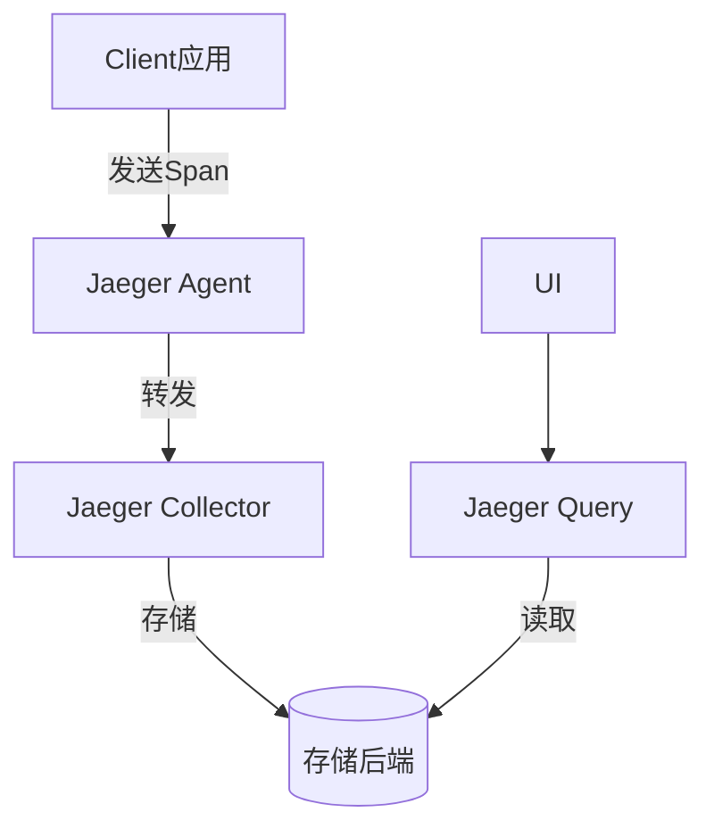

# Jaeger 安装配置

## 介绍

Jaeger是一个开源的分布式追踪系统，用于监控和排查微服务架构中的复杂事务。它由Uber开发并贡献给云原生计算基金会（CNCF）。本文将指导你完成Jaeger的安装和基础配置，涵盖开发环境快速启动和生产环境部署方案。

## 安装方式

Jaeger提供多种安装方式，以下是常见的三种：

### 1. 使用Docker快速启动（开发环境）

最简单的入门方式是使用Docker运行Jaeger的all-in-one镜像，它包含了所有必要组件：

```bash
docker run -d --name jaeger \
  -e COLLECTOR_ZIPKIN_HOST_PORT=:9411 \
  -p 5775:5775/udp \
  -p 6831:6831/udp \
  -p 6832:6832/udp \
  -p 5778:5778 \
  -p 16686:16686 \
  -p 14268:14268 \
  -p 14250:14250 \
  -p 9411:9411 \
  jaegertracing/all-in-one:1.42
```

启动后，访问 `http://localhost:16686` 即可打开Jaeger UI。

:::tip
此配置仅适用于开发测试，生产环境需要单独部署各组件并配置持久化存储。
:::

### 2. Kubernetes部署（生产环境）

在Kubernetes中可以使用Helm chart部署：

```bash
helm repo add jaegertracing https://jaegertracing.github.io/helm-charts
helm install my-jaeger jaegertracing/jaeger
```

### 3. 二进制安装

从[官方发布页面](https://github.com/jaegertracing/jaeger/releases)下载对应平台的二进制文件：

```bash
# 以Linux为例
wget https://github.com/jaegertracing/jaeger/releases/download/v1.42.0/jaeger-1.42.0-linux-amd64.tar.gz
tar -xvzf jaeger-1.42.0-linux-amd64.tar.gz
cd jaeger-1.42.0-linux-amd64
```

## 组件配置

Jaeger由多个组件组成，典型的生产部署包含：



### 核心组件配置示例

**Jaeger Agent配置 (agent.yaml):**

```yaml
processor:
  jaeger_binary:
    server_host_port: ":6832"
  jaeger_compact:
    server_host_port: ":6831"
  zipkin:
    server_host_port: ":9411"
```

启动命令：
```bash
jaeger-agent --config-file=agent.yaml
```

**Jaeger Collector配置 (collector.yaml):**

```yaml
collector:
  zipkin:
    host-port: ":9411"
```

启动命令：
```bash
jaeger-collector --config-file=collector.yaml
```

## 存储后端配置

Jaeger支持多种存储后端，以下是Elasticsearch配置示例：

```yaml
storage:
  type: elasticsearch
  elasticsearch:
    server-urls: http://elasticsearch:9200
    index-prefix: jaeger
    username: elastic
    password: changeme
```

## 实际案例：微服务追踪配置

假设你有一个使用OpenTelemetry的Python微服务：

```python
from opentelemetry import trace
from opentelemetry.sdk.trace import TracerProvider
from opentelemetry.sdk.trace.export import BatchSpanProcessor
from opentelemetry.exporter.jaeger.thrift import JaegerExporter

# 设置Jaeger导出器
jaeger_exporter = JaegerExporter(
    agent_host_name="localhost",
    agent_port=6831,
)

# 配置追踪提供者
trace.set_tracer_provider(TracerProvider())
tracer = trace.get_tracer(__name__)
span_processor = BatchSpanProcessor(jaeger_exporter)
trace.get_tracer_provider().add_span_processor(span_processor)

# 在业务代码中使用
with tracer.start_as_current_span("service-operation"):
    # 你的业务逻辑
    pass
```

## 验证安装

1. 发送一些追踪数据
2. 访问Jaeger UI (`http://localhost:16686`)
3. 在搜索界面查看服务列表和追踪数据

## 总结

本文介绍了Jaeger的多种安装方式和基础配置：
- 开发环境使用Docker快速启动
- 生产环境推荐Kubernetes部署
- 详细讲解了各组件配置
- 提供了实际集成案例

:::note 进阶学习
要进一步掌握Jaeger：
1. 尝试集成到你的现有项目中
2. 探索采样策略配置
3. 学习使用自适应采样
4. 研究与其他可观测性工具的集成
:::

## 附加资源

- [Jaeger官方文档](https://www.jaegertracing.io/docs/)
- [OpenTelemetry集成指南](https://opentelemetry.io/docs/)
- [分布式追踪模式](https://microservices.io/patterns/observability/distributed-tracing.html)