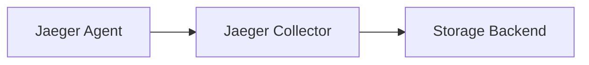

# Jaeger 组件介绍

Jaeger 是一个开源的分布式追踪系统，用于监控和排查微服务架构中的复杂事务。它由多个核心组件组成，每个组件都有其特定的功能。本文将详细介绍这些组件及其工作原理。

## 什么是Jaeger？

Jaeger 由 Uber 开发并开源，现已成为云原生计算基金会（CNCF）的项目之一。它帮助开发者在分布式系统中追踪请求的流转路径，分析性能瓶颈，并优化系统架构。

## 核心组件

Jaeger 主要由以下组件构成：

1. **Agent**
2. **Collector**
3. **Storage Backend**
4. **Query Service**
5. **UI**

### 1. Jaeger Agent

Jaeger Agent 是一个网络守护进程，负责接收来自客户端的追踪数据，并将其批量发送到 Collector。它通常以 sidecar 模式部署在应用程序所在的节点上。

:::note
Agent 减轻了应用程序直接与 Collector 通信的负担，提高了系统的可扩展性。
:::

**示例配置（Docker环境）**:
```bash
docker run -d --name jaeger-agent \
  -p 5775:5775/udp \
  -p 6831:6831/udp \
  -p 6832:6832/udp \
  jaegertracing/jaeger-agent \
  --reporter.grpc.host-port=jaeger-collector:14250
```

### 2. Jaeger Collector

Collector 接收来自 Agent 的追踪数据，对其进行验证、处理和存储。它支持多种存储后端，如 Cassandra、Elasticsearch 等。

**工作流程**:


### 3. Storage Backend

Jaeger 支持多种存储后端来持久化追踪数据，常见的有：

- **Cassandra**: 适合大规模部署，但需要额外维护。
- **Elasticsearch**: 提供强大的搜索功能，适合日志和追踪数据结合的场景。
- **内存存储**: 仅用于测试和开发环境。

### 4. Query Service

Query Service 负责从存储后端检索追踪数据，并提供 API 供 UI 或其他工具查询。它支持复杂的查询条件，如服务名、操作名、时间范围等。

**示例查询API**:
```bash
curl -X GET "http://jaeger-query:16686/api/traces?service=my-service&limit=10"
```

### 5. Jaeger UI

Jaeger UI 是一个可视化工具，用于展示和分析追踪数据。它提供了直观的界面，帮助开发者快速定位问题。

**UI功能**:
- 显示请求的完整调用链。
- 展示每个调用的耗时和状态。
- 支持时间轴和依赖图视图。

## 实际案例

假设你有一个微服务架构的电商系统，包含以下服务：
1. **用户服务**
2. **订单服务**
3. **支付服务**

当用户下单时，请求会依次经过这些服务。通过 Jaeger，你可以追踪整个请求的流转路径，分析每个服务的性能表现。

**示例追踪数据**:
```json
{
  "traceID": "abc123",
  "spans": [
    {
      "operationName": "user-service:create",
      "duration": 50,
      "tags": {"status": "success"}
    },
    {
      "operationName": "order-service:place",
      "duration": 100,
      "tags": {"status": "success"}
    },
    {
      "operationName": "payment-service:process",
      "duration": 200,
      "tags": {"status": "failed"}
    }
  ]
}
```

:::warning
如果某个服务的耗时异常高（如支付服务的 `duration: 200`），可能需要进一步优化或排查问题。
:::

## 总结

Jaeger 的组件各司其职，共同构成了一个强大的分布式追踪系统。通过 Agent、Collector、Storage、Query Service 和 UI 的协作，开发者可以轻松监控和分析微服务架构中的请求流转。

## 附加资源

1. [Jaeger官方文档](https://www.jaegertracing.io/docs/)
2. [CNCF Jaeger项目](https://github.com/jaegertracing/jaeger)
3. [分布式追踪入门指南](https://opentracing.io/docs/)

## 练习

1. 部署一个简单的 Jaeger 实例，并发送一些测试数据。
2. 尝试在 UI 中查询和分析追踪数据。
3. 探索不同的存储后端，比较它们的优缺点。