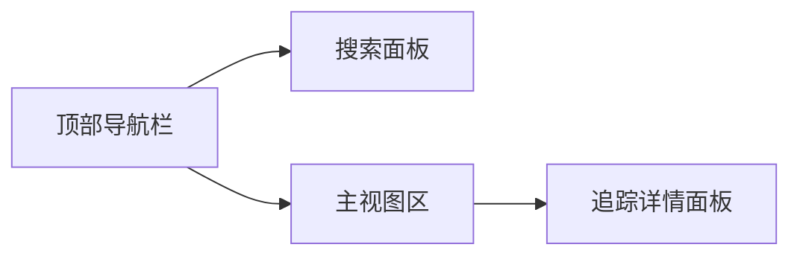
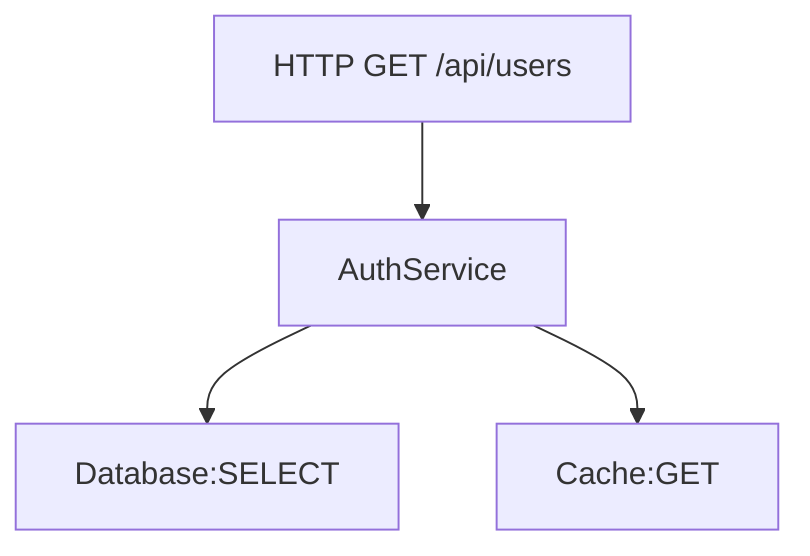
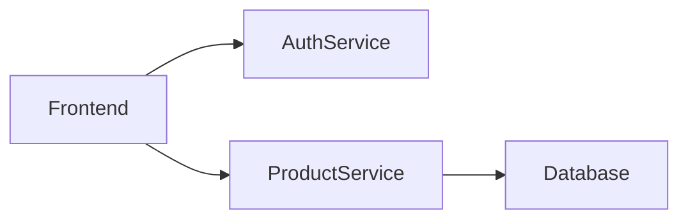

# Jaeger 界面导航

Jaeger是一个开源的分布式追踪系统，用于监控和排查微服务架构中的性能问题。其Web界面提供了直观的可视化工具，帮助开发者分析请求链路。本文将详细介绍Jaeger界面的核心功能区域及操作流程。

## 界面概览

Jaeger界面主要分为以下功能区域：



1. **顶部导航栏**：包含系统名称、服务选择器和时间范围控件
2. **搜索面板**：用于筛选追踪数据
3. **主视图区**：展示追踪列表或单个追踪的火焰图
4. **追踪详情面板**：显示Span的详细信息

## 核心功能详解

### 1. 服务与操作选择

在搜索面板顶部，您会看到两个关键下拉菜单：

- **Service**：选择要监控的微服务（如 `frontend`、`backend`）
- **Operation**：选择特定操作（如 `HTTP GET`、`database.query`）

:::tip
组合选择服务和操作可以快速缩小搜索范围。例如选择 `checkout-service` 和 `POST /cart` 可专门监控购物车结算请求。
:::

### 2. 时间范围设置

Jaeger提供多种时间范围预设：
- 最近15分钟/1小时/3小时
- 自定义绝对时间范围
- 相对时间范围（如"最近30分钟"）

使用示例：
```javascript
// 通过UI设置的时间范围会转换为类似这样的查询参数
{
  start: '2023-07-20T10:00:00Z',
  end: '2023-07-20T10:15:00Z',
  lookback: '1h'  // 自动回看1小时
}
```

### 3. 追踪列表视图

搜索结果以列表形式展示，包含以下关键信息：

| 列名 | 说明 | 示例值 |
|------|------|--------|
| Trace ID | 追踪唯一标识 | `3a4b5c6d7e8f9g0h` |
| Duration | 请求总耗时 | 256ms |
| Services | 涉及的服务数量 | 3 |
| Operations | 操作类型数量 | 5 |

点击任意行可展开查看该追踪的详细信息。

### 4. 火焰图分析

进入单个追踪视图后，Jaeger会展示火焰图（Flame Graph）：



火焰图特点：
- 横向表示时间跨度
- 纵向表示调用栈深度
- 颜色区分不同服务
- 鼠标悬停显示Span详情

### 5. Span详情面板

点击火焰图中的任意Span会显示详情面板，包含：

- **基本信息**：开始时间、持续时间、标签
- **标签**：`http.method=GET`、`http.status_code=200`
- **日志**：关键事件的时间点记录
- **进程**：执行该Span的服务实例信息

## 实际案例

假设我们有一个电商应用出现结账延迟问题：

1. 在服务下拉菜单选择 `checkout-service`
2. 设置时间范围为问题发生时段
3. 按Duration排序找到耗时最长的追踪
4. 分析火焰图发现：
   - 支付服务调用耗时800ms（正常应`<200ms`）
   - 数据库查询`SELECT inventory`占用了700ms
5. 检查相关Span标签发现：
   ```json
   {
     "db.statement": "SELECT * FROM inventory WHERE item_id='XYZ'",
     "db.response_size": "1200rows"
   }
   ```
6. 结论：未优化的SQL查询导致性能瓶颈

## 高级功能

### 对比模式

按住`Ctrl`(Windows)或`Command`(Mac)选择多个追踪，点击"Compare"按钮可并排对比火焰图，适合分析性能回归问题。

### 系统架构视图

点击"System Architecture"标签可查看服务间依赖关系图：



## 总结

Jaeger界面提供了从宏观到微观的多层次分布式追踪分析能力。关键操作流程：

1. 选择目标服务和时间范围
2. 筛选或搜索特定追踪
3. 通过火焰图定位性能瓶颈
4. 分析Span详情找出根本原因

## 延伸练习

1. 在测试环境中发起一组微服务调用，尝试找出最慢的请求链路
2. 创建一个包含自定义标签的Span，然后在UI中定位它
3. 对比正常和异常情况下的火焰图差异

## 附加资源

- [Jaeger官方文档 - UI指南](https://www.jaegertracing.io/docs/latest/frontend-ui/)
- [分布式追踪模式与反模式](https://github.com/jaegertracing/jaeger/blob/master/docs/patterns.md)