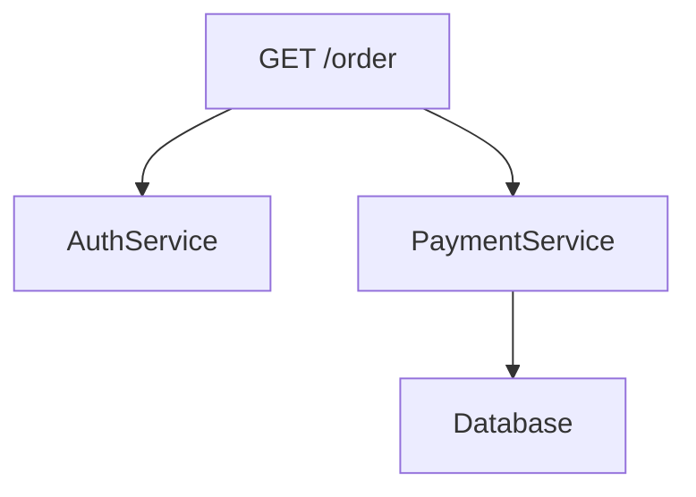

# Jaeger 基本概念

## 介绍

Jaeger是一个开源的**分布式追踪系统**，由Uber开发并贡献给CNCF（云原生计算基金会）。它帮助开发者监控和诊断微服务架构中的复杂事务流转，通过可视化请求链路来定位性能瓶颈或故障点。

:::tip 为什么需要分布式追踪？
在微服务架构中，一个用户请求可能跨越数十个服务。传统日志难以串联完整调用链，而Jaeger能清晰展示请求的"全生命周期"。
:::

## 核心组件

Jaeger由以下关键组件构成：


1. **Client SDK**：集成在应用程序中（如`jaeger-client`包）
2. **Agent**：接收客户端数据的守护进程（通常部署为DaemonSet）
3. **Collector**：处理并存储追踪数据
4. **Storage**：支持Elasticsearch、Cassandra等后端
5. **Query**：检索追踪数据的服务
6. **UI**：可视化界面（访问`http://localhost:16686`）

## 关键概念解析

### 1. Span（跨度）

追踪的基本单元，代表一个**独立的工作单元**。例如：

```python
# Python示例：创建一个span
from jaeger_client import Config

config = Config(config={'sampler': {'type': 'const', 'param': 1}}, service_name='myapp')
tracer = config.initialize_tracer()

with tracer.start_span('say-hello') as span:
    span.log_kv({'event': 'name-request', 'value': 'John'})
    print("Hello, John!")
```

每个Span包含：
- 操作名称（如`/api/users`）
- 开始/结束时间戳
- Tags（键值对元数据）
- Logs（时间戳事件）

### 2. Trace（追踪）

一组**相关联Span**的有向无环图（DAG），代表完整请求链路：



### 3. Context Propagation（上下文传播）

跨服务传递追踪信息的机制，主要通过以下HTTP头：
- `uber-trace-id`：格式为`trace-id:span-id:parent-span-id:flags`

## 实际案例：电商订单系统

假设用户下单时经过以下服务：

1. **Frontend** 接收请求
2. 调用 **AuthService** 验证权限
3. 调用 **OrderService** 创建订单
4. 调用 **PaymentService** 处理支付

在Jaeger UI中看到的Trace可能如下：

```
Frontend (200ms)
├─ AuthService (50ms)
├─ OrderService (120ms)
│  └─ Database (30ms)
└─ PaymentService (80ms)
```

:::note 采样策略
生产环境通常配置概率采样（如1%请求）：
```yaml
sampler:
  type: probabilistic
  param: 0.01
```
:::

## 总结

关键要点：
- Jaeger通过Span和Trace模型可视化微服务调用链
- 需要客户端集成+服务端组件协同工作
- 特别适合诊断跨服务延迟问题

## 延伸学习

1. 官方文档：[Jaeger Getting Started](https://www.jaegertracing.io/docs/latest/getting-started/)
2. 实践建议：
   - 在本地用`all-in-one`镜像快速体验
   ```bash
   docker run -d -p 16686:16686 -p 6831:6831/udp jaegertracing/all-in-one
   ```
3. 进阶话题：
   - 与OpenTelemetry集成
   - 自定义采样策略
   - 存储后端性能调优