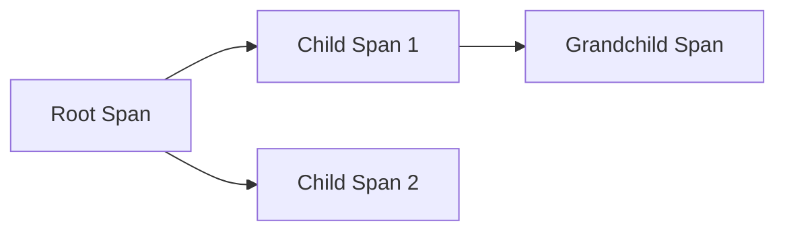

# Jaeger 数据模型

## 介绍

Jaeger是一个开源的分布式追踪系统，用于监控和排查微服务架构中的性能问题。理解Jaeger的数据模型是使用该工具的基础。本文将详细介绍Jaeger的核心数据模型，包括`Span`、`Trace`等关键概念，并通过实际案例展示它们如何工作。

## 核心概念

### 1. Span

`Span`是Jaeger数据模型中的基本单元，代表一个独立的工作单元。例如，一个HTTP请求或数据库查询都可以是一个`Span`。每个`Span`包含以下关键信息：

- **操作名称（Operation Name）**：描述`Span`执行的操作，例如`GET /api/users`。
- **开始时间和持续时间**：记录`Span`的开始时间和执行时长。
- **标签（Tags）**：键值对形式的元数据，用于描述`Span`的属性，例如`http.status_code=200`。
- **日志（Logs）**：记录`Span`执行过程中的事件或错误信息。

#### 示例代码
以下是一个用Go语言创建`Span`的示例：

```go
import (
    "context"
    "github.com/opentracing/opentracing-go"
    "github.com/uber/jaeger-client-go"
)

func main() {
    tracer := opentracing.GlobalTracer()
    span := tracer.StartSpan("example_operation")
    defer span.Finish()

    span.SetTag("http.method", "GET")
    span.LogKV("event", "started")
}
```

### 2. Trace

`Trace`是由多个`Span`组成的有向无环图（DAG），表示一个完整的请求链路。`Trace`通过`Trace ID`唯一标识，而`Span`之间通过`Parent-Span`关系关联。

#### 父子关系
- **Root Span**：`Trace`中的第一个`Span`，没有父`Span`。
- **Child Span**：由其他`Span`创建的`Span`，继承父`Span`的`Trace ID`。



### 3. Context Propagation

`Span`的上下文（`SpanContext`）包含`Trace ID`和`Span ID`，用于在服务之间传递追踪信息。Jaeger支持以下传播方式：
- **HTTP Headers**：通过`uber-trace-id`等头部字段传递。
- **gRPC Metadata**：通过gRPC的元数据传递。

## 实际案例

假设有一个用户服务调用订单服务的场景：

1. **用户服务**接收HTTP请求，创建`Root Span`。
2. **用户服务**调用订单服务的API，生成`Child Span`并注入HTTP头部。
3. **订单服务**从HTTP头部提取`SpanContext`，继续记录`Span`。

#### 代码片段
用户服务调用订单服务时注入`SpanContext`：

```go
func callOrderService(ctx context.Context) {
    span, ctx := opentracing.StartSpanFromContext(ctx, "call_order_service")
    defer span.Finish()

    req, _ := http.NewRequest("GET", "http://orders/api/orders", nil)
    opentracing.GlobalTracer().Inject(
        span.Context(),
        opentracing.HTTPHeaders,
        opentracing.HTTPHeadersCarrier(req.Header),
    )
    http.DefaultClient.Do(req)
}
```

## 总结

Jaeger的数据模型围绕`Span`和`Trace`构建，通过上下文传播实现分布式追踪。关键点包括：
- `Span`是基本单元，包含操作、标签和日志。
- `Trace`是`Span`的集合，表示完整请求链路。
- 上下文传播确保跨服务的追踪连续性。

## 附加资源

1. [Jaeger官方文档](https://www.jaegertracing.io/docs/)
2. 练习：尝试在本地部署Jaeger并记录一个简单的微服务调用链路。
3. 扩展阅读：OpenTracing标准规范。

:::tip
使用Jaeger时，确保为`Span`设置有意义的操作名称和标签，便于后续分析和排查问题。
:::