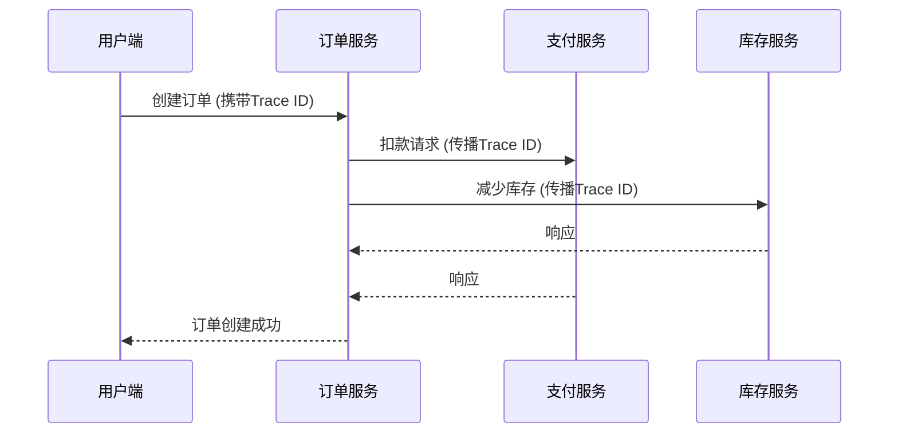

# Jaeger 上下文传播

## 介绍

在分布式系统中，一个用户请求可能涉及多个微服务。为了追踪整个请求链路，需要将**追踪上下文**（如Trace ID、Span ID）在服务间传递。Jaeger通过**上下文传播**机制实现这一功能，确保所有相关服务能记录到同一个追踪树中。

:::note 关键概念
- **Trace ID**：唯一标识一个分布式请求链路的ID。
- **Span ID**：标识单个操作的ID。
- **上下文传播**：将Trace ID和Span ID等信息跨服务传递的过程。
:::

## 上下文传播的工作原理

Jaeger支持多种上下文传播格式，最常见的是：
1. **HTTP头传播**（如 `uber-trace-id`）
2. **gRPC元数据**
3. **消息队列属性**（如Kafka headers）

### HTTP头传播示例

当一个HTTP请求从服务A发往服务B时，Jaeger客户端会自动注入以下头信息：

```plaintext
uber-trace-id: 3a3c43f38c8e156b:3a3c43f38c8e156b:0000000000000000:1
```
格式说明：`trace-id:span-id:parent-span-id:flags`

## 代码示例

### 1. 手动提取HTTP上下文（Node.js）

```javascript
const { initTracer } = require('jaeger-client');

// 初始化Tracer
const tracer = initTracer(config);

// 在服务端提取上下文
app.get('/api', (req, res) => {
  const spanContext = tracer.extract(
    opentracing.FORMAT_HTTP_HEADERS,
    req.headers
  );
  
  // 创建子Span
  const span = tracer.startSpan('serviceB_operation', {
    childOf: spanContext
  });
  
  // ...业务逻辑...
  span.finish();
});
```

### 2. 自动传播（Java Spring Boot）

```java
@RestController
public class Controller {
  
  @Autowired
  private Tracer tracer;

  @GetMapping("/endpoint")
  public String handleRequest() {
    // 自动从HTTP头中提取上下文并创建子Span
    Span span = tracer.buildSpan("handle_request").start();
    
    try (Scope scope = tracer.activateSpan(span)) {
      // ...业务逻辑...
      return "Success";
    } finally {
      span.finish();
    }
  }
}
```

## 实际应用场景

### 电商订单流程



在这个场景中，所有服务共享同一个Trace ID，Jaeger UI会显示完整的调用链。

## 常见问题

:::caution 上下文丢失
如果未正确处理传播，会导致：
- 新服务创建全新Trace（断链）
- 无法关联相关操作
:::

解决方案：
1. 确保所有客户端/服务端使用相同的传播格式
2. 在异步任务中显式传递上下文

## 总结

Jaeger上下文传播是分布式追踪的核心机制，通过：
- 标准化格式（如HTTP头）传递Trace信息
- 支持多种通信协议
- 提供自动和手动传播方式

## 扩展练习

1. 尝试在本地启动两个微服务，观察Jaeger中的上下文传播
2. 修改一个服务的传播逻辑，故意造成上下文丢失，观察Jaeger UI的变化

## 附加资源

- [Jaeger官方文档：上下文传播](https://www.jaegertracing.io/docs/)
- [OpenTracing传播标准](https://opentracing.io/docs/overview/inject-extract/)