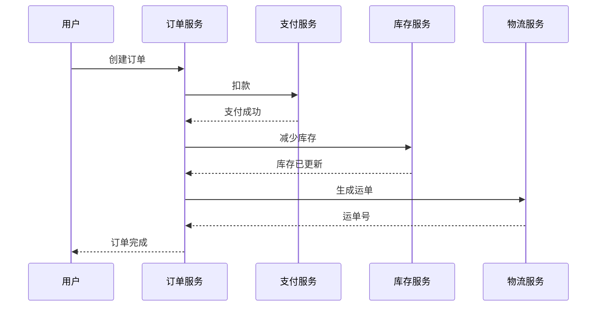

# 分布式追踪简介

## 什么是分布式追踪？

在传统的单体应用中，调试请求的完整执行路径相对简单，因为所有逻辑都在同一个进程中运行。但在微服务架构中，一个用户请求可能跨越多个服务，每个服务还可能进一步调用数据库或其他第三方服务。**分布式追踪**（Distributed Tracing）就是用来记录和可视化这些跨服务调用链路的工具，帮助开发者理解请求的完整生命周期、定位性能瓶颈或故障点。

:::note 核心概念
- **Span（跨度）**：代表一个独立的工作单元（例如一次函数调用、一次HTTP请求）。
- **Trace（追踪）**：由一组关联的Span组成，描述一个请求的完整路径。
- **上下文传播**：通过唯一ID（Trace ID）将跨服务的Span关联起来。
:::

## 为什么需要分布式追踪？

假设你的电商应用在用户下单时变慢，而该流程涉及以下服务：
1. 订单服务 → 2. 支付服务 → 3. 库存服务 → 4. 物流服务

没有分布式追踪时，你需要手动检查每个服务的日志，耗时且容易遗漏。而通过追踪系统，你可以直接看到：



## Jaeger 的核心组件

Jaeger 是一个开源的分布式追踪系统，包含以下组件：
1. **Client SDK**：集成到应用中生成Span（支持Java、Go、Python等）。
2. **Agent**：接收应用发送的Span数据。
3. **Collector**：处理并存储Span。
4. **Query Service**：提供查询界面。
5. **UI**：可视化展示追踪数据。

## 实际代码示例

以下是一个使用Jaeger的Python Flask应用的简单示例：

```python
from flask import Flask
from jaeger_client import Config

app = Flask(__name__)

def init_tracer():
    config = Config(
        config={
            'sampler': {'type': 'const', 'param': 1},
            'logging': True,
        },
        service_name='order-service'
    )
    return config.initialize_tracer()

tracer = init_tracer()

@app.route('/order')
def create_order():
    with tracer.start_span('create_order') as span:
        span.log_kv({'event': 'order_created', 'user_id': 123})
        return "Order created!"

if __name__ == '__main__':
    app.run(port=5000)
```

**输出结果**：在Jaeger UI中，你会看到一个名为 `create_order` 的Span，包含自定义日志 `user_id: 123`。

## 真实应用场景

**案例：诊断延迟问题**  
某社交平台的“发布动态”功能突然变慢，通过Jaeger追踪发现：
- 90%的时间消耗在“反垃圾服务”的第三方API调用上。
- 最终解决方案：对该服务添加缓存层，延迟降低70%。

:::tip 最佳实践
1. 为所有微服务集成追踪。
2. 在Span中添加业务相关的标签（如 `user_id`）。
3. 监控关键路径的P99延迟。
:::

## 总结

分布式追踪是现代可观测性的重要组成部分，尤其适用于微服务架构。通过Jaeger等工具，开发者可以：
- 可视化请求链路
- 快速定位性能问题
- 分析服务依赖关系

## 扩展资源

1. [Jaeger官方文档](https://www.jaegertracing.io/docs/)
2. 练习：尝试在本地启动Jaeger并记录一个包含3个Span的Trace。
3. 进阶：探索如何将追踪数据与日志、指标系统（如Prometheus）关联。