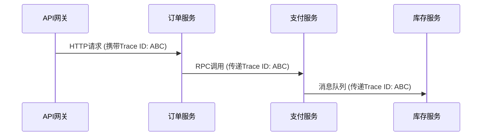

# 追踪上下文

## 介绍

在分布式系统中，**追踪上下文（Trace Context）**是贯穿多个服务的请求的唯一标识信息。它允许我们将分散在不同服务中的日志和性能数据关联起来，形成一个完整的调用链路。Jaeger通过追踪上下文实现跨服务边界的请求跟踪，帮助开发者诊断性能瓶颈和故障。

追踪上下文通常包含以下核心元素：
- **Trace ID**：整个请求链路的唯一标识。
- **Span ID**：当前操作的唯一标识。
- **Parent Span ID**（可选）：父级操作的标识，用于构建调用树。

## 上下文传播机制

Jaeger支持通过HTTP头、gRPC元数据等协议传递追踪上下文。以下是常见的传播格式：

### 1. HTTP头示例
```plaintext
uber-trace-id: 3a3c43f33c3a3c3a:1e7d5e3a3c3a3c3a:3a3c3a3c3a3c3a3c:1
```
字段说明（冒号分隔）：
- `Trace ID`
- `Span ID`
- `Parent Span ID`
- `采样标志`

### 2. 代码示例（Node.js）
以下示例展示如何在HTTP请求中注入和提取追踪上下文：

```javascript
const { initTracer } = require('jaeger-client');

// 初始化Tracer
const tracer = initTracer({ serviceName: 'my-service' });

// 创建Span并注入上下文
const span = tracer.startSpan('call_external_api');
const headers = {};
tracer.inject(span.context(), FORMAT_HTTP_HEADERS, headers);

// 输出注入后的HTTP头
console.log(headers);
// 示例输出: { 'uber-trace-id': '3a3c43f33c3a3c3a:1e7d5e3a3c3a3c3a:0:1' }
```

## 实际应用场景

### 案例：电商订单流程
假设一个订单请求依次经过以下服务：
1. **API网关** → 2. **订单服务** → 3. **支付服务** → 4. **库存服务**

通过追踪上下文，Jaeger可以将所有服务的Span关联为一个Trace：



:::tip 上下文一致性
确保在所有跨服务通信中传递相同的Trace ID，否则Jaeger无法正确关联调用链。
:::

## 总结

- 追踪上下文是分布式追踪的**基石**，包含Trace ID、Span ID等关键信息。
- 通过**上下文传播**机制（如HTTP头）实现跨服务链路关联。
- 实际应用中需确保上下文在服务间**无损传递**。

## 扩展练习
1. 使用Jaeger客户端库创建一个包含子Span的Trace，并验证上下文传播。
2. 尝试在gRPC请求中手动传递追踪上下文（提示：使用`metadata`）。

## 附加资源
- [Jaeger官方文档：上下文传播](https://www.jaegertracing.io/docs/latest/client-libraries/#context-propagation)
- [OpenTelemetry追踪规范](https://github.com/open-telemetry/opentelemetry-specification)