# 追踪流程可视化

## 介绍

在现代分布式系统中，理解请求的完整生命周期至关重要。Jaeger 是一个开源的分布式追踪系统，它通过可视化请求的流程，帮助开发者快速定位性能瓶颈和错误。本文将介绍 Jaeger 的追踪流程可视化功能，并通过实际案例展示其应用。

## 什么是追踪流程可视化？

追踪流程可视化是指将分布式系统中请求的路径、耗时和依赖关系以图形化的方式呈现。Jaeger 通过收集和展示追踪数据（Traces），帮助开发者直观地理解请求的流转过程。

一个典型的 Jaeger 追踪流程包含以下关键概念：
- **Span**：表示一个操作或工作单元，例如一个函数调用或 HTTP 请求。
- **Trace**：由多个 Span 组成，表示一个完整的请求流程。
- **Parent-Child 关系**：Span 之间可以嵌套，形成父子关系。

## 追踪流程的基本结构

Jaeger 的追踪流程通常以时间轴的形式展示。以下是一个简单的追踪流程示例：

```mermaid
gantt
    title 示例追踪流程
    dateFormat  X
    axisFormat %s
    section 服务A
    Span1 :a1, 0, 2s
    section 服务B
    Span2 :a2, after a1, 1s
    section 服务C
    Span3 :a3, after a2, 3s
```



在这个示例中：
1. 请求首先到达 `服务A`（Span1），耗时 2 秒。
2. 然后调用 `服务B`（Span2），耗时 1 秒。
3. 最后调用 `服务C`（Span3），耗时 3 秒。

## 代码示例：生成追踪数据

以下是一个使用 OpenTelemetry（Jaeger 的兼容 SDK）生成追踪数据的简单示例：

```javascript
const { NodeTracerProvider } = require('@opentelemetry/node');
const { SimpleSpanProcessor } = require('@opentelemetry/tracing');
const { JaegerExporter } = require('@opentelemetry/exporter-jaeger');

// 初始化追踪器
const provider = new NodeTracerProvider();
const exporter = new JaegerExporter({ serviceName: 'my-service' });
provider.addSpanProcessor(new SimpleSpanProcessor(exporter));
provider.register();

// 创建一个追踪 Span
const tracer = provider.getTracer('example-tracer');
const span = tracer.startSpan('my-operation');
span.setAttribute('key', 'value');

// 模拟一些工作
setTimeout(() => {
  span.end();
  console.log('Span completed and sent to Jaeger!');
}, 1000);
```

**输出**：
在 Jaeger UI 中，你将看到一个名为 `my-operation` 的 Span，持续时间为 1 秒，并包含一个属性 `key: value`。

## 实际案例：电子商务订单流程

假设我们有一个电子商务系统，用户下单的流程涉及多个服务：
1. **订单服务**：创建订单。
2. **库存服务**：检查库存。
3. **支付服务**：处理支付。

以下是该流程的追踪可视化：

```mermaid
gantt
    title 订单流程追踪
    dateFormat  X
    axisFormat %s
    section 订单服务
    创建订单 :order, 0, 1s
    section 库存服务
    检查库存 :inventory, after order, 2s
    section 支付服务
    处理支付 :payment, after inventory, 3s
```



通过 Jaeger UI，我们可以清晰地看到每个服务的耗时，并快速发现性能瓶颈（例如支付服务耗时较长）。

## 总结

Jaeger 的追踪流程可视化功能为分布式系统的调试和性能优化提供了强大支持。通过本文的介绍，你应该已经了解了：
- 追踪流程的基本概念（Span、Trace）。
- 如何生成和查看追踪数据。
- 实际案例中的应用场景。

## 附加资源与练习

### 练习
1. 使用 OpenTelemetry 和 Jaeger 追踪一个简单的 Node.js 应用程序。
2. 在 Jaeger UI 中查看追踪数据，尝试分析 Span 之间的关系。

### 资源
- [Jaeger 官方文档](https://www.jaegertracing.io/docs/)
- [OpenTelemetry JavaScript SDK](https://opentelemetry.io/docs/instrumentation/js/)

:::tip
提示：在生产环境中，确保合理配置采样率，以避免过多的追踪数据影响系统性能。
:::