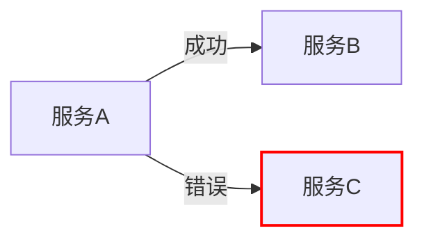

## 介绍

在分布式系统中，错误和异常是不可避免的。Jaeger作为一款流行的分布式追踪工具，提供了强大的功能来标记和可视化这些错误与异常。通过正确标记错误，开发者可以更快地定位问题根源，提高系统的可观测性。

本文将介绍如何在Jaeger中标记错误和异常，包括基本概念、代码示例和实际应用场景。

## 什么是错误与异常标记？

错误与异常标记是指在Jaeger的追踪数据中，显式地标识出操作失败或异常发生的时刻。这些标记通常包括：
- 错误状态（如HTTP 500）
- 异常类型（如`NullPointerException`）
- 错误消息
- 堆栈跟踪（如果可用）

Jaeger会将这些信息与追踪数据一起存储，并在UI中用醒目的红色标记显示，帮助开发者快速发现问题。

## 基础标记方法

### 1. 设置错误标签

在Jaeger中，最常见的错误标记方式是设置`error=true`标签。这是一个约定俗成的标准，Jaeger UI会特别处理这个标签。

```javascript
const span = tracer.startSpan('operation_name');
span.setTag('error', true);
span.finish();
```

### 2. 添加错误详情

除了简单的错误标记外，你还可以添加更多上下文信息：

```python
try:
    # 业务逻辑代码
except Exception as e:
    span.set_tag('error', True)
    span.set_tag('error.message', str(e))
    span.set_tag('error.type', type(e).__name__)
    span.log_kv({'stack_trace': traceback.format_exc()})
```

## 实际案例

### 案例1：HTTP服务错误处理

假设你有一个返回用户信息的HTTP服务：

```go
func getUserHandler(w http.ResponseWriter, r *http.Request) {
    ctx, span := tracer.Start(r.Context(), "getUser")
    defer span.Finish()

    userID := r.URL.Query().Get("id")
    user, err := db.GetUser(ctx, userID)
    if err != nil {
        span.SetTag("error", true)
        span.SetTag("error.message", err.Error())
        span.SetTag("error.type", "database_error")
        span.SetTag("http.status_code", 500)
        w.WriteHeader(http.StatusInternalServerError)
        return
    }
    // ...正常处理逻辑
}
```

### 案例2：微服务间通信

在微服务架构中，服务A调用服务B：

```java
Span span = tracer.buildSpan("serviceA-operation").start();
try {
    Response response = serviceBClient.call(request);
    if (!response.isSuccess()) {
        span.setTag("error", true);
        span.setTag("error.message", "Service B returned error: " + response.getError());
    }
} catch (Exception e) {
    span.setTag("error", true);
    span.log(Map.of(
        "event", "error",
        "error.object", e,
        "stack", ExceptionUtils.getStackTrace(e)
    ));
} finally {
    span.finish();
}
```

## 最佳实践

:::tip 错误标记建议
1. **一致性**：在整个系统中使用相同的错误标记约定
2. **丰富上下文**：除了标记错误外，添加尽可能多的诊断信息
3. **避免敏感信息**：不要在错误消息中包含密码等敏感数据
4. **标准化错误类型**：定义一组标准的错误类型（如`database_error`、`network_error`等）
:::

## 可视化错误

Jaeger UI会自动高亮显示包含错误的追踪：



在UI中：
1. 错误追踪会显示为红色
2. 可以按错误类型过滤追踪
3. 点击错误span可以查看详细错误信息

## 总结

正确标记错误和异常对于分布式系统调试至关重要。通过Jaeger的错误标记功能，你可以：
- 快速识别失败请求
- 了解错误发生的上下文
- 分析错误模式与趋势

## 延伸学习

1. 尝试在你的项目中实现错误标记
2. 探索Jaeger UI中的错误搜索功能
3. 研究如何将错误标记与告警系统集成

:::note 练习
在你的Jaeger环境中：
1. 故意制造几种不同类型的错误
2. 为每种错误添加适当的标记
3. 在Jaeger UI中观察这些错误如何显示
:::