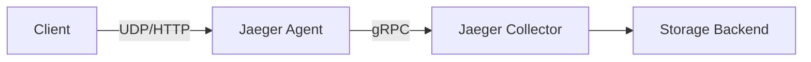
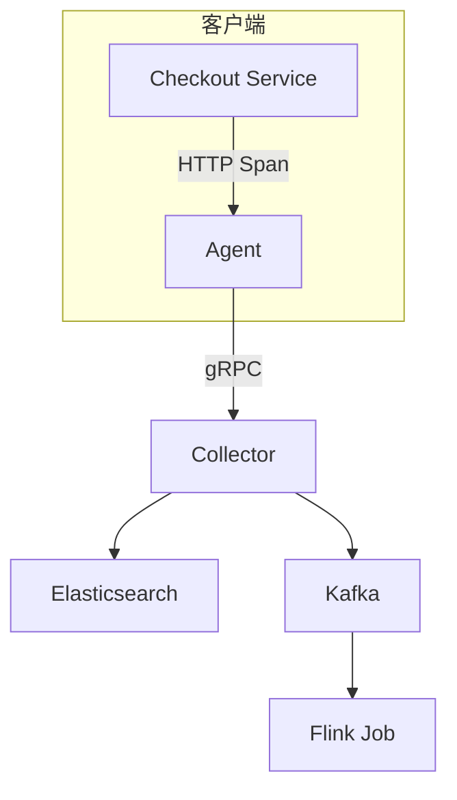

# 追踪数据导出

## 介绍

在分布式系统中，Jaeger通过收集和存储追踪数据来帮助开发者分析请求链路。**追踪数据导出**是指将这些数据从Jaeger客户端或收集器传输到后端存储（如Elasticsearch、Cassandra等）的过程。理解这一机制对于配置生产级监控系统至关重要。

## 导出流程概述

Jaeger的追踪数据通常通过以下步骤导出：
1. **客户端生成数据**：应用代码中的Jaeger客户端生成Span数据。
2. **传输到Agent**：数据通过UDP/HTTP发送到Jaeger Agent。
3. **收集器处理**：Agent将数据转发给Jaeger Collector。
4. **存储导出**：Collector将数据写入配置的后端存储。



## 数据格式与协议

Jaeger支持两种主要导出格式：
- **Thrift**：旧版格式，兼容性高
- **ProtoBuf**（推荐）：高效二进制格式，占用带宽更少

## 配置导出器

### 示例：Go语言导出到Jaeger Collector
```go
import (
	"go.opentelemetry.io/otel/exporters/jaeger"
)

func initJaeger() (*jaeger.Exporter, error) {
	return jaeger.New(jaeger.WithCollectorEndpoint(
		jaeger.WithEndpoint("http://jaeger-collector:14268/api/traces"),
	))
}
```

### 环境变量配置
也可以通过环境变量快速配置：
```bash
export JAEGER_ENDPOINT=http://jaeger-collector:14268/api/traces
export JAEGER_SAMPLER_TYPE=const
export JAEGER_SAMPLER_PARAM=1
```

:::note
生产环境中建议使用ProtoBuf格式并通过gRPC传输，性能比HTTP/JSON高50%以上。
:::

## 存储后端选项

### 常见存储系统对比
| 存储类型       | 适用场景          | 数据保留策略 |
|----------------|-------------------|--------------|
| Elasticsearch  | 全文搜索与分析    | 基于索引周期 |
| Cassandra      | 大规模时序数据    | TTL设置      |
| Kafka          | 流式处理管道      | 基于Topic    |

### Cassandra配置示例
```yaml
storage:
  type: cassandra
  cassandra:
    servers: "cassandra1,cassandra2"
    keyspace: jaeger_v1
    replicationFactor: 3
```

## 实际案例：电商系统追踪导出

某电商平台使用以下架构处理追踪数据：
1. 前端服务通过HTTP将Span发送到Agent
2. Agent批量压缩后通过gRPC转发
3. Collector将数据同时写入：
   - Elasticsearch（用于实时查询）
   - Kafka（供Flink进行异常检测）



## 常见问题排查

:::caution 数据丢失问题
如果发现Span缺失，检查：
1. Agent日志中的`dropped-spans`指标
2. 网络防火墙是否阻塞14250(gRPC)或14268(HTTP)端口
3. 存储系统是否达到容量限制
:::

## 总结

关键要点：
- Jaeger支持灵活的多后端导出
- ProtoBuf是推荐的传输格式
- 生产环境需要配置适当的批处理和重试策略

## 扩展学习

推荐练习：
1. 配置Jaeger将数据同时导出到Elasticsearch和Kafka
2. 使用`curl`手动发送Span数据到Collector端点
3. 在Docker中搭建Cassandra存储测试环境

附加资源：
- Jaeger官方文档的"Storage Backends"章节
- OpenTelemetry导出器规范