# 时间戳与持续时间

## 介绍

在分布式系统中，追踪请求的路径和性能至关重要。Jaeger作为一款开源的分布式追踪系统，通过记录**时间戳**和计算**持续时间**，帮助开发者分析请求在微服务间的流转效率。本教程将详细介绍这两个核心概念及其实际应用。

---

## 时间戳（Timestamp）

### 定义
时间戳表示某个事件发生的具体时间点，通常以**微秒或纳秒**为单位存储。在Jaeger中，每个Span（追踪的基本单元）会记录以下时间戳：
- `startTime`: Span开始的时间
- `endTime`: Span结束的时间

### 代码示例
以下是一个使用OpenTelemetry SDK创建Span并记录时间戳的示例：

```javascript
const { trace } = require('@opentelemetry/api');

const tracer = trace.getTracer('my-service');
const span = tracer.startSpan('my-operation');

// 模拟操作
setTimeout(() => {
  span.end();
  console.log('Span开始时间:', span.startTime);
  console.log('Span结束时间:', span.endTime);
}, 100);
```

**输出结果**（示例）：
```
Span开始时间: 1625097600000000
Span结束时间: 1625097600100000
```

:::note
时间戳通常以Unix时间戳格式存储（自1970年1月1日以来的微秒数）。
:::

---

## 持续时间（Duration）

### 定义
持续时间是计算两个时间戳之间的差值，表示某个操作的执行时长。Jaeger自动通过公式计算：
```
duration = endTime - startTime
```

### 可视化分析
通过Jaeger UI可以看到Span的持续时间分布：

```mermaid
gantt
    title 请求在微服务中的持续时间
    dateFormat  X
    axisFormat %s
    section 服务A
    Span1 :a1, 0, 3
    section 服务B
    Span2 :a2, 3, 5
```



---

## 实际应用场景

### 案例：电商订单处理
假设一个订单请求经过以下服务：
1. **API网关**（10ms）
2. **库存服务**（50ms）
3. **支付服务**（200ms）

通过Jaeger追踪的时间戳数据，可以识别出支付服务是性能瓶颈。

:::tip
在生产环境中，通常会设置**持续时间阈值**，超过该阈值的Span会被标记为异常。
:::

---

## 总结

1. **时间戳**记录事件发生的精确时刻，是分布式追踪的基础。
2. **持续时间**帮助定位系统性能瓶颈。
3. Jaeger UI提供直观的时间线可视化工具。

---

## 扩展练习

1. 使用OpenTelemetry手动创建一个Span，并打印其时间戳。
2. 在本地部署Jaeger，观察不同服务的持续时间分布。
3. 尝试为你的服务设置警报规则（例如：当数据库查询超过500ms时触发）。