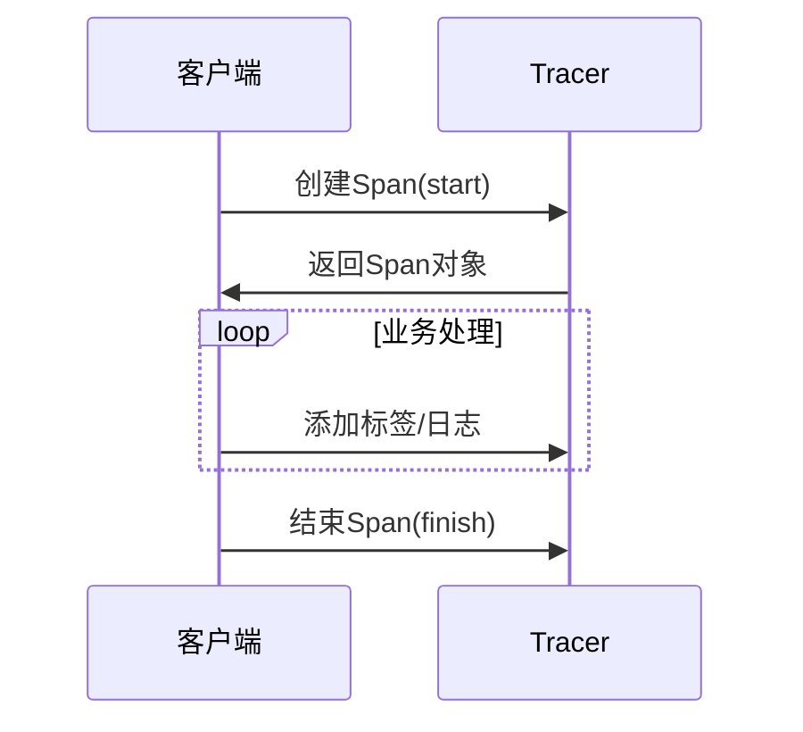
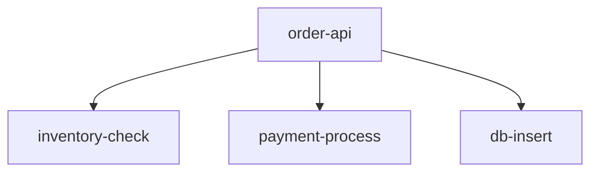

# Span基础概念

## 介绍

在分布式系统中，**Span**是分布式追踪（Distributed Tracing）的基本构建块。它代表系统中一个独立的工作单元，可以是一次函数调用、数据库查询或HTTP请求。多个Span通过父子关系连接起来，形成完整的调用链（Trace），帮助我们理解请求在分布式系统中的流转路径。

:::tip 类比理解
想象Span就像快递物流中的"运输段"：从仓库打包（Span开始）到派送签收（Span结束），每个环节都有详细记录。多个运输段组合起来就是完整的物流轨迹（Trace）。
:::

## Span的核心属性

一个标准的Span通常包含以下关键信息：

| 属性          | 说明                                                                 |
|---------------|----------------------------------------------------------------------|
| OperationName | Span的名称（如"GET /api/users"）                                     |
| StartTime     | Span开始的时间戳                                                    |
| Duration      | Span持续的时长（单位通常为微秒）                                    |
| Tags          | 键值对形式的元数据（如`http.status_code=200`）                      |
| Logs          | 时间戳事件记录（如异常日志）                                        |
| SpanContext   | 包含TraceID、SpanID等上下文信息                                     |

## Span的生命周期



## 代码示例

以下是使用Jaeger客户端创建Span的Python示例：

```python
from jaeger_client import Config

def init_tracer(service):
    config = Config(
        config={'sampler': {'type': 'const', 'param': 1}},
        service_name=service)
    return config.initialize_tracer()

tracer = init_tracer('my-awesome-app')

# 创建顶级Span
with tracer.start_span('main-operation') as span:
    span.set_tag('http.method', 'GET')
    
    # 创建子Span
    with tracer.start_span('child-operation', 
                          child_of=span) as child_span:
        child_span.log_kv({'event': 'processing started'})
        # 模拟业务处理
        import time
        time.sleep(0.1)
        child_span.log_kv({'event': 'processing finished'})
    
    span.set_tag('http.status_code', 200)
```

## 实际应用场景

**电商订单创建流程**中的Span可能包括：

1. `order-api`: 接收用户请求（父Span）
   - `inventory-check`: 库存检查（子Span）
   - `payment-process`: 支付处理（子Span）
   - `db-insert`: 订单入库（子Span）



:::caution 常见错误
1. **Span泄露**：忘记结束Span会导致内存泄漏
2. **过度记录**：不应将敏感信息（如密码）写入Span标签
3. **命名模糊**：避免使用"process-data"等无意义名称
:::

## 总结

- Span是分布式追踪的最小执行单元
- 通过父子关系形成调用链（Trace）
- 包含操作名称、时间戳、标签等关键信息
- 合理使用Tags和Logs能增强可观测性

## 扩展练习

1. 使用Jaeger本地实例创建一个包含3个层级Span的Trace
2. 尝试为Span添加自定义标签（如`user.id=123`）
3. 在Span日志中记录一个模拟异常事件

## 附加资源

- [Jaeger官方文档 - Span概念](https://jaegertracing.io/docs/1.6/architecture/#span)
- [OpenTracing语义规范](https://opentracing.io/specification/)