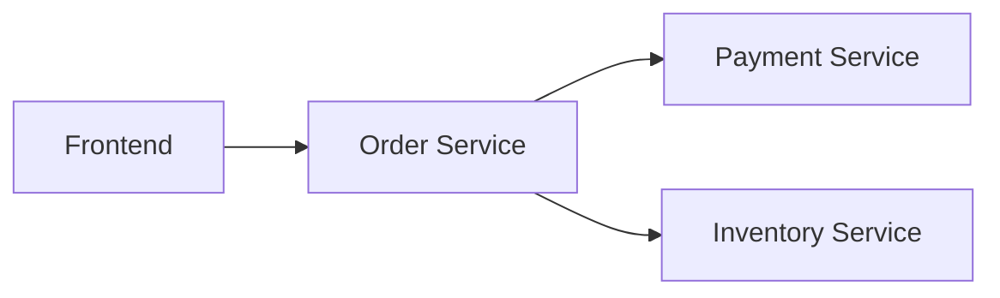
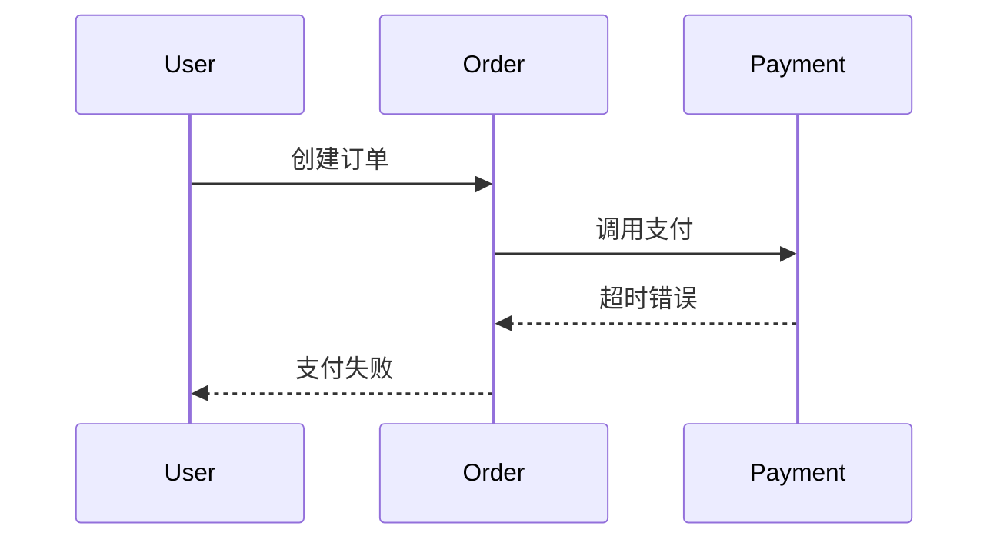

# Trace基础概念

## 介绍

在现代分布式系统中，一个用户请求可能跨越多个服务。**Trace（追踪）**是记录请求在系统中完整路径的技术，它由多个**Span（跨度）**组成，每个Span代表请求在一个服务中的处理过程。通过Trace，开发者可以直观地分析系统性能瓶颈和故障点。

:::tip 为什么需要Trace？
当你的服务从单体架构变为微服务架构时，传统的日志监控难以回答："为什么这个请求慢了？" Trace通过可视化跨服务调用链给出答案。
:::

## 核心概念

### 1. Trace
一个Trace代表**完整的请求生命周期**。例如用户点击"购买"按钮后，从前端到订单服务、支付服务、库存服务的整个流程。



### 2. Span
Span是Trace的基本单元，包含：
- 开始/结束时间
- 操作名称（如`HTTP GET /order`）
- 标签（Key-Value格式的元数据）
- 引用关系（父子或兄弟Span）

:::note Span示例
一个查询数据库的Span可能包含：
- 名称：`MySQL SELECT users`
- 标签：`db.statement: "SELECT * FROM users"`
- 持续时间：12ms
:::

## 代码示例

### 创建简单Trace（Python + OpenTelemetry）

```python
from opentelemetry import trace
from opentelemetry.sdk.trace import TracerProvider

# 初始化Tracer
provider = TracerProvider()
trace.set_tracer_provider(provider)
tracer = trace.get_tracer("my.tracer")

# 创建Trace（自动生成TraceId）
with tracer.start_as_current_span("parent-span") as parent:
    # 子Span
    with tracer.start_as_current_span("child-span"):
        print("Processing...")  # 业务逻辑
```

**输出到Jaeger的效果**：
- 一个Trace包含两个Span
- `child-span`是`parent-span`的子节点
- 可以看到每个Span的执行时间线

## 实际应用场景

### 电商系统故障排查
假设用户支付失败，通过Trace可以发现：
1. 订单服务耗时正常（50ms）
2. 支付服务超时（3000ms）
3. 根本原因：支付服务连接第三方API时网络抖动



## 总结

| 概念       | 作用                          | 类比          |
|------------|-----------------------------|-------------|
| Trace      | 请求的完整调用链                  | 一本小说      |
| Span       | 单个服务的操作记录                | 小说中的章节   |
| Tags       | 添加诊断信息（如HTTP状态码）       | 章节的注释    |

## 扩展练习
1. 在你的本地Jaeger实例中创建一个包含3个层级Span的Trace
2. 尝试给Span添加这些标签：
   ```python
   span.set_attribute("http.method", "GET")
   span.set_attribute("http.route", "/api/users")
   ```

## 附加资源
- [Jaeger官方文档：Trace和Span](https://jaegertracing.io/docs/1.22/architecture/)
- 《分布式追踪：实践手册》第三章