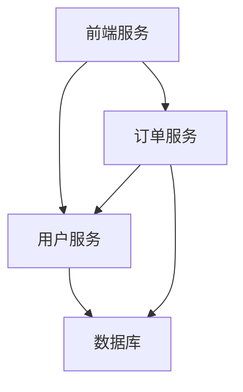
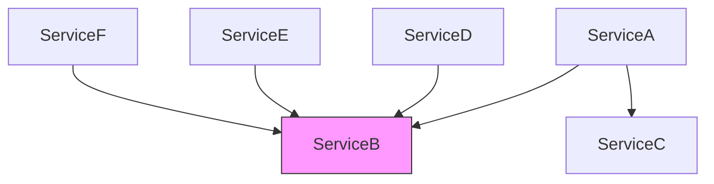

# 服务依赖关系

## 介绍

在现代分布式系统中，应用程序通常由多个相互通信的微服务组成。**服务依赖关系**描述了这些服务之间的调用链路和交互方式。理解这些依赖关系对于系统调试、性能优化和架构设计至关重要。

Jaeger作为分布式追踪系统，能够自动捕获并可视化服务间的调用关系，帮助开发者：

- 发现隐藏的服务依赖
- 分析跨服务调用的性能瓶颈
- 理解复杂系统的整体行为

## 基本概念

### 1. 什么是服务依赖

服务依赖是指一个服务（服务A）为了完成其功能，需要调用另一个服务（服务B）的情况。这种关系可以是直接的（A→B）或间接的（A→B→C）。

### 2. 依赖类型

| 依赖类型 | 描述 | 示例 |
|---------|------|------|
| 强依赖 | 没有B服务A无法正常运行 | 支付服务依赖账户服务 |
| 弱依赖 | A可以降级运行当B不可用时 | 推荐服务依赖日志服务 |
| 循环依赖 | A依赖B，B又依赖A | 应尽量避免的设计 |

## Jaeger 中的依赖可视化

Jaeger通过收集各个服务的追踪数据，自动构建服务依赖图。以下是一个典型的依赖关系图示例：



## 实际案例

### 电商系统示例

考虑一个简化的电商系统，包含以下服务：

1. `Web前端` - 处理用户请求
2. `ProductService` - 商品信息
3. `InventoryService` - 库存管理
4. `PaymentService` - 支付处理

当用户下单时，调用流程如下：

```go
// 伪代码示例
func placeOrder(orderRequest) {
    // 1. 验证商品
    product := productService.verifyProduct(orderRequest.productId)
    
    // 2. 检查库存
    inventory := inventoryService.checkStock(orderRequest.productId, orderRequest.quantity)
    
    // 3. 创建支付
    payment := paymentService.createPayment(orderRequest.userId, orderRequest.amount)
    
    // 4. 完成订单
    order := orderService.createOrder(product, inventory, payment)
    return order
}
```

在Jaeger UI中，这个调用会显示为：

```
Web前端 → ProductService → InventoryService → PaymentService → OrderService
```

:::tip 实际观察
在Jaeger的"Dependencies"视图中，你可以看到:
- 每个服务的调用频率
- 请求的延迟分布
- 错误率等关键指标
:::

## 识别问题依赖

通过Jaeger的依赖图，我们可以发现潜在的系统问题：

1. **意外依赖**：比如发现前端直接调用了数据库
2. **性能瓶颈**：某个服务被过多依赖导致延迟
3. **单点故障**：关键服务被大量其他服务依赖



上图中，ServiceB是明显的单点故障风险点。

## 最佳实践

1. **减少强依赖**：通过缓存、异步处理等方式降低依赖强度
2. **避免循环依赖**：设计时注意服务边界
3. **监控关键路径**：对核心依赖链路设置警报
4. **文档化依赖**：维护系统架构图

:::caution 注意
不要过度依赖Jaeger自动发现的依赖关系，某些低频调用可能不会被捕获。建议结合架构文档一起分析。
:::

## 总结

服务依赖关系是分布式系统设计和运维的核心关注点。Jaeger提供的依赖可视化功能能够帮助开发者：

- 理解系统实际运行时的拓扑结构
- 发现设计中的问题
- 优化系统性能
- 规划容量和扩展

## 扩展学习

1. 在Jaeger UI中尝试不同的时间范围，观察依赖关系的变化
2. 模拟服务故障，观察依赖图中的表现
3. 比较测试环境和生产环境的依赖差异

练习建议：
1. 部署一个简单的微服务系统，使用Jaeger追踪依赖关系
2. 故意引入一个循环依赖，观察Jaeger如何显示
3. 尝试为关键依赖设置监控警报