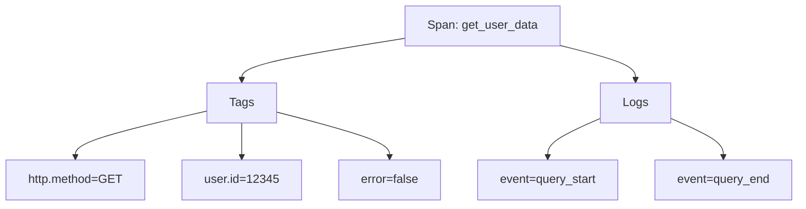

# 标签与属性

## 介绍

在分布式追踪系统中，**标签(Tags)**和**属性(Attributes)**是为追踪数据添加元数据的关键机制。它们就像给快递包裹贴上的标签，能帮助我们快速识别和分类追踪信息。在Jaeger中，这些元数据可以包含：

- 请求的HTTP方法
- 数据库查询语句
- 错误代码
- 业务相关标识符
- 任何有助于分析性能问题的上下文信息

:::tip 关键区别
- **标签(Tags)**：应用于整个Span的不可变元数据（创建后不能修改）
- **日志字段(Log Fields)**：与特定Span事件关联的可变数据
:::

## 基础用法

### 添加标签

以下是使用Jaeger客户端库添加标签的示例：

```javascript
const { initTracer } = require('jaeger-client');

const tracer = initTracer(config);

const span = tracer.startSpan('get_user_data');
span.setTag('http.method', 'GET');
span.setTag('user.id', '12345');
span.setTag('error', false);

// 业务逻辑...

span.finish();
```

### 标签类型

Jaeger支持多种标签值类型：

| 类型       | 示例                  |
|------------|-----------------------|
| 字符串     | `"production"`        |
| 数字       | `200`, `3.14`         |
| 布尔值     | `true`, `false`       |
| 二进制数据 | `Buffer.from('data')` |

## 实战案例

### 案例1：HTTP请求追踪

```python
from jaeger_client import Config

tracer = Config(config={'sampler': {'type': 'const', 'param': 1}}).initialize_tracer()

with tracer.start_span('http_request') as span:
    span.set_tag('http.method', 'POST')
    span.set_tag('http.url', '/api/users')
    span.set_tag('http.status_code', 201)
    span.set_tag('response.size', '256kb')
    
    # 模拟业务处理
    try:
        # ...处理逻辑
        span.set_tag('processing.time_ms', 45)
    except Exception as e:
        span.set_tag('error', True)
        span.log_kv({'event': 'error', 'message': str(e)})
```

### 案例2：数据库操作追踪

```go
span := tracer.StartSpan("db_query")
defer span.Finish()

span.SetTag("db.type", "mysql")
span.SetTag("db.instance", "users")
span.SetTag("db.statement", "SELECT * FROM users WHERE id = ?")
span.SetTag("db.rows_affected", 1)

// 执行查询...
if err != nil {
    span.SetTag("error", true)
    span.LogFields(log.String("error.message", err.Error()))
}
```

## 高级用法

### 结构化属性

对于复杂数据，可以使用JSON格式：

```java
Span span = tracer.buildSpan("complex_operation").start();
span.setTag("metadata", "{\"department\":\"finance\",\"priority\":\"high\"}");
```

### 动态标签

```javascript
function wrapRequest(req, res) {
    const span = tracer.startSpan('http_request');
    
    // 根据请求自动添加标签
    span.setTag('http.method', req.method);
    span.setTag('http.path', req.path);
    
    res.on('finish', () => {
        span.setTag('http.status_code', res.statusCode);
        span.finish();
    });
}
```

## 可视化分析

在Jaeger UI中，标签会显示在Span详情中：



## 最佳实践

1. **命名一致性**：建立团队标签命名规范，如统一使用 `http.status_code` 而不是混合使用 `status`/`http_status`
2. **避免敏感数据**：不要在标签中包含密码、密钥等敏感信息
3. **适度使用**：过多的标签会影响存储和查询性能
4. **业务相关性**：添加能帮助排查业务问题的标签，如 `order_id`、`transaction_type`

:::caution 警告
避免使用高频变化的标签值（如时间戳），这会导致Jaeger存储大量几乎唯一的标签，严重影响查询性能！
:::

## 总结

标签和属性是Jaeger追踪系统的核心功能，它们：

- 为Span添加上下文信息
- 支持强大的筛选和查询功能
- 帮助识别性能瓶颈和错误根源
- 使追踪数据对业务分析更有价值

## 扩展练习

1. 在你的项目中为关键操作添加至少5个有意义的标签
2. 尝试在Jaeger UI中按标签筛选Span
3. 比较带有不同标签集的Span在UI中的显示差异

## 延伸阅读

- [Jaeger官方文档 - 标签规范](https://www.jaegertracing.io/docs/)
- [OpenTracing语义约定](https://github.com/opentracing/specification/blob/master/semantic_conventions.md)
- [分布式追踪模式与反模式](https://distributed-tracing.net/)