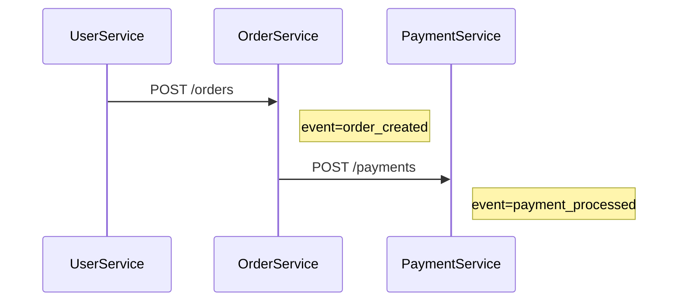

# 日志与事件

## 介绍

在分布式系统中，**日志（Logs）**和**事件（Events）**是Jaeger追踪的重要组成部分。它们为Span（追踪的基本单元）提供了额外的上下文信息，帮助开发者理解系统在特定时刻的行为。日志通常记录离散的时间点信息（如错误、状态变更），而事件则是带有时间戳的结构化数据，用于标记关键操作。

:::note
日志与事件的区别：
- **日志**：自由格式的文本或键值对，记录瞬时状态（如 `error="File not found"`）。
- **事件**：具有明确语义的操作标记（如 `http.request.sent`）。
:::

---

## 基础用法

### 在Span中添加日志
Jaeger允许通过OpenTracing API为Span附加日志。以下是一个Python示例：

```python
from jaeger_client import Config

# 初始化Jaeger追踪器
config = Config(config={'sampler': {'type': 'const', 'param': 1}}, service_name='my_service')
tracer = config.initialize_tracer()

with tracer.start_span('process_data') as span:
    span.log_kv({
        'event': 'start_processing',
        'data': {'file': 'example.txt', 'size': 1024}
    })
    
    try:
        # 模拟处理逻辑
        span.log_kv({'event': 'processing_complete', 'status': 'success'})
    except Exception as e:
        span.log_kv({'event': 'error', 'error': str(e)})
        span.set_tag('error', True)
```

**输出结果**：
在Jaeger UI的Span详情中，你会看到类似这样的日志条目：
```
[2023-10-01 12:00:00] event=start_processing data={file: "example.txt", size: 1024}
[2023-10-01 12:00:02] event=processing_complete status=success
```

---

## 实际案例

### 微服务通信追踪
假设有一个订单处理系统，包含以下步骤：
1. 用户服务接收请求
2. 订单服务创建订单
3. 支付服务处理付款

通过事件标记关键节点：



对应代码实现（Node.js示例）：
```javascript
const { initTracer } = require('jaeger-client');

const tracer = initTracer({ serviceName: 'order-service' });

app.post('/orders', async (req, res) => {
    const span = tracer.startSpan('create_order');
    span.logEvent('order_created', { userId: req.body.userId });
    
    try {
        const paymentSpan = tracer.startSpan('process_payment', { childOf: span });
        paymentSpan.logEvent('payment_processed', { amount: req.body.amount });
        // ...
    } finally {
        span.finish();
    }
});
```

:::tip 最佳实践
- **结构化日志**：始终使用键值对而非纯文本（如 `status="failed"` 而非 `"Failed to process order"`）
- **事件命名**：采用`domain.action`格式（如 `db.query_executed`）
:::

---

## 高级特性

### 日志与Span的关系
每个日志条目会自动关联到Span的时间轴。在Jaeger UI中，你可以看到日志在Span持续时间内的分布：

```mermaid
gantt
    title Span时间轴中的日志分布
    dateFormat  HH:mm:ss
    section Process
    Span :a1, 2023-10-01 12:00:00, 5s
    Log1 :a1, 2023-10-01 12:00:01, 1s
    Log2 :a1, 2023-10-01 12:00:03, 1s
```



---

## 总结

| 关键点                 | 说明                                                                 |
|------------------------|----------------------------------------------------------------------|
| **日志的用途**         | 记录Span执行过程中的关键状态变化或错误信息                           |
| **事件的语义化**       | 使用明确命名标记业务操作（如 `user.registered`）                     |
| **性能考虑**           | 避免高频日志（>100条/Span），优先使用Tags                            |

## 扩展练习
1. 修改上述Python示例，添加一个记录处理耗时的日志
2. 在Jaeger UI中对比不同Span的日志分布模式
3. 尝试通过日志重建一个失败请求的执行路径

:::caution 注意事项
- 日志字段避免包含敏感信息（如密码、令牌）
- 生产环境中应限制日志量（可通过采样配置）
:::