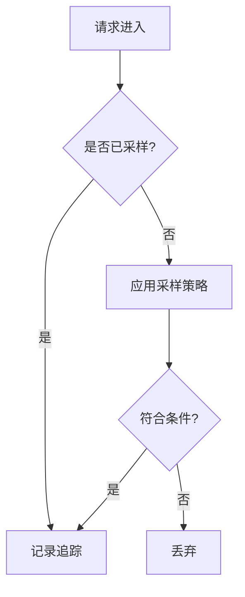

# 追踪采样

## 介绍

在分布式系统中，每一次用户请求都可能触发多个服务的调用，生成大量追踪数据。如果全量收集这些数据，会带来巨大的存储和分析成本。**追踪采样（Sampling）** 是 Jaeger 中的核心机制，它通过智能筛选部分请求的追踪数据，平衡系统开销与观测需求。

采样策略决定了哪些请求的追踪数据会被记录。常见的场景包括：
- **生产环境**：采样率通常较低（如 1%），以减少资源消耗。
- **调试环境**：可能采用 100% 采样，捕获所有请求细节。

## 采样类型

Jaeger 支持多种采样策略：

### 1. 恒定采样（Constant Sampling）
最简单的策略，固定采样率（如 `true` 表示全采样，`false` 表示不采样）。

```json
{
  "type": "const",
  "param": 1  // 1=全采样，0=不采样
}
```

### 2. 概率采样（Probabilistic Sampling）
按概率随机采样，例如 0.1 表示 10% 的请求会被记录。

```json
{
  "type": "probabilistic",
  "param": 0.1
}
```

### 3. 限流采样（Rate Limiting Sampling）
控制单位时间内的最大追踪数，适合高流量服务。

```json
{
  "type": "rateLimiting",
  "param": 100  // 每秒最多 100 条追踪
}
```

### 4. 动态采样（Adaptive Sampling）
根据系统负载和业务规则动态调整采样率（需配合 Jaeger Agent 使用）。

## 实际案例

### 场景：电商网站的订单服务
假设你的订单服务日均处理 100 万请求，全量追踪会导致：
- **存储成本高**：每天可能产生 TB 级数据。
- **分析延迟**：大数据量降低查询速度。

通过概率采样（如 1%）：
- 每天仅收集 1 万条追踪。
- 关键路径（如支付失败）可通过 `tag` 标记强制采样。

```go
// Go 示例：标记关键请求强制采样
span := tracer.StartSpan("process_order")
span.SetTag("sampling.priority", 1)  // 1=强制采样
defer span.Finish()
```

## 采样决策流程



## 配置示例

以下是通过环境变量配置 Jaeger 采样率的方式：

```bash
# 设置概率采样率为 20%
JAEGER_SAMPLER_TYPE=probabilistic
JAEGER_SAMPLER_PARAM=0.2
```

## 总结

- **采样目的**：降低系统负载，同时保留有代表性的追踪数据。
- **策略选择**：根据业务场景混合使用多种策略（如基础概率采样 + 关键路径强制采样）。
- **调试技巧**：临时提高采样率定位问题。

:::tip 最佳实践
- 生产环境建议从 1% 采样率开始，逐步调整。
- 为错误请求和高延迟请求配置更高采样率。
:::

## 扩展资源

1. [Jaeger 官方文档：采样配置](https://www.jaegertracing.io/docs/latest/sampling/)
2. 练习：在本地 Jaeger 中对比 1% 和 10% 采样率的追踪数据差异。